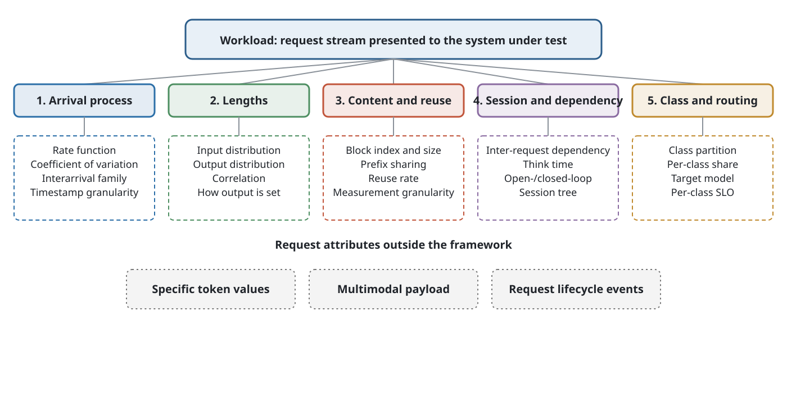
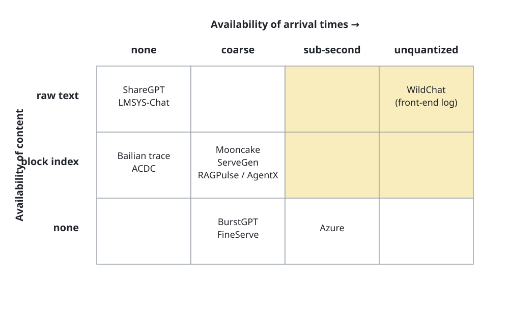
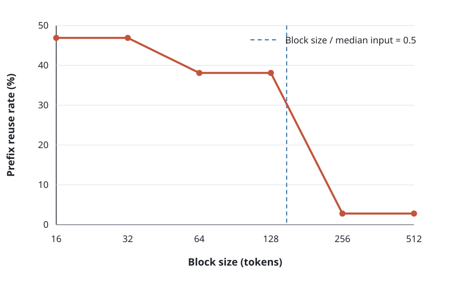
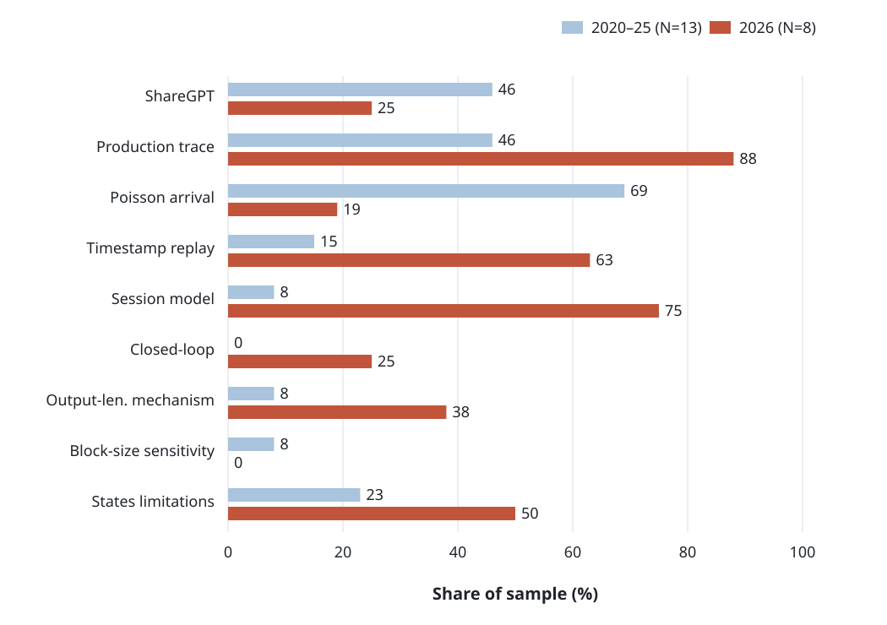

[Download the English paper as PDF (v1.1)](/blog/llm-inference-system-workload-survey/survey-en-v1.1.pdf)

*Paper version v1.1, dated 2026-09-07.*

> **Abstract.** Performance results for inference serving systems depend on the workload under which they are obtained, yet the workload itself has received little systematic attention. We define a workload as the request stream presented to the system under test, and describe it along five aspects: the arrival process, lengths, request content and its reuse relation, session and dependency, and traffic class and model routing. We state the conditions under which this description holds, and identify three classes of request attribute that fall outside it. We then report three studies. First, we map the public workload datasets and load-generation tools available as of September 2026: none of the production traces we examined retains the original token sequence, and arrival times or content identifiers are generally aggregated or block-coded. We give the direction and magnitude of the bias this introduces. Second, we code the experimental setup of 29 serving papers against a fixed set of eight fields: 1 reports a sensitivity analysis over KV cache block size; roughly half of the 2020–2025 sample fixes or truncates output length, and most do not state the mechanism; none of the four simulators we examined replays production arrival timestamps. Third, within our 2026 sample we observe two coexisting evaluation practices: work on real systems tends to use trace replay, while simulation work tends to validate on fixed lengths and ShareGPT. We close with a checklist for evaluation setups and a list of open questions. This study is not a prevalence estimate for the field; our sampling and its limitations are discussed in the section on threats to validity.

**Keywords:** large language model; inference serving; workload characterization; evaluation methodology; prefix caching

## Introduction

Microsoft’s Azure LLM inference dataset states in its documentation[^1]:

> Due to customer privacy requirements (e.g., GDPR), we do not have visibility into the content of
> the prompts. We instead use the production traces to guide the input and output sizes… Note that
> the text of the inputs prompts does not impact the performance metrics that we benchmark, since
> they depend only on the input and output sizes.[^2]

This note implies a testable assumption: the specific tokens of the prompt have no effect on the
reported performance metrics. The public file therefore keeps only three columns: timestamp, input
token count, and output token count. Splitwise [[1]](#ref-patel2024splitwise) adopts the
length distributions from this dataset and generates arrival times with a parameterized Poisson
process.

This assumption may hold for most metrics on dense models, but at least three serving mechanisms
depend on the specific token values: the router of a mixture-of-experts model selects the top few
experts from the product of the hidden state and the expert weights; speculative decoding decides
acceptance from the logits of the draft and target models; and when generation stops depends on when
the model produces the end-of-sequence token.

A single publisher is not consistent across its artifacts. When SemiAnalysis released the
AgentX agent trace, it replaced the original content with 64-token block indices; yet the
benchmark’s scenario setup also states that, because synthetic tokens change the
acceptance rate of speculative decoding, the acceptance rate is fixed to a constant. The
two choices rest on different assumptions about content, and the range of metrics each
supports needs to be stated separately.

These examples point to a gap in existing surveys, which the next subsection develops.

### Relation to existing surveys

Several surveys of LLM inference serving already exist. Their organizing threads differ, but all
take serving mechanisms as the main axis. Table [1](#tab-surveycmp) lists the six we
examined and their coverage.

**Table 1. Coverage of workload-related content in existing inference-serving surveys. “●” marks a dedicated section, “○” a mention within another section, and “–” not found. Coverage is judged from each paper's table of contents and section headings.**

| **Survey** | **Organizing axis** | **Load** | **Data** | **Eval.** |
| --- | --- | --- | --- | --- |
| Miao et al. [[8]](#ref-miao2024towards) | Algorithms and systems | – | ● | ○ |
| Zhen et al. [[9]](#ref-zhen2025taming) | Serving mechanisms | – | ○ | ○ |
| Park et al. [[10]](#ref-park2025engines) | Inference engines | – | – | – |
| Li et al. [[11]](#ref-li2024hpec) | Optimization techniques | – | – | – |
| Pan and Li [[12]](#ref-pan2025survey) | Request handling and memory | – | – | – |
| Zhou et al. [[77]](#ref-zhou2024efficient) | Optimization layers | – | ○ | ○ |
| **This work** | **Workload** | ● | ● | ● |

All six take serving mechanisms or optimization techniques as the organizing thread, and we found no
section organized around the workload. The one with the broadest coverage has a single, unsubdivided
section on benchmarking; the longest, at 106 pages, has no heading related to workloads, traces, or
benchmarks in its table of contents. We note that the absence of a dedicated section does not mean
the topic is absent altogether: these surveys may touch on datasets within their caching or
scheduling sections. The statement we can support is this: among the 6 surveys we examined, none
uses workload characterization as a primary axis of organization.

We divide labor with two kinds of adjacent work. Relative to the discussion of evaluation
methodology [[14]](#ref-agrawal2025evaluating), which enumerates common evaluation pitfalls for
practitioners, we focus on a description framework for the workload itself and on surveying public
data. Relative to single-dataset characterization
work [[20]](#ref-xiang2026servegen), [[21]](#ref-wang2025burstgpt), [[15]](#ref-wang2025kvcachewild), which analyzes one
dataset in depth, we make horizontal comparisons across datasets.

### What we do

We carry out three studies centered on the workload.

First, we give a description framework (Section [3](#sec-framework)). We describe the
request stream along five aspects, state the conditions under which the description holds, identify
three classes of request attribute outside the framework, and give a table relating workload aspects
to the sensitivity of system mechanisms.

Second, we map the public datasets and load-generation tools (Section [9](#sec-tools)).
None of the production traces we examined retains the original token sequence, and arrival times or
content identifiers are generally aggregated or block-coded. We further give the direction and
magnitude of the bias that block-coded representation introduces.

Third, we survey evaluation setups in the field (Section [10](#sec-audit)). We read the
experimental setup of 29 serving papers one by one, code it against a fixed set of eight fields, and
from this tabulate the distribution of workload settings and their missing items.

### Scope

Our scope is the workload of inference serving: how requests arrive, how long they are, how their
content is related, and how these properties affect the conclusions of system evaluation. Three
things fall outside our scope: a model’s reasoning ability (in Chinese, the word for “inference”
also means “reasoning,” so the two must be distinguished); training workloads; and purely
mechanistic work whose conclusions do not depend on workload properties.

Our material comes from three sources, covering January 2023 to September 2026 and reaching back to
include foundational work: published and preprint academic literature; downloadable workload
datasets; and load-generation and load-testing tools—our judgments about tools come from reading the
source and documentation on their current main branch, not their release notes, because the two are
often inconsistent.

We organize the body of the paper around the five aspects of the workload; the basis for this
division is given in Section [3](#sec-framework).

### Organization

Section [2](#sec-bg) introduces the basic concepts and metrics of inference serving for
readers unfamiliar with the area. Section [3](#sec-framework) gives the description
framework and taxonomy of the workload.
Sections [4](#sec-arrival)–[8](#sec-strat) survey the five aspects of the
framework in turn. Section [9](#sec-tools) maps the public datasets and load-generation
tools. Section [10](#sec-audit) reports the survey of evaluation setups.
Section [11](#sec-discuss) draws together cross-aspect observations,
Section [12](#sec-checklist) gives the checklist, Section [13](#sec-threats)
discusses threats to validity, Section [14](#sec-open) lists open questions, and
Section [15](#sec-related) discusses related work.

## Background

This section introduces the inference-serving concepts and metrics used later. Readers familiar with
the area can skip it.

### Two stages and their resource profiles

An autoregressive model processes a request in two stages. The **prefill** stage processes all input
tokens at once and computes the key–value tensors needed for attention; it has high parallelism and
is usually compute-bound. The **decode** stage generates output tokens one at a time, and generating
each token requires reading the key–value of all preceding tokens; this stage is usually
memory-bandwidth-bound.

The two stages have different resource profiles, which has led to several system designs. Deploying
the two stages on separate devices is called **prefill–decode
disaggregation** [[1]](#ref-patel2024splitwise), [[35]](#ref-zhong2024distserve); splitting prefill into
chunks that interleave with decode is called **chunked
prefill** [[33]](#ref-agrawal2023sarathi), [[34]](#ref-agrawal2024sarathiserve). The trade-off between them
depends on the input-to-output length ratio of the workload, so the workload’s length distribution
directly affects evaluation conclusions for such designs.

### KV cache and prefix reuse

The decode stage must retain the key–value tensors of processed tokens, together called the **KV
cache**. Its footprint grows linearly with sequence length and is usually the main consumer of
device memory. Mainstream engines manage it by paging: the cache is cut into fixed-size blocks that
are allocated and indexed by block, with the block size called `block_size` in vLLM and page size in
SGLang.

When two requests share a prefix, the key–value of the shared prefix can be reused without
recomputation; this mechanism is called **prefix caching**. Because the cache is managed in whole
blocks, reuse can also only proceed in whole blocks: when the number of matched tokens falls short
of a full block, that block cannot be reused. The content-sharing structure of the workload and the
engine’s block size therefore jointly determine the actual benefit from reuse, which is the subject
of Section [6](#sec-content).

### Batching and scheduling

**Continuous batching** [[32]](#ref-yu2022orca) reorganizes the batch at every decode step:
finished requests leave the batch and newly arrived requests join at any time. The composition of
the batch therefore depends on request arrival times and remaining output lengths, both of which are
workload properties. On this basis, some engines further co-schedule prefill and decode within a
batch [[42]](#ref-holmes2024fastgen), or reorder the operators within a batch to maximize
throughput [[43]](#ref-zhu2024nanoflow). By contrast, systems for offline batch
processing [[44]](#ref-sheng2023flexgen) are not subject to latency constraints and can
organize the batch in an entirely different way—a distinction showing that evaluation conclusions
for a batching strategy depend on whether the workload is online or offline.

### Mixture-of-experts and speculative decoding

A **mixture-of-experts** model places several expert networks in each layer, and a router selects a
few of them for each token based on the current hidden state. Whether load is balanced across
experts depends on the routing result, and the routing result depends on the specific token values.

**Speculative decoding** uses a smaller draft model to generate several candidate tokens first, and
the target model then verifies them in one pass and decides how many to accept. The acceptance rate
depends on how close the two models’ output distributions are on the given content.

Both mechanisms depend on token values, not on length alone—a point we use again in
Section [3](#sec-framework) when we delimit the boundary of the framework.

### Common metrics

**Time to first token** (TTFT) is the time from a request’s arrival to the production of its first
output token, including queueing and prefill. **Time per output token** (TPOT) is the time between
two adjacent output tokens during decode. **Throughput** is usually counted as tokens or requests
processed per second. **Goodput** is the portion of throughput that meets a given latency
constraint.

Service level objectives (SLOs) are usually given as percentiles of TTFT and TPOT. Because queueing
delay is included in TTFT, conclusions involving TTFT are the most sensitive to the fidelity of the
arrival process.

## Five Aspects of a Workload

### Basis for the division

A taxonomy needs to state its purpose first. Our purpose is this: to describe what information about
a workload must be given so that the behavior on the serving side is reproducible. Each aspect below
follows from this purpose.

Under this purpose, reproducing a request stream requires describing the arrival times of requests,
the input and output lengths, the token content and its reuse relation across requests, the
dependencies and think time between requests, and the traffic class and target model. This yields
five aspects, whose taxonomy is shown in Figure [1](#fig-taxonomy).

*Figure 1. A description framework for workloads. The top two layers show the five aspects and the observable quantities under each; the dashed box at the bottom holds the three classes of request attribute outside the framework, the first of which is the subject of Section [6](#sec-content).*

1.  **Arrival process**: when requests arrive and how their intensity varies over time;

2.  **Lengths**: how long the input and output each are, and whether the two are correlated;

3.  **Request content and its reuse relation**: which requests share content, and how much;

4.  **Session and dependency**: which request a given request waits for, and for how long;

5.  **Traffic class and model routing**: how many classes of traffic with different properties there
    are, and which model each goes to.

### Conditions under which the description holds

We do not claim that these five aspects can characterize every inference request. An unconditional
completeness claim cannot be proved here, so we first state the conditions of applicability and then
what can be obtained under them.

**Quantities held fixed.** We consider plain-text, autoregressive, single-call inference requests,
and assume the following are fixed within a single experiment: the model and its weights, decoding
parameters (temperature, top-$p$, random seed), output-format constraints (such as JSON mode or
grammar constraints), the transport mode (streaming or non-streaming), and quality-of-service
policies (quota, admission, priority rules). These quantities do affect serving-side behavior, but
they are part of the experiment configuration and do not vary from request to request.

**Two properties under this condition.** First, the five aspects do not overlap and are each
necessary: for each aspect there is a class of system behavior that cannot be reproduced when that
aspect is distorted, and Table [2](#tab-sensitivity) gives the correspondence and the
supporting evidence. By the criteria of Nickerson et al. [[7]](#ref-nickerson2013taxonomy),
this division satisfies two of their objective ending conditions—that the dimensions are mutually
exclusive and that each dimension has instances—while the condition that no new dimension is
produced we cannot verify, and so do not claim.

Second, several common quantities are either derivable from the five aspects or are outputs of the
system rather than inputs. Prefix cache hit rate, batch composition, expert load distribution, and
queueing delay belong to the latter: they are the result of the request stream interacting with a
particular system, depend on cache capacity, eviction policy, and routing, and are measured rather
than set. Client-side tool-call time is folded into the think time of the session aspect, and tenant
and priority labels into the traffic class.

**Three classes outside the framework.** The following three are neither derivable from the five
aspects above nor outputs of the system:

1.  *Specific token values.* The third aspect records the content reuse relation between requests,
    not the token sequence itself. Two request streams can be identical on all five aspects yet,
    because their token values differ, activate different experts and obtain different speculative
    acceptance rates. This is exactly the problem discussed in Section [6](#sec-content):
    public data generally retains the reuse relation but not the values.

2.  *Multimodal payload.* Image resolution, patch count, and audio duration determine the encoder’s
    workload, and neither token count nor the reuse relation encodes this information. Our analysis
    is limited to plain-text workloads.

3.  *Request lifecycle events.* Client-initiated cancellation, timeout abandonment, and retries are
    exogenous events, not system outputs. None of the public datasets we examined records them
    (Section [14](#sec-open)).

Our statement is therefore this: under the conditions above, the five aspects form a description
skeleton for a text inference workload. We do not use the word “complete.”

**Table 2. Sensitivity of system mechanisms to workload aspects. ●●● means we have observed a change in the direction of the conclusion, ●● a clear change in magnitude, ● some effect, and ○ negligible effect. This is a qualitative comparison; the basis for each ●●● cell is given in the notes below, and the remaining cells reflect our judgment. PD disaggregation denotes deploying the prefill and decode stages on separate devices.**

| **Workload aspect** | **Continuous batching** | **Prefix caching** | **PD disagg.** | **Scheduling and SLO** | **Mixture-of-experts** | **Speculative decoding** | **Capacity planning** |
| --- | --- | --- | --- | --- | --- | --- | --- |
| Arrival process | ●● | ○ | ● | ●●● | ○ | ○ | ●●● |
| Input length | ●● | ● | ●●● | ●● | ● | ○ | ●● |
| Output length | ●●● | ○ | ●●● | ●●● | ○ | ●● | ●● |
| Content and reuse | ○ | ●●● | ●● | ● | ●●● | ●●● | ● |
| Session structure | ● | ●●● | ● | ●● | ○ | ○ | ●● |
| Traffic class | ●● | ●● | ●● | ●●● | ●● | ● | ●●● |

**Basis for the ratings.** Arrival $\times$ scheduling: for comparable mechanisms, the
relative improvement reported under open-loop and closed-loop settings differs by roughly an
order of magnitude (Section [10](#sec-audit); this comparison does not control for
implementation differences).
Input length $\times$ prefill–decode disaggregation: the optimal resource split reported by
Splitwise varies with workload class, (35,5) for the code class and (25,15) for the
conversation class [[1]](#ref-patel2024splitwise).
Output length $\times$ batching and scheduling: ignoring the end-of-sequence token makes
output length determined by the load-generator setting (Section [5](#sec-length)).
Content and reuse $\times$ prefix caching: on ACDC offline trace a, raising the block size from
16 to 256 lowers the prefix reuse rate from 46.9% to 2.8% (Section [6](#sec-content)).
Content and reuse $\times$ mixture-of-experts: DeepSeek reports a 45.8$\times$ load
difference between the hottest and coldest expert in its production environment.
Content and reuse $\times$ speculative decoding: AgentX fixes the acceptance rate to a
constant because synthetic tokens change it.
Session $\times$ prefix caching: AgentX has a within-session reuse rate of 98.9%, with very
little cross-session reuse.
Traffic class $\times$ scheduling and capacity: in BurstGPT a single class accounts for
77.7%, and across the four classes the median output length differs by 9.2$\times$ and the
arrival coefficient of variation by 22$\times$ [[21]](#ref-wang2025burstgpt).

### Overview of public datasets

The sections that follow draw repeatedly on a set of public datasets, so we give an overview first,
in Table [3](#tab-datasets). The inclusion criterion is that a dataset be downloadable and
contain request-level records; work that reports only statistical summaries or fitted parameters is
not listed.

**Table 3. Public LLM serving-workload datasets. In the “Time granularity” column, values in parentheses are our own measurements; in the “Content representation” column, block size is the number of tokens the dataset uses to form a block index or hash. Datasets marked “*” are those we downloaded and whose schema we checked.**

| **Dataset** | **Source** | **Time granularity** | **Content representation** | **Session field** | **Notes** |
| --- | --- | --- | --- | --- | --- |
| *(a) Production server-side traces* |  |  |  |  |  |
| Azure LLM 2023* | Microsoft | Sub-second, absolute | none | none | Split into conversation and code files |
| Azure LLM 2024 | Microsoft | Sub-second, absolute | none | none | Same fields as 2023 |
| Azure LMM 2025 | Microsoft | Sub-second, absolute | none | none | The only multimodal trace to record image counts |
| BurstGPT*[[21]](#ref-wang2025burstgpt) | University service | Integer seconds | none | In some files | Column counts differ across files |
| Mooncake*[[3]](#ref-qin2025mooncake) | Moonshot AI | Millisecond field (≈3 s measured) | Block index, block size 512 | none | Split into conversation, tool, and synthetic classes |
| ServeGen*[[20]](#ref-xiang2026servegen) | Alibaba | 600-s rate table | Block hash, block size 16 | In the multi-turn file | Online and multi-turn files |
| ACDC*[[19]](#ref-yang2026acdc) | Alibaba | none (whole-batch submission) | Block index, block size 16 | none | Offline batch, six files |
| Bailian trace[[15]](#ref-wang2025kvcachewild) | Alibaba | Relative; absolute removed | Block hash, block size 16 | Parent–child chain | Public release is a two-hour sample |
| FineServe | PPIO | Inconsistent statements; internal resolution no finer than 1 s | none | none | Stratified by architecture, scale, and intent |
| RAGPulse | RAG service | Integer seconds | Hashes decomposed by semantic component | Yes | The only retrieval-augmented service trace |
| *(b) Agent traces* |  |  |  |  |  |
| AgentX* | Agent framework | Relative, closed-loop | Block index, block size 64, valid within a session | Dependency graph | Includes inter-request dependencies |
| *(c) Front-end conversation logs (not server-side)* |  |  |  |  |  |
| WildChat[[76]](#ref-zhao2024wildchat) | Chat front-end | Microsecond, absolute, unquantized | Raw text | Yes | No token counts, no queueing information |
| ShareGPT* | User-shared | none | Raw text | Yes | The de facto default length corpus |
| LMSYS-Chat-1M*[[75]](#ref-zheng2024lmsys) | Chat arena | none | Raw text | Yes | No timestamp field in the corpus itself |

The grouping in the table itself points to a problem. Group (a) has real arrival times and
server-side context, but none of it retains the raw text; group (c) retains the raw text—and
WildChat even carries microsecond-precision, unquantized timestamps—but records front-end
conversations, without instance identifiers, queueing delay, or cache signals. This lets us state
something precise: among the datasets we found, no production server-side trace retains both real
arrival times and the original token sequence; WildChat has both, but it is not a server-side trace.

The direct consequence of this situation is that any experiment depending on both the arrival
process and token values can currently be constructed only by stitching the two kinds of data
together, and the bias introduced by stitching has not been systematically evaluated.

Figure [2](#fig-quadrant) arranges two columns of Table [3](#tab-datasets) into
a grid. The horizontal axis is the availability of arrival times, and the vertical axis is the
availability of request content. The upper-right region, where both are strong at once, contains no
server-side trace.

*Figure 2. Distribution of public datasets along two axes, arrival time and request content. On the horizontal axis, “unquantized” means the timestamps are not aggregated; on the vertical axis, “block index” means block indices or hashes replace the raw text. The yellow region is where both are strong at once: it contains only WildChat, which is a front-end conversation log without instance identifiers, queueing delay, or cache signals. All production server-side traces we examined fall outside this region. The absolute timestamps of the Bailian trace have been removed, so it is listed under “none.”*

Constrained by privacy and storage cost, public production traces usually do not contain the
original token sequence. Take the Mooncake conversation trace: its 145 million tokens would need
about 580 MB if stored as text, but 2.89 MB if stored as block indices. This trade-off has its
reasons; our concern is the bias that this representation introduces, and the lack of systematic
evaluation of that bias in existing work.

Several other works report production data of considerable scale but release no trace, including a
provider dataset covering 12 months and 6.12 billion requests [[71]](#ref-nixon2026year) (whose
footnote states that release has been approved, but which we did not find released as of our
search), a code-completion service dataset covering 3.2 million users and 761 million
calls [[66]](#ref-liu2026copilot), and several artifacts announced as forthcoming open source
whose repositories do not exist. Were these data released, they would appreciably change the picture
in the table above.

## Arrival Process

### Three statistics

Describing the arrival process usually uses three quantities: the rate, the coefficient of
variation, and the distribution family of interarrival times.

Measured over 10-minute windows, the arrival rate fluctuates clearly over time. In the client sample
of ServeGen, the busiest 10% of intervals contribute 53.4% of the request volume; provisioning
capacity from the all-interval average rate alone would underestimate peak demand.

The coefficient of variation (CV) here is the standard deviation of the interarrival times between
adjacent requests divided by their mean, capturing the dispersion of the intervals; we use a ratio
rather than the variance so that two datasets with different rates can be compared directly. Three
points deserve care: CV equal to 1 is a property of exponential intervals and is not enough to
establish that the process is a fixed-rate homogeneous Poisson process; a non-homogeneous Poisson
process, because its rate varies over time, also has an interval CV greater than 1; and a CV greater
than 1 indicates dispersion higher than the exponential distribution but does not by itself prove
the presence of clustered arrivals.

For two files from the same day and cluster of the Azure dataset, the per-second arrival counts over
the same 30-second window are:

> Conversation (CV=1.09) 3 5 8 3 3 5 4 4 2 2 6 3 5 5 6 $\cdots$
>
> Code (CV=13.15) 0 0 0 0 0 0 0 0 0 0 0 0 0 0 0 $\cdots$

The CV in parentheses is computed from per-request interarrival times; the per-second count
sequences listed above serve only to show the difference between the two visually, and the two are
not the same statistic.

The conversation class is relatively smooth; the code class has no requests in this 30-second
window, yet its busiest second sees 67 arrivals, and 73% of its seconds have no request. The two
differ by less than a factor of three in mean rate, yet their queueing behavior is clearly
different.

### Recording granularity of timestamps

We use a diagnostic: the ratio of the number of distinct timestamps to the number of records. When
this ratio is low, the timestamps may have been aggregated at the collection or release stage.
Table [4](#tab-tsquant) gives the measured results.

**Table 4. Measured recording granularity of timestamps. Ratio = distinct timestamps / records.**

| **Dataset** | **Records** | **Timestamps** | **Ratio** | **Grid** |
| --- | --- | --- | --- | --- |
| Azure conversation | 19,366 | 19,366 | 100% | none |
| Azure code | 8,819 | 8,819 | 100% | none |
| Mooncake conversation | 12,031 | 1,180 | 9.8% | ≈3 s |
| Mooncake tool | 23,608 | 1,180 | 5.0% | ≈3 s |
| BurstGPT | 1,404,294 | 767,313 | 54.6% | 1 s |

A low ratio does not by itself mean the data are unusable, since concurrent arrivals also
produce identical timestamps; the deciding test is whether the values fall on a regular
grid. Mooncake’s interval values concentrate on three numbers: 3000 ms occurs 651 times,
2999 ms 263 times, and 3001 ms 260 times, with the rest totaling 5; the median number of
requests per timestamp is 10. This shape is hard to explain by chance same-instant arrivals
and is closer to the result of aggregation over a fixed window, though genuine periodic
batch submission cannot be entirely ruled out.

This yields two limitations. First, without an additional within-bucket arrival model, this
trace is not suitable for directly replaying the queueing process or time to first token,
because the order and spacing of requests within a bucket have been lost, and queue behavior
is nonlinear in both. Second, counting arrivals or offered load over windows much larger than
3 s is affected little by this aggregation. Note that this does not mean throughput
conclusions are uniformly unaffected: artificial batched arrivals likewise change the
system’s actual throughput. The coefficients of variation the dataset reports (3.03 for
conversation, 4.36 for tool) reflect the aggregated shape and should not be read directly as
the burstiness of the original workload.

This recording granularity is not easy to see from the schema. vLLM’s trace loader offers a
`timed-trace-sec-multiplier` parameter, and its Mooncake example passes 0.001 explicitly, indicating
that the field is in integer milliseconds. The unit is declared as milliseconds while the actual
values fall on a 3-second grid, and the loader converts timestamps by the unit it is given, so it
preserves this periodic aggregation as is.

### The production traces we analyzed generally depart from the Poisson assumption

ServeGen provides the finest-grained data we have seen: across 36,969 active intervals from
422 clients on a production platform, the median coefficient of variation is 1.61, with
13.3% at most 1 and 20.8% above 5; the fitted interarrival distributions are Gamma (61%)
and Weibull (38%), with no exponential.

The interarrival times of multi-agent traffic were also reported in 2026 to depart from the
Poisson assumption, with interarrival distributions conditioned on topology [[70]](#ref-lamagna2026multiagent).
These results agree with classical network-traffic work [[6]](#ref-leland1993self) and indicate
that the applicability of Poisson arrivals should be checked before adopting them in
inference-serving settings.

We add that the rate, CV, and marginal distribution family cannot capture autocorrelation,
long-range dependence, or synchronization effects across clients. The diagnostics above serve only
as an initial screen, and a fuller assessment requires point-process tests or index-of-dispersion
analysis.

### Arrival settings in the literature

By the coding results of Section [10](#sec-audit), of the 13 papers in the 2020–2025 sample,
9 use Poisson arrivals and 2 replay real timestamps.

The experimental-setup section of vLLM writes [[2]](#ref-kwon2023vllm): “Since these datasets
do not include timestamps, we generate request arrival times using Poisson distribution with
different request rates.” DistServe [[35]](#ref-zhong2024distserve) and
FastServe [[36]](#ref-wu2023fastserve) give the same rationale, and FastServe explicitly notes
that it follows prior work. The wording of the three papers is very close, but we can only observe
the repeated appearance of this rationale and cannot determine its path of propagation: FastServe
and DistServe have overlapping authors, and the chronological order of the versions would need to be
checked against version history to establish.

For contrast, AlpaServe [[37]](#ref-li2023alpaserve) cuts the original trace into time windows
and fits a Gamma process within each window using two parameters, rate and coefficient of variation,
a practice inherited from earlier serving-system work. The same paper states that no public
production inference trace existed at the time, so it substituted a function-call trace from
serverless computing instead. This contrast shows that later work, when it adopts more realistic
content or length distributions, often does not simultaneously preserve the statistical
characteristics of the arrival process. We do not attribute a cause for this phenomenon.

The arrival process deserves separate treatment because the benefit of several mechanisms rests
directly on its shape. Scheduling work aimed at load balancing and
migration [[38]](#ref-sun2024llumnix) depends on the difference in instantaneous load across
instances, and that difference is set by the burstiness of arrivals; work aimed at the
streaming-output experience [[39]](#ref-liu2024andes) defines user-perceived smoothness as a
time-varying quantity, and its evaluation conclusions likewise depend on the distribution of
requests over time; serverless inference serving [[40]](#ref-fu2024serverlessllm) takes
cold-start overhead as its central problem, and how often cold starts occur depends on the long-tail
shape of interarrival times. Each of these works adopts a different arrival setting, and we did not
find any comparison among them under a unified arrival process.

On the tool side, the Gamma distribution is supported by four tools (vLLM’s `burstiness` parameter,
AIPerf’s arrival-mode option, ServeGen, and BurstGPT’s bundled generator), Weibull by only ServeGen,
and the sinusoid by only Dynamo; among the 24 tools we examined, we found no implementation
supporting a Markov-modulated Poisson process or a Hawkes process. SGLang is the only one of the
mainstream frameworks we examined that offers only the exponential distribution.

The conclusion of this section is therefore that existing tools already support a range of arrival
distributions, but the basis for choosing a distribution and the error from model mismatch still
lack systematic evaluation.

## Lengths

### Differences in input length across datasets

Table [5](#tab-lengthgrowth) lists the median input length of each dataset by collection
time.

**Table 5. Median input length of each dataset.**

| **Dataset** | **Collected** | **Median input** | **Relative** |
| --- | --- | --- | --- |
| BurstGPT | 2023 | 262 | 0.3× |
| ACDC offline a | 2026 | 298 | 0.3× |
| Azure conversation | 2023-11 | 1,020 | 1× |
| Mooncake conversation | 2024 | 6,909 | 6.8× |
| AgentX | 2026 | 201,664 | 198× |

This is a range across datasets, not to be read directly as growth over time for one business: data
from different years also correspond to different vendors, applications, and workload classes, and
AgentX is not a successor sampling of the Azure conversation workload. The conclusion we can support
is that public datasets differ by three orders of magnitude in input length, so a workload library
should report collection time and business type, and an earlier length distribution should not
directly represent current long-context workloads.

### Three common length distortions

**Truncation.** The input-length percentiles of the Azure code class are P95 = 7,303, P99 = 7,436,
and P100 = 7,437, three close percentiles. This shape suggests truncation on the collection side,
which can be seen only by looking at the high percentiles and is not reflected in the mean or
median.

**Bimodal distribution.** The output length of the Mooncake tool-call trace is P25 = 13, P50 = 30,
P75 = 356, with the shortest length bin holding 62%. The prefix match depth of the same dataset is
also bimodal: 61.3% of requests match only one block, and 21.8% match more than ten blocks, and the
36.6% total reuse rate the dataset reports comes mainly from the latter. Designing a cache policy
around the mean would depart from the actual distribution.

**Widely differing prefill-to-decode ratios.** 
ACDC’s offline traces d and e sit at opposite ends: the former has a median input of 56
and median output of 1,468, a ratio of about 1 to 26; the latter has a median input of 707
and an output of 5 throughout, a ratio of about 141 to 1; AgentX is about 395 to 1. A conclusion
claimed to hold for the “typical workload” should state which part of this range it holds
for.

### Correlation between input and output length

The correlation coefficient of the Azure conversation class is $-0.112$ and that of the code class
is $+0.001$, both close to independent; the within-class correlation coefficients of BurstGPT’s
four classes lie between $+0.236$ and $+0.368$. BurstGPT’s aggregate correlation coefficient is
$+0.243$ and its within-class weighted average is $+0.248$, the two being close, which shows the
correlation is not produced by class mixing.

Input and output length should therefore neither be assumed independent across the board nor assumed
correlated across the board, but measured per dataset. This matters especially in synthetic workload
generation: sampling the two independently would destroy the joint distribution present in real
data.

### Unpredictability of output length and related work

Output length is unknown at a request’s arrival, a property that gives rise to a separate line of
research.

One kind of work tries to predict length to improve scheduling. $S^3$ [[56]](#ref-jin2023s3)
trains a classifier to predict the output-length bin and allocates device memory accordingly to
raise batch occupancy; sequence scheduling [[57]](#ref-zheng2023seqsched) uses the model itself
to anticipate reply length and groups requests of similar length into the same batch. Both require a
way to handle prediction error, because underestimation leads to reallocation.

Another kind does not predict length but makes the system insensitive to length uncertainty.
SuperServe [[58]](#ref-khare2023superserve) adjusts model size for unpredictable workloads;
tail-aware scheduling [[23]](#ref-beyondpred2026) is explicitly premised on not relying on
prediction and is designed for tail latency rather than mean latency. The premises of these two
lines are mutually exclusive: the benefit of the former rises with prediction accuracy, while the
value of the latter shows precisely when prediction is unreliable. We did not find a direct
comparison of the two under the same workload.

The shape of the length distribution also determines whether certain system forms hold. In scenarios
typified by retrieval-augmented generation and recommendation, output length is extremely short,
sometimes a single token, and an engine for such workloads [[59]](#ref-du2025prefillonly) omits
the decode stage entirely; conversely, long-context
work [[54]](#ref-wu2024loongserve), [[55]](#ref-lin2024infinitellm) targets the case where input length far
exceeds single-device memory, and the benefit of its elastic sequence parallelism and distributed
attention grows with input length. The applicable range of these two lines is divided by the
prefill-to-decode ratio described in Section [5](#sec-length), and that ratio differs by
more than two orders of magnitude across public datasets.

### Forced control of output length

Load-testing tools commonly force generation to a set length by ignoring the end-of-sequence token.
This setting disables the model’s natural termination mechanism and makes output length determined
mainly by the load-test configuration.

The coding results of Section [10](#sec-audit) show that about half the papers in the 2020–2025
sample fix or truncate output length, of which 1 states the mechanism fully and 1 partially.

Some agent work in the 2026 sample also forces the output length, but for a different stated reason:
to keep the cross-turn trace consistent. SMetric [[16]](#ref-wang2026smetric) notes that a
divergence between the evaluated model’s reply and the recorded trace breaks the KV cache reuse
pattern in two ways—the generated length may differ, and the history recorded for later requests no
longer matches the tokens the serving instance has actually cached—so it ignores the end-of-sequence
token and truncates to the recorded length, and further rewrites part of the later requests with the
generated content.

This handling shows that, in session-replay settings, content and output length need to be
controlled jointly. The effect of this handling itself on performance measurements has not yet been
quantified in any report we found.

### Length distribution affects the interpretation of normalized metrics

A 2026 energy-characterization study [[22]](#ref-vellaisamy2026energy) reports that, at fixed hardware
and batch size, raising output length from 10 to 512 tokens lowers per-token energy from 7.46 J
to 0.72 J and raises the total energy of a single window from 1.19 kJ to 5.93 kJ; the gain of
batch size 16 over batch size 1 falls from 6.31$\times$ at context 512 to 1.17$\times$ at context
4K.

A token-normalized metric therefore depends on the workload’s length distribution, and a report of
“per-token cost” should give the length distribution alongside it, or the number is hard to
interpret.

A similar situation holds for latency metrics. A 2026 scheduling
study [[23]](#ref-beyondpred2026) reports that, comparing shortest-job-first against an oracle
predictor, mean end-to-end latency improves by 11.1% and P95 by 12.5%, while P99 rises by 11.2%. The
mean and P99 reflect different facets of the policy, and reporting only one of them would highlight
a different conclusion, so multiple percentiles should be reported together.

## Request Content and Its Reuse Relation

The content aspect affects prefix caching, expert routing, and speculative decoding at the same
time, yet public data retains the least about this aspect.

### Content representation in public data

Among the production traces we examined, the ones that provide content information use block indices
rather than raw text; the rest (such as Azure and BurstGPT) provide no content field at all, see
Table [3](#tab-datasets). Block indices are generated as follows: the real content is
hashed into a sequence of integers, which are then renumbered into smaller consecutive integers; the
result of the hashing step is not retained in the file.

We checked the range of the indices: the Mooncake conversation trace has 182,790 unique indices with
a largest index of 182,789; ACDC offline trace a has 625,269 and 625,268. The indices fill the
interval $[0, N-1]$ exactly, which shows that the indices are dense: every index is used and there
are no gaps. We note that density alone does not prove that the indices are assigned in order of
first appearance; confirming this would require separately checking whether the position of each
index’s first appearance is monotone, a check we did not perform.

Two points follow. First, the indices in the file cannot be used for hash-collision analysis,
because a collision (if any) occurs before renumbering and is not visible in the file. Second, an
index is meaningful only within the file it belongs to, unless the publisher states that a shared
counter across files was used.

The block-level representation is a compromise between “a single identifier for the whole request”
and “the raw token sequence”: the former cannot express partial prefix sharing, and the latter is
infeasible in both size and privacy. We stress that the block-level representation corresponds to
the engine’s cache-management granularity only when the trace’s block length matches the inference
engine’s KV cache block length; the case where the two differ is discussed in
Section [6.4](#sec-threeerr).

### System mechanisms that depend on content reuse

The reuse relation constitutes a separate aspect because a body of mechanisms has formed around it,
and the benefit of these mechanisms is determined directly by the reuse structure.

**Organizing the cache by prefix.** SGLang[[45]](#ref-zheng2024sglang) organizes cached
prefixes in a radix tree so that multiple requests share their common part; Prompt
Cache[[46]](#ref-gim2024promptcache) further allows reuse of non-contiguous modular segments,
at the cost of having to declare the reusable structure in advance. The benefit of both grows with
the share of cross-request sharing, and this share is a property of the workload, not of the system.

**Bringing reuse into scheduling.** Preble[[49]](#ref-srivatsa2025preble) makes prefix sharing
an objective of distributed scheduling, placing requests with the same prefix on the same instance;
MemServe[[50]](#ref-hu2024memserve) shares context across instances with an elastic memory pool
under a disaggregated architecture. The evaluation conclusions of this line of work are most
sensitive to the sharing structure of the workload: if the requests in the test workload are
independent of one another, no difference appears between scheduling policies.

**Relaxing the “exactly identical” requirement.** CacheBlend[[47]](#ref-yao2025cacheblend)
targets the retrieval-augmented setting, fusing cached segments from multiple non-prefix positions
before use and recomputing a small number of positions;
Cache-Craft[[51]](#ref-agarwal2025cachecraft) manages the cache of retrieved segments in a
blockwise manner. These two works show that the range of what is reusable depends on the tolerance
for loss in generation quality, so the “reuse rate” as a number itself depends on the reuse
criterion adopted. CacheGen[[48]](#ref-liu2024cachegen) compresses the already-computed cache
and transfers it across nodes, and its benefit depends on the probability that the cache is used
again.

**Changing how the cache is stored.** vAttention[[52]](#ref-prabhu2025vattention) points out
that paging is not the only way to achieve dynamic GPU-memory management, and argues for keeping
tensors contiguous through a virtual-memory mechanism. This route relates to block size differently
from the paging approach, so how the block-granularity bias described in
Section [6.4](#sec-threeerr) manifests under this form needs separate analysis. A fuller
account of KV cache management is given in a related survey[[53]](#ref-li2026kvsurvey).

What these mechanisms have in common is that evaluating them requires a workload with a real sharing
structure, and Section [3.3](#sec-datasets) has shown that the sharing structure in public
data is given as block indices. We now explain the effect of this representation on measurement
results.

### Effect of block size on reuse-rate measurement

The measured reuse rate depends on the block size used for the measurement. We ran a coarsening
experiment on ACDC offline trace a [[19]](#ref-yang2026acdc) (native block size 16) as the
baseline: we merge several adjacent 16-token blocks into a larger block (hereafter coarsening),
recompute the prefix reuse rate, and fix the denominator at the true total input. The results are
given in Table [6](#tab-blockcliff).

We first note what this data is. It is a single offline batch task submitted as a whole (dictionary
translation, 51,429 requests), with no per-request arrival time; the record order is the order in
the submitted file. We chose it for this experiment because it has the finest content granularity
among the public data we examined (16 tokens), which lets it serve as the reference point for
coarsening; the cost is that prefix sharing in this kind of workload comes from a uniform task
template, so the sharing fraction is higher than in interactive conversational workloads and the
drop occurs elsewhere. Section [13](#sec-threats) states the resulting limits on
generalization.

We fix the following conventions so that the measurement can be reproduced. Cache capacity is
infinite with no eviction, so what we obtain is the prefix reuse resolvable by the trace at a given
block size, not the hit rate any engine could achieve. Matching is streaming in file order, each
record being compared only against records before it. Matching is exact-prefix, stopping at the
first differing block. A coarse block is charged by the number of native blocks it actually
represents, rather than uniformly as a full block. The denominator is fixed at the total input
tokens over all records and does not vary with block size. The script, the checksum of the data
used, and the itemized definitions above are released alongside this paper.

**Table 6. Reuse rate as a function of block size (ACDC offline trace a, native block size 16)**

| **Block size** | **Block / median input** | **Prefix reuse** | **Requests with a hit** |
| --- | --- | --- | --- |
| 16 | 0.05 | 46.9% | 100.0% |
| 32 | 0.11 | 46.9% | 100.0% |
| 64 | 0.21 | 38.1% | 100.0% |
| 128 | 0.43 | 38.1% | 100.0% |
| 256 | 0.86 | 2.8% | 2.8% |
| 512 | 1.72 | 2.8% | 2.8% |

Accounting: a coarse block is formed by concatenating several consecutive 16-token blocks; the final coarse block may be partial and is counted by the number of base blocks it actually represents. Coarsening should not increase the reusable amount, and the values in the table satisfy this monotonicity.

The same result is shown as a curve in Figure [3](#fig-blockcliff). The reuse rate does
not fall smoothly with block size but in steps: as the ratio crosses near 0.5, it drops from 38.1%
to 2.8%.

*Figure 3. Prefix reuse rate as a function of block size (ACDC offline trace a, 51,429 records, native block size 16 tokens, median input length 298). The dashed line marks where the ratio of block size to median input length equals 0.5. The denominator of the vertical axis is fixed at the true total input, so the points are directly comparable.*

The mechanism can be illustrated with the first two records of this trace. The block sequences of
the two requests are $[0,1,\dots,9,\ 10,11,\dots,16]$ and $[0,1,\dots,9,\ 17,18,\dots,24]$,
sharing the first 10 blocks. After coarsening to 64 the common prefix is 2 blocks, to 128 it is 1
block, and to 256 it is 0 blocks: a 256-token coarse block spans the original blocks 0 through 15,
which contains both the shared blocks 0 through 9 and the differing parts from block 10 onward, and
as soon as a single position within the block differs, the coarse block cannot be counted as a hit.

On this trace, the reuse rate drops markedly when the ratio of block size to median input length
increases from 0.43 to 0.86. The ratio 0.5 can serve as a warning value for a sensitivity analysis,
but this threshold comes from two adjacent values on a single trace and is not enough to serve as a
general criterion. A more appropriate reference quantity would be the distribution of shared-prefix
lengths, not the median input length; obtaining that distribution requires recomputation per trace,
and we did not complete this step for all datasets.

### Three classes of bias from the block-level representation

The block-level representation introduces bias in three places. The three have different reference
quantities, cannot be added together, and must be treated separately. Let the true per-token
common-prefix length be $S$, the trace block size be $B_t$, and the engine block size be
$B_e$.

**Bias 1: the trace block granularity cannot express sharing of less than one block.** The sharing
observable from the trace is $T = \lfloor S/B_t \rfloor \cdot B_t$, which undercounts each shared
segment by $S \bmod B_t$ tokens relative to $S$. If the remainder is assumed to be uniformly
distributed over $\{0,1,\dots,B_t-1\}$, its expectation is $(B_t-1)/2$. Whether this assumption
holds depends on the distribution of shared-prefix lengths, and needs to be checked per trace.

We ran one such check on ACDC offline trace a:
taking the measurement at block size 16 as the reference, after coarsening to 64
each hit undercounts by 31.1 tokens on average
($(8{,}511{,}920-6{,}911{,}936)/51{,}428$, the denominator being the number
of requests with a hit on this trace).
Under the uniform-remainder assumption, the expected additional loss from
coarsening 16 to 64 would be $(64-16)/2 = 24$ tokens.
The measured value is higher than this estimate, which shows that the remainder
distribution of this trace is not uniform and that the uniform assumption is
optimistic here. We therefore do not use this assumption to back out the
“true value” for other datasets.
If an estimate is still to be given, it should be stated as an extrapolation
under the uniform-remainder model, and reported together with the number of hit
requests and a sensitivity range.

**Bias 2: overcounting when counting by matched block count times block
size.** 
If a measurement script multiplies the number of matched blocks directly by
$B_t$ rather than truncating at the request’s actual input length, a trailing
partial block is counted as a whole block.
This is not an inherent property of the block-level representation: as long as
the input-length field is available, this bias can be eliminated entirely.
On ACDC offline trace a, the uncapped and input-length-capped conventions differ
by 10,600 tokens, which against the true total input of 18,131,603 is
0.059 percentage points.
This magnitude is determined jointly by the dataset and the block size and
should not be treated as a universally negligible constant: it depends on how
many requests have a shared prefix that ends exactly at their input boundary.
The counts in our Table [6](#tab-blockcliff) are already charged by the number
of base blocks actually represented and do not include this term.

**Bias 3: the engine block size limits the achievable hit.** This term is not a measurement bias of
the trace but a capability constraint of the engine, yet it determines whether the reuse rate
measured from the trace can actually be exploited by the system. The engine indexes and allocates by
whole blocks, so the achievable reuse is $E = \lfloor S/B_e \rfloor \cdot B_e$: when 10 tokens
match but $B_e = 16$, the block cannot be reused, because the KV of the other 6 tokens in the
block belongs to a different request. SGLang calls this the page size, and vLLM calls it the block
size.

The relation between $T$ and $E$ depends on the relative size of $B_t$ and $B_e$, and its
direction is not fixed: when $B_t > B_e$ the trace underestimates the achievable hit, and when
$B_t < B_e$ the trace may instead overestimate it. Therefore, when comparing reuse rates across
datasets, one must report both the trace block size and the engine block size and state their
relative relation; reporting only one of the two makes the direction of the bias impossible to
determine.

### Block-Size values in public configurations

Among the public configurations we collected, the block-size values obtained
from instrumenting production traffic are 16 and 64:
16 appears in vLLM’s default and in the anonymization pipeline of one
production-platform trace, and 64 appears in AgentX’s collection agent, AIPerf’s
default, and the baseline configuration of SGLang’s hierarchical cache.
When OpenAI reports the number of cached tokens, it rounds down to a multiple of
128, reflecting an observable granularity of 128.
512 appears in the Mooncake public trace and the default configuration of one
synthetic generator.

What can be stated from this is: 512 appears rarely among the public configurations we collected and
cannot yet be regarded as a general production configuration. Coarsening to 512 underestimates the
reuse rate of short-append workloads, which are relatively common in agentic settings: the per-turn
append length measured by TraceLab[[17]](#ref-zhu2026tracelab) has a median of 875 tokens,
equivalent to 1.7 blocks of 512 or 13.7 blocks of 64.

Here we need to distinguish an easily confused quantity: the minimum cacheable prefix length
published by vendors (Kimi 256, Groq 128 to 1024, OpenAI 1024 or 2048, Anthropic 1024 to 4096) is a
threshold at the commercial and routing level and is not the same parameter as block size. Reading
the minimum cacheable prefix as the block size introduces a bias of one to two orders of magnitude,
as OpenAI’s own 128-token reporting granularity attests.

The `prefix_match_unit` field recently added by vLLM makes this distinction explicit: its
documentation states that it can be set finer than the physical KV cache block, so that a hit can
fall on a boundary inside a physical block. A trace with a block length of 512 cannot resolve the
first divergence position inside a 512-token block, and therefore cannot be used to evaluate the
gain from a matching unit smaller than 512 tokens.

### The default block size and its evaluation workloads

Section 7.2 of the vLLM paper writes[[2]](#ref-kwon2023vllm):

> The choice of block size can have a substantial impact on the performance of vLLM. If the block
> size is too small, vLLM may not fully utilize the GPU’s parallelism for reading and processing KV
> cache. If the block size is too large, internal fragmentation increases and the probability of
> sharing decreases. … In the ShareGPT trace, block sizes from 16 to 128 lead to the best
> performance. In the Alpaca trace, while the block size 16 and 32 work well, larger block sizes
> significantly degrade the performance since the sequences become shorter than the block sizes. In
> practice, we find that the block size 16 is large enough to efficiently utilize the GPU and small
> enough to avoid significant internal fragmentation in most workloads. Accordingly, vLLM sets its
> default block size as 16.

Three points can be observed from this. First, the optimal range of block size in this experiment
varies with the dataset: on ShareGPT the difference between 16 and 128 is small, while Alpaca
penalizes larger blocks. Second, the reason the authors give for the value is a trade-off between
GPU utilization and internal fragmentation, not a single dataset; we do not read 16 as an artifact
of Alpaca. Third, that trade-off was calibrated on 2023 workloads, whereas the workloads used in
later work are far longer than these two datasets: Mooncake[[3]](#ref-qin2025mooncake) has an
average input of 7,955 to 19,019 tokens, and the paper-abstract dataset used by
Sarathi[[33]](#ref-agrawal2023sarathi) has an input P90 of 12,985 tokens.

Two quantities also need to be kept apart here. That experiment measured the physical PagedAttention
block size and its end-to-end performance, which is not the same quantity as the prefix-matching
granularity discussed in this section; in some engines the latter can be set finer than the physical
block. What we can support is therefore the narrower statement that the trade-off behind this
default is worth re-evaluating under current length distributions, not that the default was chosen
wrongly at the time.

Among the 29 papers we audited, we did not find any work that re-reports a sensitivity analysis over
this parameter.

### Mechanisms that depend on token values, not only on the reuse relation

Section [3.2](#sec-scope) noted that the specific values of tokens fall outside the five
aspects: the reuse relation is an equivalence relation that records only which segments are
identical, not what they are. Two classes of mechanism have behavior that depends directly on the
values themselves, and therefore cannot be derived from the reuse relation.

**Routing in mixture-of-experts.** Each token is assigned by the router to a number of experts, so
the load on each expert depends on the token values. Several system works exist around this:
improving scale efficiency through disaggregated expert
parallelism[[60]](#ref-zhu2025megascaleinfer), partitioning across nodes by expert activation
pattern[[63]](#ref-bambhaniya2026moeactivation), and predicting expert activation to move
weights in advance[[61]](#ref-yu2025moepatterns). The benefit of all of these depends on
whether routing concentrates on a few experts.

The predictability of routing is itself disputed. One analysis[[62]](#ref-wang2026moemyth)
argues that the division of labor among experts reflects the geometry of the representation space
and does not necessarily correspond to interpretable domain partitions. If this conclusion holds,
then a workload synthesized from domain labels is not sufficient to reproduce the real expert-load
distribution. Our position is that this disagreement has not yet been tested at the level of serving
workloads, and testing it requires data that has both real tokens and real arrivals, which, by the
account in Section [3.3](#sec-datasets), does not currently exist.

**Acceptance rate in speculative decoding.** The fraction of the draft model’s output that is
accepted depends on whether the distributions of the two models over that content are close, and so
also depends on the values. Because public traces replace the raw text with block indices, they
cannot be used to measure the acceptance rate. The existing practice is to fix the acceptance rate
at a constant, and AgentX’s treatment described in Section [1](#sec-intro) is one example.
This treatment decouples the evaluation of speculative decoding from the workload content, at the
cost of not reflecting the case where the acceptance rate varies with the workload type.

These two classes of mechanism show that the block-based representation of public data is not merely
a matter of precision: it makes the workload sensitivity of a whole class of mechanisms impossible
to measure from public data.

## Session and Dependency

The first three aspects treat requests as individuals independent of one another. In real workloads,
the time at which a request is issued often depends on when another request finishes, and this
dependency determines whether the workload should be replayed in an open-loop or a closed-loop
manner.

### A unified expression for arrival time

Let the arrival time of request $R$ be
$$
t(R) = \max\bigl(\,e(R),\ \; t_{\mathrm{fin}}(a(R)) + w(R)\,\bigr),
$$
where $e(R)$ is the scheduled issue time, $a(R)$ is the request that $R$ depends on,
$t_{\mathrm{fin}}(\cdot)$ is the finish time of that request, and $w(R)$ is the think time that
follows it. Three common forms are all special cases of this expression:

- when $a(R)$ is empty, $t(R) = e(R)$, i.e., open-loop replay;

- when $a(R)$ is the previous request of the same client and $e(R)=0$, $t(R)$ equals the
  previous finish time plus the think time, i.e., closed-loop;

- when $a(R)$ is the previous turn of the same session, $w(R)$ is the time spent on external
  processing such as a tool call, corresponding to the multi-step execution of an agent.

Under this expression, a session is a dependency chain, and multi-turn conversation, the agent loop,
and user retries are only differences in the shape of the chain.

The AgentX trace can verify the applicability of this expression. The dataset records, for each
request, the relative time $t$, the system time, and the think time that follows, and the three
satisfy $t_{k+1} = t_k + \text{api\_time}_k + \text{think\_time}_{k+1}$; in the sessions we
extracted, the check residual was zero for 7 pairs of adjacent requests. The time axis of this
dataset is itself in closed-loop form, and its arrival times cannot be given independently of the
system response time.

### When closed-loop is required

The choice between open-loop and closed-loop is not a matter of style. The criterion is the fraction
of one round’s period taken by the system time: if this fraction is small, a faster system has
negligible effect on the issue time of the next request, and open-loop replay suffices; if this
fraction is large, the two cannot substitute for each other.

Table [7](#tab-thinktime) gives a comparison of two public datasets.

**Table 7. Think time and system time for two classes of workload**

| **Data source** | **Median think time** | **Median system time** | **System share** |
| --- | --- | --- | --- |
| ServeGen multi-turn conversation | 308 s | seconds | $<1%$ |
| AgentX agentic | 4.73 s | 8.4 s | about 64% |

The think times of the two differ by about 65-fold. For multi-turn conversation, a 200 ms faster
system response changes the period of one round by only about 0.06%, and open-loop replay against
fixed timestamps introduces no appreciable error; for the agentic workload, the system time already
exceeds the think time itself, a 20% faster system makes the next turn issue about 1.7 s earlier,
and open-loop replay cannot reflect this effect.

This gives the form of a criterion: using the fraction of one round’s period taken by the system
time as the metric, closed-loop should be used when the fraction exceeds some threshold. We can only
show that this fraction differs by about an order of magnitude between the two classes of workload;
the threshold itself needs to be determined by measurement on a specific system, and we did not
perform this measurement.

### Comparability of the two setups

Open-loop and closed-loop behave differently in three respects, and these differences affect
experimental design.

First, capacity is defined differently. Under open-loop the workload is independent of system
performance, and when the system saturates the queue grows without bound, giving a clear knee; under
closed-loop the number of clients is fixed, a slower system automatically lowers the request issue
rate, and throughput saturates smoothly with no knee. Experiments aimed at finding the capacity
limit should therefore use open-loop.

Second, the control group receives a different request stream. Under open-loop the two experimental
groups receive the same request stream request by request; under closed-loop a faster system
receives more requests in the same amount of time. This is not a defect of the closed-loop setup but
a direct consequence of its definition, but it means that the premise “the two groups have exactly
the same workload” does not hold under closed-loop and should be stated in the report.

Third, the agentic workload is closed-loop by construction. The way the AgentX benchmark is run uses
the number of active sessions as the concurrency and sets no request rate, so this dataset cannot be
used to find the capacity knee.

### Session structure in public data

The extent to which session structure is recorded in public data varies widely, see
Table [8](#tab-session).

**Table 8. Session information recorded by public datasets**

| **Dataset** | **Session information** |
| --- | --- |
| ServeGen multi-turn | 1,616 sessions, 5,720 turns; turns per session P50 = 2, P95 = 9 |
| BurstGPT | only two of the six released files contain a session identifier |
| AgentX | two-level structure: main requests and sub-agent groups; requests per session P50 = 94, P95 = 795 |
| Azure, Mooncake | no session field |

The structure of AgentX deserves separate comment. The sessions of this dataset are not a single
chain but a two-level tree: below a main-agent request, sub-agent groups can unfold, and requests
within a group execute concurrently. We found while processing this data that if one reads only the
top-level requests without recursing into the sub-agent groups, every request inside those groups is
missed: by the dataset’s own summary statistics there are 56,798 main turns and 42,029 sub-agent
inner requests, 98,827 in total, so the missed share is 42.5%. The missed portion is concentrated in
the requests that use a different model; in the subset we took, about 53% of sessions call multiple
models within a single session.

We should state the sample basis for the AgentX figures in this section. The dataset releases 393
sessions, of which we parsed 53 in full locally. Apart from the missed share above, which is quoted
from the publisher’s own summary, all other AgentX figures in this paper come from those 53 sessions
and are computed including nested sub-agent requests. This subset is not sufficient to support a
judgment about the distribution of the dataset as a whole. In addition, the dependency is not a
strict chain: we observed 4 deviations in the sample we extracted, where a positive deviation
corresponds to the main agent waiting for a sub-chain to complete, and a negative deviation
corresponds to the main agent’s own concurrent calls.

### Session setups in the literature

By the coding results in Section [10](#sec-audit), 1 of the 13 papers in the
2020–2025 sample models cross-turn state, and that instance is a synthetic
multi-turn conversation; 5 of the 8 papers in the 2026 sample model sessions.
A closed-loop setup with a concurrency count appears in 0 papers in the core
sample and 2 papers in the 2026 sample.

The absence of this setup is notable, because what Schroeder et
al.[[5]](#ref-schroeder2006open) discuss is precisely the model of a fixed number of clients,
each waiting after receiving a response before issuing the next request. By the citation record in
OpenAlex, this paper has been cited by 4 works since 2022, none of which is on large language model
inference serving. We do not claim from this that the result has been overlooked, only that within
our search scope we did not find it applied to this setting.

CacheWise[[18]](#ref-tiwari2026cachewise) is the fullest treatment in our sample. It runs a
fixed number of coding-agent sessions concurrently until all finish, and reports results grouped by
concurrency; its treatment of think time takes the human idle period as the session boundary, and it
separately evaluates sessions that resume after idling—such sessions need markedly more KV cache to
be re-prefilled.

### Characterization of agentic workloads and related system work

Session and dependency appear in concentration in 2026 because agentic applications turn
inter-request dependency from an occasional case into the norm. The related work we found can be
divided into three classes.

**Characterization.** One group of works reports the shape of agentic workloads in production: an
analysis of multi-turn sessions on a production platform[[16]](#ref-wang2026smetric), the
caching behavior of coding agents[[18]](#ref-tiwari2026cachewise), the overall characteristics
of agentic workloads[[65]](#ref-yuan2026agentic), and a large-scale trace characterization of a
code-completion service[[66]](#ref-liu2026copilot). The last reports a scale of 3.2 million
users and 761 million calls but does not release the trace. Another work models the traffic of
multi-agent systems from the angle of coordination topology[[70]](#ref-lamagna2026multiagent),
concluding that inter-arrival times should be conditioned on the topology rather than characterized
by a single distribution.

**System work that exploits dependency structure.** One line of work uses the predictability of the
workflow as a basis for scheduling[[64]](#ref-yu2026pythia), prefetching or reserving resources
before a request arrives based on the known process structure; another attends to the pressure that
agentic workloads place on storage bandwidth[[69]](#ref-wu2026dualpath), driven by the repeated
swapping in and out of session state. Both lines require the workload to have a real dependency
structure and cannot be evaluated with an independent request stream.

**Evaluation tools and simulation.** A benchmark for agentic
workloads[[68]](#ref-wang2026xperf) and a multi-turn session
simulator[[67]](#ref-rajib2026agentservesim) appeared in the same period. The latter makes a
controlled comparison within a single simulation environment, and its subsection title states
directly the dependence of the policy ranking on the reuse rate, a result we cite in
Section [10](#sec-audit).

These three classes of work together show that session and dependency have become a research object
in their own right. But by the account in Section [3.3](#sec-datasets), only one public
dataset contains an explicit dependency graph, so most works can only be evaluated on their own
data, and comparability across works is limited.

## Traffic Class and Model Routing

The first four aspects describe a single stream of traffic. A real deployment carries several
classes of traffic with different characteristics at the same time, and merging them into one
average distribution changes several statistics at once.

### Magnitude of differences across classes

BurstGPT is divided into four classes by model and call type, and the statistics of each class are
given in Table [9](#tab-strat).

**Table 9. Statistics of the four BurstGPT classes (1,404,294 records in total)**

| **Class** | **Share** | **Input P50** | **Output P50** | **CV** |
| --- | --- | --- | --- | --- |
| ChatGPT / API | 77.7% | 221 | 26 | 97.55 |
| GPT-4 / API | 11.9% | 466 | 40 | 33.71 |
| ChatGPT / conversation | 6.9% | 533 | 229 | 4.86 |
| GPT-4 / conversation | 3.4% | 576 | 240 | 4.40 |

The median output length differs 9.2-fold across the four classes, and the coefficient of variation
differs 22-fold. Because a single class accounts for 77.7%, the aggregated statistics are
essentially determined by that class, and the other three classes are invisible in the aggregate.
The two files of the Azure dataset show a similar situation: the median output length of the
conversation class and the coding class differs 9.9-fold, and the coefficient of variation differs
12-fold.

Merging has three effects. First, the joint structure within a class is destroyed: if one class has
both long inputs and high burstiness, after merged sampling these two properties no longer occur
together, yet their co-occurrence is precisely the worst-case operating condition. Second, the
per-class SLO loses its object: a target can only be attached to a specific class. Third, comparison
experiments are hard to attribute: the aggregated metric is dominated by the class with the largest
share.

### Class fields in public data

The class dimensions provided by the datasets differ widely: BurstGPT provides two dimensions, model
and call type; ServeGen is organized by client, its sample contains 422 clients, divided into
several groups by model scale and type; FineServe provides three dimensions: architecture (dense or
mixture-of-experts), scale (four levels), and task intent (ten classes); Azure and Mooncake have no
class field and can only be distinguished by file name.

### Model routing

In agentic workloads, calling multiple models within a single session is a common form. About 53% of
the sessions in AgentX involve multiple models, the typical form being a main agent using a larger
model and sub-agents using smaller models. The assumption that “a single run involves only one
model” therefore does not hold for this class of workload.

Two kinds of information need to be distinguished: which model a request is sent to is the client’s
choice and is a property of the request; the model’s vocabulary size, number of experts, and the
like are properties of the model and not of the workload. Our fifth aspect includes only the former.

### System work for mixed traffic

Handling traffic of different characteristics separately is itself a line of system design.

Separation by downstream task is an earlier kind. One work[[41]](#ref-hu2024interference)
points out that when summarization and conversation requests are mixed on the same instance, the two
interfere with each other, and it therefore argues for separate deployment by downstream
workload—the premise of this argument is precisely that the traffic has distinguishable classes. A
similar approach appears in the multimodal setting[[73]](#ref-papaioannou2026tcmserve),
scheduling by modality to address the differences in compute across modalities.

Multiplexing at the adapter level is another kind. Work targeting multi-adapter
environments[[74]](#ref-iliakopoulou2024chameleon) caches and schedules adaptively by the usage
frequency of adapters. This line of work is adjacent to but not the same as our fifth aspect:
adapters share the same base model, whereas model routing points to different base models, and the
two differ in order of magnitude in GPU-memory footprint and switching cost.

On the measurement side, FineServe[[72]](#ref-zhang2026fineserve) stratifies along three
dimensions—architecture, scale, and task intent—and is the public work with the finest
stratification we have seen. It reports that its platform shows no clear daily cycle, contrary to
the shape reported by Azure and BurstGPT, and its explanation is that the platform’s users are
distributed across many time zones worldwide. This contrast shows that a daily cycle is not an
inherent property of inference-serving workloads but depends on the geographic distribution of those
served.

### Tool support

Among the 24 tools we checked, the dataset parameter and the model parameter of mainstream
load-testing tools are both single-valued, so a single run can apply only one class of traffic and
point to only one model. As for per-class SLOs, vLLM provides a global threshold, and SGLang
provides no per-class threshold.

The three closest implementations are: Dynamo’s priority benchmark script supports three concurrent
priority tiers and reports time-to-first-token by tier; inference-perf supports distributing traffic
by weight across multiple adapters and provides per-adapter reports; and SGLang provides a
configuration option for the adapter request distribution. All three work at the adapter level
rather than the model level.

Therefore, applying multiple classes of traffic concurrently in a single run, with each class
pointing to a different model and setting its own SLO, is something we did not find implemented
among the tools we checked.

## Load-Generation Tools

The previous five sections are organized by aspect. This section takes a different view and
organizes by artifact, going through the load-generation and load-testing tools that researchers can
use directly. The public datasets have already been given in Table [3](#tab-datasets) of
Section [3.3](#sec-datasets).

### Support for the arrival process

Table [10](#tab-tools) summarizes the arrival-process capabilities of the tools we checked.
We checked by reading the source code and documentation of each tool’s current main branch, rather
than relying on its release notes.

**Table 10. Arrival-process support in load-generation tools. “✓” means the option is provided, “–” means it is not.**

| **Tool** | **Constant** | **Poisson** | **Gamma** | **Weibull** | **Replay** |
| --- | --- | --- | --- | --- | --- |
| vLLM | ✓ | ✓ | ✓ | – | ✓ |
| SGLang | – | ✓ | – | – | ✓ |
| AIPerf | ✓ | ✓ | ✓ | – | ✓ |
| guidellm | ✓ | ✓ | – | – | ✓ |
| inference-perf | ✓ | ✓ | – | – | ✓ |
| AIBrix[[4]](#ref-aibrix2025) | ✓ | ✓ | – | – | ✓ |
| Dynamo | ✓ | – | – | – | ✓ |
| ServeGen[[20]](#ref-xiang2026servegen) | – | – | ✓ | ✓ | ✓ |
| BurstGPT[[21]](#ref-wang2025burstgpt) | – | – | ✓ | – | ✓ |

The table shows that configurability of the interval distribution is already
fairly common: 8 of the 9 tools provide either Poisson or Gamma, and 4 of them
provide Gamma. Weibull is provided only by ServeGen.
We note that SGLang is the only tool among them that provides no
constant-interval option and whose trace replay supports only a single format.

Three tools additionally provide capabilities beyond our five aspects: Dynamo provides a sinusoidal
rate function that can construct a periodic workload; inference-perf provides dependency-graph-based
session replay and telemetry-span replay; and ServeGen provides arrival generation driven by a rate
function, decoupled from the content distribution.

### Whether the arrival process is decoupled from the dataset

A commonly voiced impression is that load-testing tools bind the arrival process to the dataset, so
that choosing a dataset also determines the arrival pattern. What we found on checking is that this
impression does not hold: all tools in the table above except SGLang allow the arrival process and
the request-content source to be specified independently, and AIBrix among them exposes the dataset,
the arrival process, and the target model as three independent parameters. SGLang is the exception:
in its Mooncake trace-replay path, the arrival times and the content are taken from the same file
and cannot be replaced separately.

### How blocking appears in the tools

Section [6](#sec-content) noted that block size affects the measurement of the reuse rate.
At the tool level, all 6 tools we checked explain the role of block size in their documentation or
code comments: one treats block size as a first-class parameter for both analysis and synthesis; one
provides a direct trace-analysis command that reports the prefix grouping under a given block size
and the hit rate assuming an infinite cache; one publishes two contrasting hit-rate tables, for the
pure-conversation case and the case with a hot prefix; one notes in a code comment that different
traces use different block sizes; one warns that a shared prefix length across scenarios causes
server-side cache warming; and one provides an option to clear the cache between warm-up and
measurement.

The statement that “no one reports the effect of block size” therefore does not hold. The statement
we can support is narrower: all 6 of these tools report numbers at some fixed block size, but none
of them sweeps block size as an independent variable.

### Format fragmentation

The above artifacts use at least 8 mutually incompatible request-stream formats, including
Mooncake’s line-oriented JSON, vLLM’s timed-trace format, the SGLang simulator format, Azure’s
comma-separated format, the BurstGPT format, the telemetry-span format, ServeGen’s blocked format,
and several formats defined by individual research tools. The BurstGPT format is itself internally
inconsistent: different files in the same release have different numbers of columns.

The direct consequence of non-uniform formats is that connecting a dataset to a new tool requires
writing conversion code, and the choices made during conversion (how to handle missing output
lengths, how to align block sizes) are usually not reported in the paper.

## A Survey of Evaluation Setups

This section reports the results of coding the experimental setups of 29 inference-serving papers.

### Sample and coding

The sample has three parts: a core sample of 13 papers from 2020–2025, a
2026 sample of 8 papers, and a supplementary sample of 8 papers. The
supplementary sample comprises 4 simulators and 4 scheduling papers, selected
because the core sample cites them as a baseline or point of comparison. The
core sample was selected under the condition that a paper’s conclusions depend
explicitly on some workload property; it covers the most-cited serving-system
work of the period, but it is not a random sample of that period.

For each paper, we extracted eight fields from its experimental-setup section: dataset source,
arrival process, open- or closed-loop, experiment scale, how output length is handled, prefix
caching and block size, whether sessions are modeled, and whether the paper states any limitation
regarding workload realism. The extraction follows common practice in systematic literature
reviews [[31]](#ref-kitchenham2007guidelines): the fields were listed before coding began and
were neither added to nor removed during coding, so that papers remain comparable. We note that the
field list itself was settled after the search and an initial reading, not before the search; see
Section [13](#sec-threats). A field not mentioned in a paper is coded as “not stated,”
which is itself an observation; several of the proportions below concern exactly this value.

Table [11](#tab-audit) reports the three parts separately and does not pool the counts: the
three parts were selected differently, and a pooled proportion would correspond to no population.

### Coding results

**Table 11. Coded evaluation setups for the 29 papers. Cells give count / stratum size.**

| **Item** | **2020–25** ($N{=}13$) | **2026** ($N{=}8$) | **Suppl.** ($N{=}8$) |
| --- | --- | --- | --- |
| Uses ShareGPT | 6/13 | 2/8 | 4/8 |
| Uses a production trace | 6/13 | 7/8 | 1/8 |
| Poisson arrival | 9/13 | 1–2/8 | 4/8 |
| Replays real timestamps | 2/13 | 5/8 | 0/8 |
| Closed-loop with concurrency | 0/13 | 2/8 | 2/8 |
| Models session state | 1/13 | 6/8 | 1/8 |
| Reports block-size sensitivity | 1/13 | 0/8 | 0/8 |
| States output-length mechanism | 1/13 | 3/8 | 1/8 |
| States workload-realism limits | 3/13 | 4/8 | 1/8 |

Plotting the first two columns as Figure [4](#fig-divergence) shows that the core sample
and the 2026 sample move in opposite directions on several items: production traces, timestamp
replay, and session modeling rise, while Poisson arrival and ShareGPT fall.

*Figure 4. Evaluation setups in the core sample versus the 2026 sample. Percentages are converted from the counts in Table [11](#tab-audit); for Poisson arrival, the 2026 count is 1–2 papers, and the figure uses the midpoint, 19%. The sample is small, so the percentages indicate direction only and are not used for population-level inference.*

Three results warrant separate comment.

**Block-size sensitivity analysis: 1 of 29.** This is the vLLM experiment cited in
Section [6](#sec-content). Two other papers come close but do not do it:
TokenSim [[79]](#ref-wu2025tokensim) lists block-granularity simulation as its source of
accuracy, but its sensitivity analyses cover request rate, request count, input/output lengths, and
hardware parameters, never block size; Splitwise [[1]](#ref-patel2024splitwise) moves KV by
block and exploits block contiguity, and likewise does not sweep the parameter. We note that block
size is configurable in both — TokenSim’s public implementation exposes it as a command-line
argument with default 16 — so the accurate statement is that neither treats it as an independent
variable, not that either hard-codes it.

**The output-length mechanism: few in the core sample state it.** About half of the 2020–2025 sample
fixes or truncates output length; of these, 1 states the mechanism fully and 1 states it partially.
The one that states it fully is Sequence Scheduling, whose research question directly involves
truncating by predicted length and which therefore must state it.

$S^3$ [[56]](#ref-jin2023s3) needs to be separated into two parts: its topic is output-length
prediction, and it defines an oracle—one that requires ground-truth lengths—as a control group.
Where those ground-truth lengths come from is stated in its method section: the predictor is
fine-tuned on a question-answering dataset using the questions as inputs and the lengths of the
answers as labels. We had previously coded this as “not stated” and correct that here. What does
still hold is a narrower point: the paper does not state how generation terminates in its
experiments, that is, whether output runs to the end-of-sequence token or is truncated at the
reference answer length. We code that field as “not stated.”

**Closed-loop with a concurrency count: 0 in the core sample.** This setup uses a fixed number of
clients, each of which waits for a think time after receiving a response before sending its next
request, matching the behavior of real chat interfaces, editor plugins, and agent frameworks. It
appears in 2 papers in the 2026 sample.

### Two evaluation practices in the 2026 sample

In the 2026 sample of 8 papers, we observe two coexisting evaluation practices. Work on real systems
(6 papers) uses trace replay, explicit session structure, and forced output length; simulation and
analytical work (2 papers) uses fixed input/output length points and the ShareGPT dataset.

Among the 4 simulators in the supplementary sample
(LLMServingSim [[80]](#ref-cho2024llmservingsim), TokenSim [[79]](#ref-wu2025tokensim),
APEX+, SplitwiseSim), none replays production arrival times directly, but what they use instead
differs. LLMServingSim, APEX+, and SplitwiseSim use a synthetic Poisson process; of these,
SplitwiseSim uses the length distribution of an Azure production trace while generating arrival
times by a Poisson process at a tunable rate. TokenSim needs to be distinguished: it drives its
experiments by queries per second and states no arrival distribution anywhere in the paper; its
public implementation offers uniform, burst, and Poisson intervals, defaults to uniform, and can
also read per-request arrival times from a trace. The single occurrence of “Poisson” in that paper
describes conversation length, not request arrivals.

We note that the real-systems side does not fully preserve original timing either: VTC replays the
LMSYS Arena trace but rescales the timestamps to the interval $[0,D]$ and sets them to 150
requests per minute. A more precise description is therefore: in our 2026 sample, work on real
systems tends to preserve the order and session structure of the trace, while simulation work tends
to replace original timing with a parameterized arrival process.

We do not present this as a field-wide shift. The sample is purposive, and 8 papers are not enough
to support a claim about the population distribution; the difference in evaluation practice between
the two groups may also stem from factors such as paper type, workload source, or publication date,
and we cannot separate these explanations.

### Divergent setups make conclusions incomparable

During coding we found several pairs of conclusions in tension, with the difference tied to the
evaluation setup. The three pairs below share a common form: two works reach conclusions in
different directions under different workloads or workload models, and therefore cannot be compared
directly. We stress that these comparisons do not control for differences in implementation and
configuration, and cannot be used to quantify the effect of any single factor.

**First, saturated-batch and isolated single-program metrics cannot be compared directly with
open-loop response latency.** For throughput, SGLang [[45]](#ref-zheng2024sglang) runs “a
sufficiently large batch of program instances to compute the maximum throughput”; for latency, it
“execute\[s\] a single program at a time without batching.” We note that the paper never uses the
open-/closed-loop pair of terms, and never describes a fixed concurrency count, a think time, or an
exogenous arrival process; classifying it as closed-loop is therefore not accurate. A better
description is that it reports throughput under saturation and single-program latency under no
contention, neither of which is response latency measured under a given arrival process.
Preble [[49]](#ref-srivatsa2025preble) evaluates a similar mechanism under an open-loop setup
and reports a 1.5$\times$ to 14.5$\times$ improvement in mean latency and a 2$\times$ to
10$\times$ improvement at P99 relative to its own SGLang baseline. We stress that these factors
come from a comparison under the same open-loop workload within Preble’s own experiments, not from a
direct comparison with the single-request experiments in the SGLang paper; the two papers use
different metric definitions to begin with. These numbers therefore show only that the two papers’
evaluation conventions are not directly comparable; they cannot be used to quantify the effect of
open- versus closed-loop setups. To give that effect, one would need a controlled comparison of
open- and closed-loop on the same implementation, and we did not find such an experiment.

**Second, two works from the same year use workloads with very different
reuse characteristics.** 
Frontier [[78]](#ref-feng2026frontier) performs its fidelity validation on four
workloads: three fixed input/output length points (2048/256, 256/2048,
1024/1024) and one ShareGPT trace.
One impression needs correcting here: that work *does* model prefix
caching. It models the prefix cache as a block-hash index that marks matched
prefix blocks as already computed, and reports cumulative hit ratios that match
vLLM’s — 36.98% under co-location and 37.11% under disaggregation. It also
models stateful requests carrying thinking rounds, tool-call delays, and
per-round token plans.

In the same year, SMetric [[16]](#ref-wang2026smetric) measures KV reuse exceeding 80% of
request tokens on a production trace, of which more than 65% comes from later requests in the same
session.

The two figures differ by more than a factor of two, but they are *not* in conflict: Frontier’s 37%
is the fraction of hits that actually occur under a given engine and a given cache capacity, whereas
SMetric’s 80% is the fraction of tokens that could potentially be skipped under an infinite-capacity
assumption. The former is constrained by capacity, eviction, scheduling, and concurrent misses; the
latter is not. Placing them side by side would simultaneously overstate the achievability of the
latter and understate the workload intensity of the former. This is exactly why the distinction
proposed in Section [6](#sec-content) is needed: when reporting a reuse figure, one should
state whether it is the fraction of potentially shareable tokens, the prefix reuse resolvable by a
trace at a given block size, or the hit rate actually measured under a named engine and
configuration. In the literature we examined, all three are commonly denoted by the same word.

For Frontier itself, what we can support is a narrower observation: its
Section 5 experimental setup does not state an arrival process, and a request
rate appears only once, in an appendix (a ShareGPT trace replayed at 64
requests per second). For a simulator whose stated goal is temporal fidelity,
the absence of an arrival process in the main experiments is worth noting.

**Third, one simulation work directly reports that the ranking of policies depends on the reuse
rate.** AgentServeSim’s subsection headings include “policy choice matters only when the prefix
reuse rate is high” and “session affinity is essential when the cross-turn cache reuse rate is
high.” It makes a controlled comparison within a single simulation environment, so its conclusion is
more direct than a cross-paper comparison.

## Discussion

This section draws together three observations that cut across the aspects.

### The trade-off between privacy and reproducibility has hardened into a representation

Table [3](#tab-datasets) in Section [9](#sec-tools) shows that every production
server-side trace removes the original token sequence in some way, and the more
recent ones use a block index or block hash as a substitute. This addresses two
problems at once: privacy, since the hash is irreversible; and storage, since
the 145 million tokens of the Mooncake conversation trace would take about
580 MB stored as text but 2.89 MB stored as block indices.

Block-coding is therefore not a one-off choice by a single dataset but the common representation for
public data in this area. Its cost is to replace a continuous quantity—the number of shared
tokens—with a discrete quantity in units of the block size, and this unit differs by a factor of 32
across datasets (16 to 512). The direction of bias given in Section [6.4](#sec-threeerr)
shows that when the trace block size and the engine block size differ, the measured reuse rate may
be either overestimated or underestimated, with the direction depending on their relative size, so
it cannot be handled by adding a single uniform correction term.

Only one tool notes, in a code comment, that different traces use different block sizes; the others
each assume a single fixed value.

### Configurability is widespread; the basis for parameter values is still missing

Placing Table [10](#tab-tools) alongside the coding results in
Section [10](#sec-audit) shows a contrast. At the tool level, interval distributions, rate
functions, and trace replay are mostly standard features, and block size, cache flushing, and prefix
length all have corresponding parameters. At the paper level, however, the basis for these parameter
values is rarely stated: 1 of 29 papers sweeps block size, none of the 4 simulators replays
production timestamps, and whether output length is forcibly truncated is disclosed by almost no
paper in the 2020–2025 sample.

This suggests that the current bottleneck is not tool capability but reporting practice. The
parameters are already adjustable, but the reason for setting one to a particular value, and how
sensitive the conclusions are to that value, are usually outside the scope of a paper’s discussion.
The checklist in Section [12](#sec-checklist) targets exactly this level.

### A lag between workload characterization and system design

The sensitivity table in Section [3](#sec-framework) lists the mechanisms that each aspect
affects. Comparing that table with the fields of public data shows a systematic lag: new system
mechanisms tend to appear before the corresponding workload data.

Prefix caching is one example. Public traces with a block-hash field appeared only after the
mechanism became common in engines; before that, evaluation could rely only on synthetic shared
prefixes. Inter-request dependency is another. There are already several agent-oriented scheduling
works, whereas only one of the public datasets we found contains a dependency graph. Multimodality
is a third: at present only one trace records the number of images, and it does not include
attributes such as resolution that affect the amount of computation.

What this lag means for a survey is that an aspect neglected in the literature is not necessarily
unimportant; it may be that the data needed to describe it does not yet exist. Distinguishing the
two requires asking whether a mechanism already depends on that aspect—by this criterion,
inter-request dependency and multimodality fall into the latter case.

## A Checklist for Evaluation Setups

This section organizes the preceding observations into actionable checklist items.

**On data.**

1.  Compute the ratio of distinct timestamps to records, and check whether the
    values fall on a regular grid. If there are signs of aggregation, do not
    report queueing or time-to-first-token conclusions finer than that
    granularity.

2.  The coefficient of variation should be reported only after the previous check, stating whether
    it reflects the raw or the aggregated shape.

3.  Check that the data schema matches the documentation. For example, BurstGPT’s documentation
    lists a session identifier and a duration as general fields, yet only two of its six released
    files contain these two columns.

4.  Do not use the ratio of block size to median input length to decide whether a dataset is safe.
    What governs the reuse rate is the distribution of shared-prefix lengths, not the input length.
    Two counterexamples: with a median input of 100K but a shared prefix of only 100 tokens, a block
    size of 512 passes any input-length-based test yet observes no reuse; with a median input of 200
    and a shared prefix of 200 tokens, a block size of 128 fails that test yet still captures 128
    reusable tokens. Scan the reuse rate over several candidate block sizes instead, and report the
    reuse rate at each, the number of requests with a hit, and the loss relative to the finest
    granularity available.

5.  Check for duplicate workloads within a single dataset. Under a record-by-record comparison, the
    two Mooncake files have identical output lengths.

**On measurement.**

6.  When reporting the reuse rate, give both the trace block size and the engine block size, and
    state the direction of bias.

7.  Sweep block size as a parameter rather than fixing it as a constant.

8.  When reporting a distribution, give quantiles. Workload data is often
    heavy-tailed, and the mean does not summarize it adequately.

9.  State how output length is determined: genuine generation to the end-of-sequence token, replay
    of the recorded length, or forced truncation.

10. State whether an open- or closed-loop workload model is used. Under closed-loop, the two
    experimental groups receive different request streams, and one cannot assume their workloads are
    identical. Experiments aimed at finding a capacity ceiling should use open-loop.

11. When replaying data with session structure, state whether sessions are flattened into
    independent requests. If the data is tree-structured (for example, with sub-agent groups), state
    whether it is read recursively.

**On reporting.**

12. When a single traffic class dominates, report by stratum. In the data we examined, the largest
    class reaches 77.7% of the total.

13. Give absolute numbers, not only relative proportions.

14. State the collection date and the business type of the workload data.

## Threats to Validity and Limitations

**Retrospective write-up of the search and coding protocol.** The actual process of this study was
to search and extract first and to write up the protocol afterward: the eight coding fields and the
sample-selection criteria listed in Section [10](#sec-audit) were written up after data
collection. We used them to re-check the entries already included, but we did not redo an
independent round of screening under the protocol. This limits the reproducibility of the search
process, and readers should take it into account when interpreting the proportions below.

**Coding errors and corrections.** 
Before finalizing this draft we re-checked a number of coded entries against
the primary sources, and corrected five of them. These corrections share a
cause: they were coded from a paper’s abstract, figures, or a secondary
description rather than from a line-by-line reading of the relevant section.
The corrections are: in TokenSim the single occurrence of “Poisson” describes
conversation length rather than request arrivals, and that paper does model
multi-round conversations (both were coded wrongly); the source of the
ground-truth lengths in $S^3$ is stated in its method section, which we had
coded as “not stated”; SGLang’s evaluation should not be classed as
closed-loop, since the paper does not use that pair of terms; and Frontier does
model block-hash prefix caching and reports hit ratios, which we had coded as
not modeled. The counts in Table [11](#tab-audit) have been updated
accordingly.

We keep this note rather than silently amending the numbers, for two reasons. First, the
distribution of these errors is itself relevant to our topic: they cluster on negative judgments of
the form “paper X does not do Y,” and it is precisely negative judgments that require line-by-line
checking of the primary source. Second, the remaining negative judgments in this paper have not each
been re-checked with the same intensity, and readers should calibrate their confidence in them
accordingly.

**Completeness of the search.** DBLP repeatedly triggered rate limits during the search, and the
proceedings of some conference years could not be enumerated exhaustively. The Chinese-language
databases (CNKI, Wanfang, VIP) were inaccessible from the network environment of this study, so our
conclusions about Chinese-language literature rest on journal websites’ tables of contents,
WeChat-account indices, and cross-refutation against Crossref and OpenAlex, and are not an
exhaustive search.

**Availability of primary sources.** We could not obtain the experimental-setup section of
Orca [[32]](#ref-yu2022orca): its full text is a USENIX-provided PDF that uses compressed
object streams, from which our tools could not extract text. Every statement we make about that
work’s workload setup is marked as not verifiable from the primary source, and we do not speculate.

**Sample selection.** The 29 papers were selected by influence and relevance, which is purposive
rather than random sampling. The proportions in Table [11](#tab-audit) therefore cannot be
extrapolated to the population distribution of the field, nor can they be used to give a confidence
interval for a population proportion. Our wording for a result such as “1 of 29 reports block-size
sensitivity” is: among these widely cited papers we observed only 1. Obtaining a population-level
judgment would require constructing an exhaustive sampling frame, or separately conducting a
targeted search for counterexamples; we did neither.

**Independence of evidence sources.** The production observations look abundant but come from about
eight independent sources, several of which share an origin: ServeGen, Pythia, ACDC, and Aegaeon are
from the same group of authors; KVCache-in-the-Wild and SMetric are from the same combination of
institutions. These works do not corroborate one another. We also note that three of the
sources—ByteDance’s HPCA 2026 production characterization, AWS’s SOSP 2026 serving-system work, and
the SoCC 2025 diffusion-model serving characterization from SIAT, Chinese Academy of Sciences—have
no preprint, and searching arXiv alone would reduce the visible independent sources from eight to
five.

**Limits of generalizing from a single trace.** The block-size experiment in
Section [6](#sec-content) was carried out only on ACDC offline trace a. That trace is
special in two ways: it is an offline batch workload, submitted as a whole and with no arrival
process, whose prefix sharing comes from a uniform task template rather than from conversational
history in an interactive workload; and its median input length is 298 tokens, which is a
short-input workload; on long-input workloads the same block size corresponds to a smaller ratio,
and the point of decline also differs. The 0.5 given in the text is a warning value for that trace,
not a universal threshold.

## Open Questions

1.  **The effect of synthetic tokens on mixture-of-experts routing.** Existing public traces express
    content as block indices, and reconstructing tokens usually uses a pseudo-random sequence.
    Because the router depends on token values, whether this reconstruction changes the distribution
    of expert load can be answered by a controlled experiment. We did not find such an experiment
    within our search scope.

2.  **The effect of forced output length.** Upstream frameworks already provide a switch to disable
    this behavior, and their documentation notes that forcing decoding past the end-of-sequence
    token changes the output distribution, but we have not seen a quantitative report of the
    difference between enabling and disabling it.

3.  **The boundary between open- and closed-loop.** The criterion we give takes the form of the
    ratio of system time to one round period; two public datasets differ by about 65$\times$ on
    this ratio, but the threshold itself needs to be determined empirically.

4.  **Whether requests rejected under overload count in the denominator of the service-level
    objective.** We did not find work that defines this explicitly, and whether they are counted
    changes the attainment rate.

5.  **Recording of retry behavior.** Retries form positive feedback and are one of the main forms by
    which overload spreads, but none of the public datasets we examined records retries.

6.  **Format conventions for the request stream.** On the results side there is already
    standardization work, while on the request-stream side there are several mutually incompatible
    formats; Mooncake has no official replay client, and six downstream projects each implement
    their own reader.

## Related Work

**Surveys of inference serving.** Existing
surveys [[8]](#ref-miao2024towards), [[9]](#ref-zhen2025taming), [[10]](#ref-park2025engines), [[11]](#ref-li2024hpec), [[12]](#ref-pan2025survey), [[77]](#ref-zhou2024efficient)
are organized around serving mechanisms; their coverage is shown in
Table [1](#tab-surveycmp).

**The effect of workload choice.** Papaioannou and Doudali [[13]](#ref-papaioannou2024workload)
point out that most systems use synthetic datasets in evaluation, and report about a threefold
throughput difference between text-generation and summarization workloads. Within our search scope
it is the earliest work to discuss this problem explicitly; it is an eight-page workshop paper,
concerns a single system, and does not address trace analysis or a classification framework.

**Discussion of evaluation methodology.** Agrawal et al. [[14]](#ref-agrawal2025evaluating)
organize common problems in inference-serving evaluation under three headings—baseline fairness,
evaluation setup, and metric design—including workload choices that fail to represent production
settings. That work is aimed at practitioners, whereas we focus on a description framework for the
workload itself; the two have different concerns.

**Production-trace characterization.** Wang et al. [[15]](#ref-wang2025kvcachewild) report the
KV reuse characteristics of a large cloud provider, measuring ideal hit rates of 62% and 54% under
an infinite-capacity assumption. The aim of that work is to guide cache-eviction policy design, so
it does not describe the matching algorithm, does not distinguish prefix-reusable content from
repetition at arbitrary positions, and does not vary the measurement granularity; these are not
flaws of that work, but they limit the comparability of its numbers with other work.

Characterization work on agent workloads appeared in a cluster in 2026, including real coding-agent
traces [[17]](#ref-zhu2026tracelab), multi-turn session analysis on a production
platform [[16]](#ref-wang2026smetric), and session-level cache-management
studies [[18]](#ref-tiwari2026cachewise).

**Load generation.** ServeGen [[20]](#ref-xiang2026servegen) models a production platform by
decomposing it into clients and is the most heavily parameterized of the general-purpose load
generators we examined; BurstGPT [[21]](#ref-wang2025burstgpt) characterizes burstiness with a
Gamma process and releases a long-term trace.

**Earlier methods of workload characterization.** Our method draws on earlier measurement literature
in networking and cloud computing: Arlitt and Williamson’s [[24]](#ref-arlitt1997web)
extraction of invariants across traces, Crovella and
Bestavros’s [[25]](#ref-crovella1997selfsimilar) practice of tracing a statistical phenomenon
back to its generating mechanism, Barford and Crovella’s [[26]](#ref-barford1998surge) argument
about the fidelity of synthetic load generators, the practice of Shahrad et
al. [[27]](#ref-shahrad2020serverless) and Joosen et al. [[28]](#ref-joosen2023howdoes) of
first releasing and characterizing a trace and then revisiting it longitudinally, and Schroeder et
al.’s [[5]](#ref-schroeder2006open) discussion of open- and closed-loop workload models. For
reporting practice in evaluation, we draw on Heiser [[29]](#ref-heiser2025crimes) and Hoefler
and Belli [[30]](#ref-hoefler2015scientific).

## Conclusion

We treat the workload as an object of study in its own right, give a
five-aspect description framework with its conditions of applicability, map how
public datasets and tools cover each aspect, and code the evaluation setups of
29 papers uniformly.

Three results bear repeating. First, among the 29 papers we examined, 1 reports a sensitivity
analysis over KV cache block size, a parameter whose effect on the measured reuse rate reaches an
order of magnitude on a single trace. Second, how output length is handled is left unstated by most
of the 2020–2025 sample; the works in the 2026 sample that do state it give reasons different from
those of load-testing tools. Third, within the 2026 sample, work on real systems and simulation work
use different workload sources and arrival models.

These results do not constitute a judgment about the field as a whole, but they are enough to show
that the workload setup should be treated, like the hardware configuration and the model version, as
an experimental condition that must be reported in full.

[^1]: We quote English-language sources in their original wording; where our own reading involves
    judgment, we say so in the main text.

[^2]: The original text is at
    [github.com/Azure/AzurePublicDataset](https://github.com/Azure/AzurePublicDataset),
    file `AzureLLMInferenceDataset2023.md`.

## References

1. Patel P, Choukse E, Zhang C, et al. Splitwise: Efficient generative LLM inference using phase splitting. In: Proc. ISCA, 2024.
1. Kwon W, Li Z, Zhuang S, et al. Efficient memory management for large language model serving with PagedAttention. In: Proc. SOSP, 2023.
1. Qin R, Li Z, He W, et al. Mooncake: Trading more storage for less computation — a KVCache-centric architecture for serving LLM chatbot. In: Proc. USENIX FAST, 2025: 155–170.
1. Team AIBrix. AIBrix: Towards scalable, cost-effective large language model inference infrastructure. arXiv preprint arXiv:2504.03648, 2025.
1. Schroeder B, Wierman A, Harchol-Balter M. Open versus closed: A cautionary tale. In: Proc. NSDI, 2006.
1. Leland W E, Taqqu M S, Willinger W, Wilson D V. On the self-similar nature of Ethernet traffic. In: Proc. SIGCOMM, 1993.
1. Nickerson R C, Varshney U, Muntermann J. A method for taxonomy development and its application in information systems. European Journal of Information Systems, 2013, 22(3): 336–359.
1. Miao X, Oliaro G, Zhang Z, et al. Towards efficient generative large language model serving: A survey from algorithms to systems. ACM Computing Surveys, 2025.
1. Zhen R, Li J, Ji Y, et al. Taming the titans: A survey of efficient LLM inference serving. In: Proc. INLG, 2025.
1. Park S, Jeon H, Lee C, et al. A survey on inference engines for large language models. arXiv:2505.01658, 2025.
1. Li B, Jiang Y, Gadepally V, Tiwari D. LLM inference serving: Survey of recent advances and opportunities. In: Proc. IEEE HPEC, 2024.
1. Pan J, Li G. A survey of LLM inference systems. arXiv:2506.21901, 2025.
1. Papaioannou K, Doudali T D. The importance of workload choice in evaluating LLM inference systems. In: Proc. 4th Workshop on Machine Learning and Systems (EuroMLSys), 2024: 39–46.
1. Agrawal A, Kedia N, Agarwal A, et al. On evaluating performance of LLM inference serving systems. arXiv:2507.09019, 2025.
1. Wang J, Han J, Wei X, et al. KVCache cache in the wild: Characterizing and optimizing KVCache cache at a large cloud provider. In: Proc. USENIX ATC, 2025.
1. Wang J, et al. SMetric: Rethinking LLM scheduling for serving agents with balanced session-centric scheduling. arXiv:2607.08565, 2026.
1. Zhu K, Jacob M, Ma C, et al. TraceLab: Characterizing coding agent workloads for LLM serving. arXiv:2606.30560, 2026.
1. Tiwari S, Chugh T, Rickert N, et al. CacheWise: Session-aware KV cache management for coding agents. arXiv:2606.16824, 2026.
1. Yang L, Li X, Qian K, et al. Batched in back: Characterizing and optimizing offline LLM inference in production with ACDC. In: Proc. ACM SOSP, 2026.
1. Xiang Y, Li X, Qian K, et al. ServeGen: Workload characterization and generation of LLM serving in production. In: Proc. USENIX NSDI, 2026: 1845–1859.
1. Wang Y, Chen Y, Li Z, et al. BurstGPT: A real-world workload dataset to optimize LLM serving systems. In: Proc. ACM SIGKDD, 2025: 5831–5841.
1. Vellaisamy P, et al. Characterization of request and token energy costs for LLM inference workloads on GPU platforms. In: Proc. IEEE IISWC, 2026.
1. Beyond prediction: On the limits of length-prediction-based scheduling for LLM serving. arXiv:2606.18431, 2026.
1. Arlitt M F, Williamson C L. Internet web servers: Workload characterization and performance implications. IEEE/ACM Transactions on Networking, 1997, 5(5): 631–645.
1. Crovella M E, Bestavros A. Self-similarity in world wide web traffic: Evidence and possible causes. IEEE/ACM Transactions on Networking, 1997, 5(6): 835–846.
1. Barford P, Crovella M. Generating representative web workloads for network and server performance evaluation. In: Proc. ACM SIGMETRICS, 1998: 151–160.
1. Shahrad M, Fonseca R, Goiri Í, et al. Serverless in the wild: Characterizing and optimizing the serverless workload at a large cloud provider. In: Proc. USENIX ATC, 2020: 205–218.
1. Joosen A, Hassan A, Asenov M, et al. How does it function? Characterizing long-term trends in production serverless workloads. In: Proc. ACM SoCC, 2023.
1. Heiser G. Systems benchmarking crimes. [gernot-heiser.org/benchmarking-crimes.html](https://gernot-heiser.org/benchmarking-crimes.html). Accessed 2026-09-06.
1. Hoefler T, Belli R. Scientific benchmarking of parallel computing systems. In: Proc. SC, 2015.
1. Kitchenham B, Charters S. Guidelines for performing systematic literature reviews in software engineering. Technical Report EBSE-2007-01, Keele University, 2007.
1. Yu G I, Jeong J S, Kim G W, et al. Orca: A distributed serving system for transformer-based generative models. In: Proc. USENIX OSDI, 2022: 521–538.
1. Agrawal A, Panwar A, Mohan J, et al. SARATHI: Efficient LLM inference by piggybacking decodes with chunked prefills. arXiv preprint arXiv:2308.16369, 2023.
1. Agrawal A, Kedia N, Panwar A, et al. Taming throughput-latency tradeoff in LLM inference with Sarathi-Serve. In: Proc. USENIX OSDI, 2024: 117–134.
1. Zhong Y, Liu S, Chen J, et al. DistServe: Disaggregating prefill and decoding for goodput-optimized large language model serving. In: Proc. USENIX OSDI, 2024: 193–210.
1. Wu B, Zhong Y, Zhang Z, et al. Fast distributed inference serving for large language models. arXiv preprint arXiv:2305.05920, 2023.
1. Li Z, Zheng L, Zhong Y, et al. AlpaServe: Statistical multiplexing with model parallelism for deep learning serving. In: Proc. USENIX OSDI, 2023: 663–679.
1. Sun B, Huang Z, Zhao H, et al. Llumnix: Dynamic scheduling for large language model serving. In: Proc. USENIX OSDI, 2024: 173–191.
1. Liu J, Wu Z, Chung J W, et al. Andes: Defining and enhancing quality-of-experience in LLM-based text streaming services. arXiv preprint arXiv:2404.16283, 2024.
1. Fu Y, Xue L, Huang Y, et al. ServerlessLLM: Low-latency serverless inference for large language models. In: Proc. USENIX OSDI, 2024: 135–153.
1. Hu C, Huang H, Xu L, et al. Inference without interference: Disaggregate LLM inference for mixed downstream workloads. arXiv preprint arXiv:2401.11181, 2024.
1. Holmes C, Tanaka M, Wyatt M, et al. DeepSpeed-FastGen: High-throughput text generation for LLMs via MII and DeepSpeed-Inference. arXiv preprint arXiv:2401.08671, 2024.
1. Zhu K, Zhao Y, Zhao L, et al. NanoFlow: Towards optimal large language model serving throughput. arXiv preprint arXiv:2408.12757, 2024.
1. Sheng Y, Zheng L, Yuan B, et al. FlexGen: High-throughput generative inference of large language models with a single GPU. In: Proc. ICML, 2023: 31094–31116.
1. Zheng L, Yin L, Xie Z, et al. SGLang: Efficient execution of structured language model programs. In: Proc. NeurIPS, 2024.
1. Gim I, Chen G, Lee S, et al. Prompt Cache: Modular attention reuse for low-latency inference. In: Proc. MLSys, 2024.
1. Yao J, Li H, Liu Y, et al. CacheBlend: Fast large language model serving for RAG with cached knowledge fusion. In: Proc. EuroSys, 2025.
1. Liu Y, Li H, Cheng Y, et al. CacheGen: KV cache compression and streaming for fast large language model serving. In: Proc. ACM SIGCOMM, 2024: 38–56.
1. Srivatsa V, He Z, Abhyankar R, et al. Preble: Efficient distributed prompt scheduling for LLM serving. arXiv preprint arXiv:2407.00023, 2025.
1. Hu C, Huang H, Hu J, et al. MemServe: Context caching for disaggregated LLM serving with elastic memory pool. arXiv preprint arXiv:2406.17565, 2024.
1. Agarwal S, Sundaresan S, Mitra S, et al. Cache-Craft: Managing chunk-caches for efficient retrieval-augmented generation. In: Proc. ACM SIGMOD, 2025.
1. Prabhu R, Nayak A, Mohan J, et al. vAttention: Dynamic memory management for serving LLMs without PagedAttention. In: Proc. ASPLOS, 2025.
1. Li J, Chen Y, Zhang Y. From tensor buffer to distributed memory hierarchy: A survey of KV cache management for LLM serving. arXiv preprint arXiv:2607.02574, 2026.
1. Wu B, Liu S, Zhong Y, et al. LoongServe: Efficiently serving long-context large language models with elastic sequence parallelism. In: Proc. SOSP, 2024: 640–654.
1. Lin B, Peng T, Zhang C, et al. Infinite-LLM: Efficient LLM service for long context with DistAttention and distributed KVCache. arXiv preprint arXiv:2401.02669, 2024.
1. Jin Y, Wu C F, Brooks D, et al. $S^3$: Increasing GPU utilization during generative inference for higher throughput. In: Proc. NeurIPS, 2023.
1. Zheng Z, Ren X, Xue F, et al. Response length perception and sequence scheduling: An LLM-empowered LLM inference pipeline. In: Proc. NeurIPS, 2023.
1. Khare A, Garg D, Kalra S, et al. SuperServe: Fine-grained inference serving for unpredictable workloads. arXiv preprint arXiv:2312.16733, 2023.
1. Du K, Cheng Y, Ye Z, et al. PrefillOnly: An inference engine for prefill-only workloads in large language model applications. arXiv preprint arXiv:2505.07203, 2025.
1. Zhu R, Jiang Y, Chen W, et al. MegaScale-Infer: Serving mixture-of-experts at scale with disaggregated expert parallelism. arXiv preprint arXiv:2504.02263, 2025.
1. Yu Z, Wang Y, Chen S, et al. Patterns behind chaos: Forecasting data movement for efficient large-scale MoE LLM inference. arXiv preprint arXiv:2510.05497, 2025.
1. Wang X, Zhang Y, Liu K. The myth of expert specialization in MoEs: Why routing reflects geometry, not necessarily domain expertise. arXiv preprint arXiv:2604.09780, 2026.
1. Bambhaniya A, Raj S, Jeong G, et al. Scaling multi-node mixture-of-experts inference using expert activation patterns. arXiv preprint arXiv:2604.23150, 2026.
1. Yu S, Xu Y, Wang H, et al. Pythia: Exploiting workflow predictability for efficient agent-native LLM serving. arXiv preprint arXiv:2604.25899, 2026.
1. Yuan Y, Li Z, Chen T, et al. Agentic AI workload characteristics. arXiv preprint arXiv:2605.26297, 2026.
1. Liu B, Wang J, Zhang H, et al. Agentic coding in the wild: Characterizing GitHub Copilot traces at production scale. arXiv preprint arXiv:2608.00101, 2026.
1. Rajib R H, Islam M, Ahmed S. AgentServeSim: A hardware-aware simulator for multi-turn LLM agent serving. arXiv preprint arXiv:2606.09613, 2026.
1. Wang M, Kumar A, Li X, et al. Benchmarking LLM serving systems for agentic AI workloads with XPerf. arXiv preprint arXiv:2608.20370, 2026.
1. Wu Y, Chen L, Zhang Q, et al. DualPath: Breaking the storage bandwidth bottleneck in agentic LLM inference. arXiv preprint arXiv:2602.21548, 2026.
1. Lamagna D, Rossi M, Bianchi L, et al. Towards traffic modelling of multi-agent systems: The role of coordination topology. arXiv preprint arXiv:2608.20494, 2026.
1. Nixon W, Chen H, Patel R, et al. A year in LLM serving: Workload evolution, caching and load-balancing. arXiv preprint arXiv:2608.13573, 2026.
1. Zhang T, Li W, Sun Y, et al. FineServe: A fine-grained dataset and characterization of global LLM serving workloads. arXiv preprint arXiv:2607.19349, 2026.
1. Papaioannou K, Doudali T D. TCM-Serve: Modality-aware scheduling for multimodal large language model inference. arXiv preprint arXiv:2603.26498, 2026.
1. Iliakopoulou N, Stojkovic J, Alverti C, et al. Chameleon: Adaptive caching and scheduling for many-adapter LLM inference environments. arXiv preprint arXiv:2411.17741, 2024.
1. Zheng L, Chiang W L, Sheng Y, et al. LMSYS-Chat-1M: A large-scale real-world LLM conversation dataset. In: Proc. ICLR, 2024.
1. Zhao W, Ren X, Hessel J, et al. WildChat: 1M ChatGPT interaction logs in the wild. In: Proc. ICLR, 2024.
1. Zhou Z, Ning X, Hong K, et al. A survey on efficient inference for large language models. arXiv preprint arXiv:2404.14294, 2024.
1. Feng Y, Tan X, Deng Y, et al. Frontier: Towards comprehensive and accurate LLM inference simulation. arXiv preprint arXiv:2605.21312, 2026.
1. Wu F, Bian Z, Duan G, et al. TokenSim: Enabling hardware and software exploration for large language model inference systems. arXiv preprint arXiv:2503.08415, 2025.
1. Cho J, Kim M, Choi H, et al. LLMServingSim: A HW/SW co-simulation infrastructure for LLM inference serving at scale. In: Proc. IEEE IISWC, 2024.
