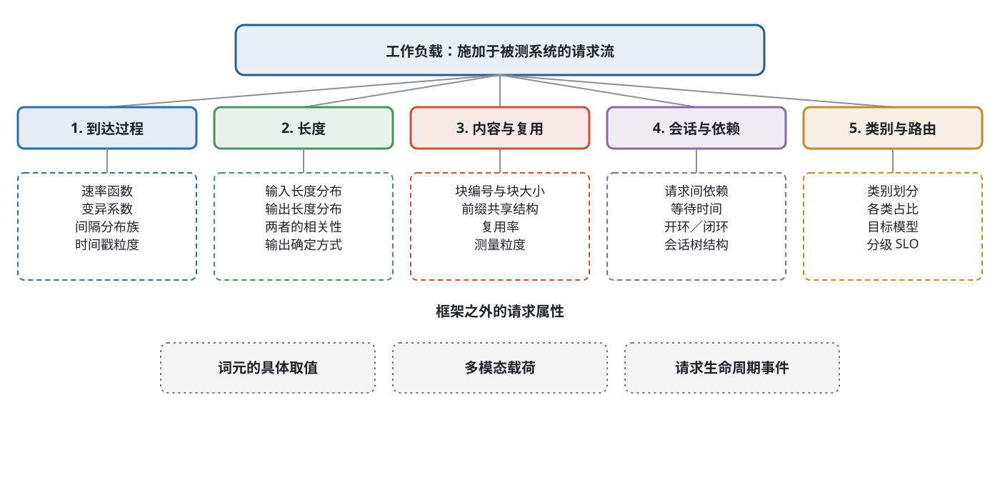
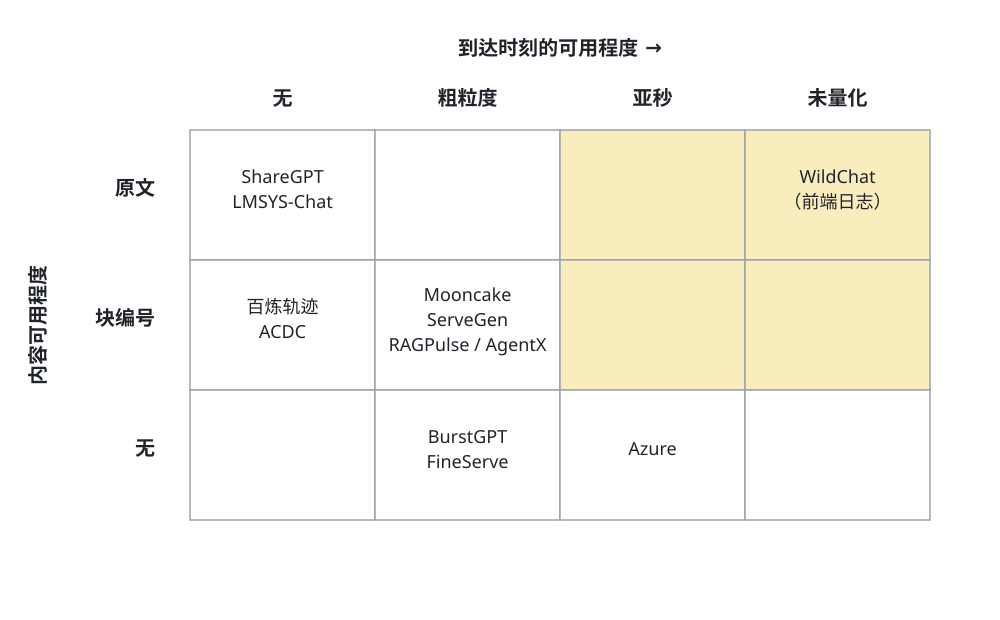
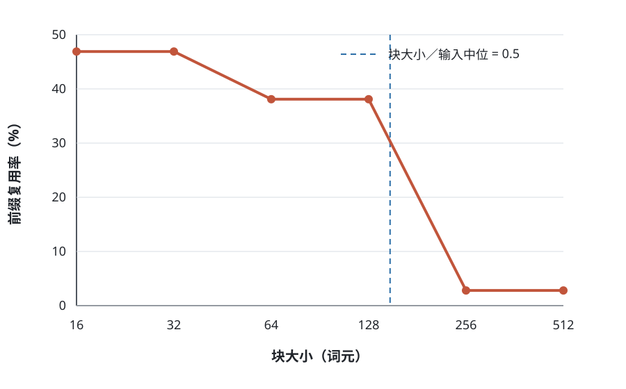
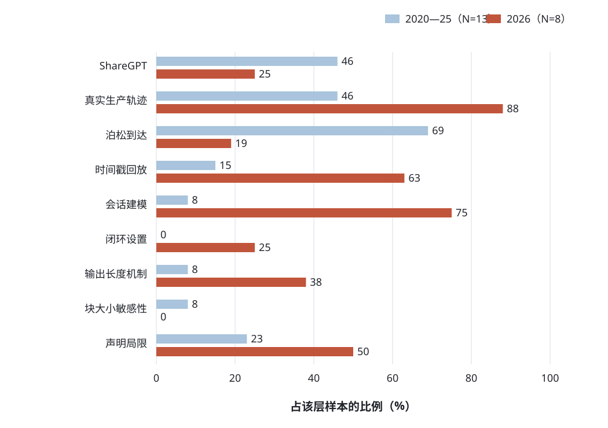

[下载中文论文 PDF（v1.0）](/blog/llm-inference-system-workload-survey/survey-zh-v1.0.pdf)

*论文版本 v1.0，日期 2026-09-06。*

> **摘要。** 推理服务系统的性能评估依赖所采用的工作负载，但现有研究较少系统考察负载本身的构成及其表示偏差。本文将工作负载界定为施加于被测系统的请求流，并从到达过程、长度、请求内容及其复用关系、会话依赖、流量类别与模型路由五个方面加以描述，同时给出该描述成立的前提条件，以及三类落在描述之外的请求属性。围绕这一框架，本文开展三方面工作。第一，梳理截至 2026 年 9 月可获取的公开负载数据集与负载生成工具，结果表明所考察的生产轨迹均未保留原始词元序列，到达时刻或内容标识普遍经过聚合或块化处理。第二，对 29 篇推理服务论文的实验设置按统一字段编码，结果为：其中 1 篇报告了 KV 缓存块大小的敏感性分析；2020 至 2025 年样本中近半数固定或截断输出长度，但多数未说明处理方式；所考察的 4 个仿真器均未直接回放生产到达时刻。第三，在 2026 年样本中观察到两种评测方式并存：其中面向真实系统的工作较多采用轨迹回放，仿真类工作较多采用固定长度与 ShareGPT 数据集。本文最后给出一份评测设置检查表，并列出若干尚待研究的问题。本文不构成对领域总体分布的估计，样本选择方式与局限见“有效性威胁与研究局限”一节。

**关键词：**大语言模型；推理服务；负载刻画；评测方法；前缀缓存

### English title and abstract

**A Survey of Workloads for Large Language Model Inference Serving: Description, Public Datasets, and Evaluation Practice**

> **Abstract.** Performance results for inference serving systems depend on the workload under which they are obtained, yet the workload itself has received little systematic attention. We define a workload as the request stream presented to the system under test and describe it along five aspects: the arrival process, lengths, request content and its reuse relation, session dependency, and traffic class with model routing. We state the conditions under which this description holds and identify three classes of request attribute that fall outside it. We then report three studies. First, we map the public workload datasets and load-generation tools available as of September 2026; none of the production traces we examined retains the original token sequence, and arrival times or content identifiers are generally aggregated or block-coded. Second, we code the experimental setup of 29 serving papers against a fixed set of fields: one reports a sensitivity analysis over KV cache block size; roughly half the 2020–2025 sample fixes or truncates output length, and most do not state the mechanism; none of the four simulators we examined replays production arrival timestamps. Third, within our 2026 sample we observe two coexisting evaluation practices: real-system work tends to use trace replay, while simulation work tends to validate on fixed lengths and ShareGPT. We close with a checklist for evaluation setups and a list of open questions. This study is not a prevalence estimate for the field; sampling and limitations are discussed in the section on threats to validity.

**Keywords:** large language model; inference serving; workload characterization; evaluation methodology; prefix caching

## 引言

微软发布的 Azure 大模型推理数据集在其说明文档中写道[^1]：

> 出于客户隐私要求，我们无法获知提示词的内容。我们改用生产轨迹来指导输入和输出的规模。
> 请注意，输入提示词的文本不影响我们所测量的性能指标，因为这些指标只取决于输入和输出的规模。[^2]

该说明隐含一个可检验的假设：对于所报告的性能指标，提示词的具体词元不产生影响。
公开文件因此只保留三列，即时间戳、输入词元数和输出词元数。
Splitwise[[1]](#ref-patel2024splitwise)沿用了其中的长度分布， 并以参数化泊松过程生成到达时刻。

这一假设对稠密模型的多数指标可能成立，但至少三个服务机制依赖词元的具体取值：
混合专家模型的路由器由隐状态与专家权重的乘积选出前若干个专家； 投机解码依据草稿模型与目标模型的
logit 决定是否接受； 生成何时终止取决于模型何时产生序列结束词元。

同一发布方在不同工件中的处理并不一致。SemiAnalysis 在发布 AgentX 智能体轨迹时， 以 64
词元的块编号代替原始内容；但该基准的场景设定中同时说明，
由于合成词元会改变投机解码的接受率，接受率被固定为常数。
两处处理所依据的内容假设不同，各自适用的指标范围需要分别说明。

上述例子反映出现有综述的一项空缺，下一小节展开说明。

### 与已有综述的关系

大语言模型推理服务已有若干综述，其组织主线各不相同， 但均以服务机制为主轴。表
[1](#tab-surveycmp) 列出本文考察的六篇及其覆盖情况。

**表 1. 已有推理服务综述对负载相关内容的覆盖。 “●”表示设有专门章节，“○”表示在其他章节中提及，“–”表示未见。 覆盖情况依据各文的目录与章节标题判定。**

| **综述** | **组织主线** | **负载** | **数据集** | **评测方法** |
| --- | --- | --- | --- | --- |
| Miao 等[[8]](#ref-miao2024towards) | 算法与系统 | – | ● | ○ |
| Zhen 等[[9]](#ref-zhen2025taming) | 服务机制 | – | ○ | ○ |
| Park 等[[10]](#ref-park2025engines) | 推理引擎 | – | – | – |
| Li 等[[11]](#ref-li2024hpec) | 优化技术 | – | – | – |
| Pan 与 Li [[12]](#ref-pan2025survey) | 请求处理与内存 | – | – | – |
| Zhou 等[[78]](#ref-zhou2024efficient) | 优化层次 | – | ○ | ○ |
| **本文** | **工作负载** | ● | ● | ● |

六篇均以服务机制或优化技术作为组织主线，未见以工作负载为主轴的章节。
其中覆盖最多的一篇设有一节未再细分的基准测试内容； 篇幅最长的一篇有 106
页，其目录中未出现负载、轨迹或基准相关的标题。 需要说明，缺少专门章节不等于完全没有讨论，
这些综述可能在缓存或调度章节中涉及数据集。 本文能够支持的表述是：在所考察的 6 篇综述中，
没有一篇以负载刻画作为主要组织维度。

本文与两类相邻工作的分工是： 与评测方法学讨论[[15]](#ref-agrawal2025evaluating)相比，
该工作面向实践者列举评估中的常见问题，本文侧重负载本身的描述框架与公开数据的梳理；
与单个数据集的刻画工作[[21]](#ref-xiang2026servegen), [[22]](#ref-wang2025burstgpt), [[16]](#ref-wang2025kvcachewild)相比，
后者深入分析某一份数据，本文做跨数据集的横向比较。

### 本文的工作

本文围绕工作负载开展三方面工作。

第一，给出一个描述框架（第 [3](#sec-framework) 节）。
我们从五个方面描述请求流，说明该描述成立的前提条件， 以及三类落在框架之外的请求属性，
并给出负载方面与系统机制的敏感性对照表。

第二，梳理公开数据集与负载生成工具（第 [9](#sec-tools) 节）。
所考察的生产轨迹均未保留原始词元序列，到达时刻或内容标识普遍经过聚合或块化处理。
我们进一步给出块化表示所引入偏差的方向与量级。

第三，调查该领域的评测设置（第 [10](#sec-audit) 节）。 我们逐篇阅读 29
篇推理服务论文的实验设置，按统一的八个字段编码， 据此统计各类负载设置及其缺失项的分布。

### 范围

本文的范围是推理服务（serving）的负载， 即请求如何到达、有多长、内容之间如何关联，
以及这些性质如何影响系统评测的结论。 不属于本文范围的有三类：
模型的推理能力（reasoning）——中文里“大模型推理”常指后者，需加以区分；
训练负载；以及结论不依赖负载性质的纯机制工作。

材料取自三个方面，覆盖 2023 年 1 月至 2026 年 9 月并回溯纳入奠基性工作：
公开发表与预印本的学术文献； 可下载的负载数据集；
以及负载生成与压测工具——对工具的判断均来自阅读其当前主分支的源码与文档，
而非其发布说明，因为两者时常不一致。

本文以负载的五个描述方面组织正文， 这一划分的依据见第 [3](#sec-framework) 节。

### 全文组织

第 [2](#sec-bg) 节介绍推理服务的基本概念与指标，供不熟悉该领域的读者参考。 第
[3](#sec-framework) 节给出负载的描述框架与分类。 第 [4](#sec-arrival) 节至第
[8](#sec-strat) 节按框架的五个方面分别综述。 第 [9](#sec-tools)
节梳理公开数据集与负载生成工具。 第 [10](#sec-audit) 节报告评测设置调查。 第
[11](#sec-discuss) 节归纳跨方面的观察， 第 [12](#sec-checklist) 节给出检查表， 第
[13](#sec-threats) 节讨论有效性威胁， 第 [14](#sec-open) 节列出尚待研究的问题，第
[15](#sec-related) 节讨论相关工作。

## 背景

本节介绍后文用到的推理服务概念与指标。熟悉该领域的读者可略过。

### 两个阶段与相应的资源特征

自回归模型处理一条请求分为两个阶段。 **预填充**（prefill）阶段一次性处理全部输入词元，
计算注意力所需的键值张量，该阶段可并行度高，通常受算力限制。
**解码**（decode）阶段逐个生成输出词元，
每生成一个词元需读取此前全部词元的键值，该阶段通常受显存带宽限制。

两个阶段的资源特征不同，由此产生若干系统设计：
把两阶段部署在不同设备上称为**预填解码分离**[[1]](#ref-patel2024splitwise), [[36]](#ref-zhong2024distserve)；
把预填充切分成若干块与解码交替执行称为**分块预填充**[[34]](#ref-agrawal2023sarathi), [[35]](#ref-agrawal2024sarathiserve)。
两者的取舍依赖于负载的输入输出长度比例， 因此负载的长度分布直接影响这类设计的评估结论。

### 键值缓存与前缀复用

解码阶段需要保存已处理词元的键值张量，合称**键值缓存**（KV cache）。
其占用随序列长度线性增长，通常是显存的主要消耗者。
主流引擎采用分页管理：把缓存切成固定大小的块，按块分配与索引， 块大小在 vLLM 中称为 `block_size`，在
SGLang 中称为页大小。

当两条请求具有相同的前缀时，前缀部分的键值可以复用， 无需重新计算，这一机制称为**前缀缓存**。
由于缓存按整块管理，复用也只能按整块进行： 匹配上的词元数不足一整块时，该块不能复用。
因此负载中的内容共享结构与引擎的块大小共同决定实际的复用收益， 这是第 [6](#sec-content)
节讨论的主题。

### 批处理与调度

**连续批处理**[[33]](#ref-yu2022orca)指在每个解码步重新组织批次，
已完成的请求离开批次，新到达的请求随时加入。 批次的组成因此取决于请求的到达时刻与剩余输出长度，
两者都是负载的属性。
在此基础上，若干引擎进一步把预填充与解码在批次内合并调度[[43]](#ref-holmes2024fastgen)，或以最大化吞吐为目标重排批内算子[[44]](#ref-zhu2024nanoflow)。
与之相对，面向离线批量处理的系统[[45]](#ref-sheng2023flexgen)不受时延约束，
可以采用完全不同的批次组织方式—— 这一区别说明批处理策略的评估结论依赖于负载是在线还是离线。

### 混合专家与投机解码

**混合专家**模型在每层设置多个专家网络， 由路由器根据当前隐状态为每个词元选择其中若干个。
各专家的负载是否均衡取决于路由结果，而路由结果依赖词元的具体取值。

**投机解码**用一个较小的草稿模型先生成若干候选词元， 再由目标模型一次性验证并决定接受多少。
接受率取决于两个模型在该内容上的输出分布是否接近。

这两项机制都依赖词元取值，而非仅依赖长度， 这一点在第 [3](#sec-framework)
节界定框架边界时会再次用到。

### 常用指标

**首词元时延**（TTFT）指从请求到达至产出第一个输出词元的时间， 包含排队与预填充。
**词元间时延**（TPOT）指解码阶段相邻两个输出词元之间的时间。
**吞吐**通常以每秒处理的词元数或请求数计。 **有效吞吐**（goodput）指满足给定时延约束的那部分吞吐。

服务水平目标（SLO）通常以 TTFT 与 TPOT 的分位数给出。 由于排队时延包含在 TTFT 中， TTFT
相关的结论对到达过程的真实性最为敏感。

## 负载的五个描述方面

### 划分依据

分类需要先说明分类的目的。本文的目的是： 描述一份负载需要交代哪些信息，才能使服务侧的行为可复现。
下列各方面均由这一目的推导。

按这一目的，复现一条请求流需要描述请求的到达时刻、输入与输出长度、
词元内容及其跨请求的复用关系、请求之间的依赖与等待时间、
以及流量类别与目标模型。据此得到五个描述方面， 其分类结构见图 [1](#fig-taxonomy)。

*图 1. 工作负载的描述框架。上两层为五个描述方面及其下属的可观测量； 底部虚线框为落在框架之外的三类请求属性，其中第一类是第 [6](#sec-content) 节讨论的主题。*

1.  **到达过程**：请求何时到来，密集程度如何随时间变化；

2.  **长度**：输入与输出各有多长，两者是否相关；

3.  **请求内容及其复用关系**：哪些请求之间共享内容，共享多少；

4.  **会话与依赖**：一条请求等待哪条请求完成，等待多久；

5.  **流量类别与模型路由**：有几类性质不同的流量，各自发往哪个模型。

### 该描述成立的条件

本文不宣称上述五个方面可以刻画一切推理请求。无条件的完备性断言在此无法证明，
下面先说明适用条件，再说明在该条件下可以得到什么。

**固定不变的量。** 本文讨论纯文本、自回归、单次调用的推理请求，并假定以下各项在一次实验内固定：
模型及其权重、解码参数（温度、top-$p$、随机种子）、 输出格式约束（如 JSON
模式或语法约束）、传输方式（流式或非流式）、 以及服务质量策略（配额、准入、优先级规则）。
这些量确实影响服务侧行为，但属于实验配置，不随请求逐条变化。

**在该条件下的两条性质。** 其一，五个方面互不重复，且各自必要：
对每一方面，都存在一类系统行为，在该方面失真时无法复现， 表 [2](#tab-sensitivity)
给出了对应关系与相应证据。 按 Nickerson 等人[[7]](#ref-nickerson2013taxonomy)的判据，
该划分满足其客观结束条件中“各维度互不重复、每个维度下都有实例”两条；
“不再产生新维度”一条本文无法验证，故不主张。

其二，若干常见的量或可由这五方面导出，或属于系统的输出而非输入。
前缀缓存命中率、批次组成、专家负载分布、排队时延属于后者：
它们是请求流与某个具体系统相互作用的结果，
取决于缓存容量、淘汰策略与路由，是被测量的对象而非可设定的条件。
客户端侧的工具调用耗时归入会话方面的等待时间， 租户与优先级标签归入流量类别。

**落在框架之外的三类量。** 以下三类既不能由上述五方面导出，也不是系统的输出：

1.  *词元的具体取值。* 第三个方面记录的是请求之间的内容复用关系，
    不是词元序列本身。两条请求流可以在五个方面上完全一致，
    却因词元取值不同而激活不同的专家、得到不同的投机接受率。 这正是第 [6](#sec-content)
    节讨论的问题： 公开数据普遍只保留复用关系而不保留取值。

2.  *多模态载荷。* 图像分辨率、patch 数、音频时长决定编码器的工作量，
    词元数与复用关系都不编码这些信息。本文的分析限于纯文本负载。

3.  *请求生命周期事件。* 客户端主动取消、超时放弃与重试属于外生事件，
    而非系统输出。本文考察的公开数据集均未记录（第 [14](#sec-open) 节）。

因此本文的表述是：在上述条件下，这五个方面构成一份文本推理负载的描述骨架。 本文不使用“完备”一词。

**表 2. 负载方面与系统机制的敏感性对照。●●● 表示已观察到结论方向发生变化， ●● 表示数值明显变化，● 表示有影响，○ 表示影响可忽略。 本表为定性对照；●●● 各格的依据见表下说明，其余各格为作者判断。 PD 分离指预填与解码阶段分离部署。**

| **负载方面** | **连续批处理** | **前缀缓存** | **PD 分离** | **调度与 SLO** | **混合专家** | **投机解码** | **容量规划** |
| --- | --- | --- | --- | --- | --- | --- | --- |
| 到达过程 | ●● | ○ | ● | ●●● | ○ | ○ | ●●● |
| 输入长度 | ●● | ● | ●●● | ●● | ● | ○ | ●● |
| 输出长度 | ●●● | ○ | ●●● | ●●● | ○ | ●● | ●● |
| 内容与复用 | ○ | ●●● | ●● | ● | ●●● | ●●● | ● |
| 会话结构 | ● | ●●● | ● | ●● | ○ | ○ | ●● |
| 流量类别 | ●● | ●● | ●● | ●●● | ●● | ● | ●●● |

**评级依据。** 到达 × 调度：开环与闭环设置下对同类机制报告的相对改进 相差约一个数量级（第 [10](#sec-audit) 节；该对比未控制实现差异）。 输入长度 × 预填解码分离：Splitwise 报告的最优资源切分随负载类别变化， 编码类为 (35,5)，对话类为 (25,15)[[1]](#ref-patel2024splitwise)。 输出长度 × 批处理与调度：忽略结束词元会使输出长度由压测设置决定 （第 [5](#sec-length) 节）。 内容与复用 × 前缀缓存：在 ACDC 离线轨迹 a 上，块大小由 16 增至 256 时 复用率由 46.9% 降至 2.8%（第 [6](#sec-content) 节）。 内容与复用 × 混合专家：DeepSeek 报告其生产环境中最热与最冷专家的负载相差 45.8 倍。 内容与复用 × 投机解码：AgentX 因合成词元改变接受率而将其固定为常数。 会话 × 前缀缓存：AgentX 会话内复用率为 98.9%，跨会话复用极少。 流量类别 × 调度与容量：BurstGPT 中单一类别占 77.7%， 四类之间输出长度中位数相差 9.2 倍、到达变异系数相差 22 倍[[22]](#ref-wang2025burstgpt)。

### 公开数据集概览

后续各节反复用到若干公开数据集，此处先给出总览，见表 [3](#tab-datasets)。
纳入条件是可下载且包含请求级记录； 仅报告统计摘要或拟合参数的工作不入表。

**表 3. 公开的大语言模型服务负载数据集。 “时间粒度”一列中，括号内为本文实测值； “内容表示”一列中，块大小指该数据集生成块编号或哈希所用的词元数。 标注“*”者为本文下载并核对过数据模式的数据集。**

| **数据集** | **来源** | **时间粒度** | **内容表示** | **会话字段** | **备注** |
| --- | --- | --- | --- | --- | --- |
| *（a）生产服务端轨迹* |  |  |  |  |  |
| Azure LLM 2023* | 微软 | 亚秒绝对时刻 | 无 | 无 | 分对话与代码两份 |
| Azure LLM 2024 | 微软 | 亚秒绝对时刻 | 无 | 无 | 字段同 2023 |
| Azure LMM 2025 | 微软 | 亚秒绝对时刻 | 无 | 无 | 唯一记录图片数量的多模态轨迹 |
| BurstGPT*[[22]](#ref-wang2025burstgpt) | 高校服务 | 1 秒整数 | 无 | 部分文件有 | 各文件列数不一致 |
| Mooncake*[[3]](#ref-qin2025mooncake) | 月之暗面 | 毫秒字段（实测约 3 秒） | 块编号，块大小 512 | 无 | 分对话、工具、合成三类 |
| ServeGen*[[21]](#ref-xiang2026servegen) | 阿里 | 600 秒速率表 | 块哈希，块大小 16 | 多轮文件有 | 在线与多轮两份 |
| ACDC*[[20]](#ref-yang2026acdc) | 阿里 | 无（整批提交） | 块编号，块大小 16 | 无 | 离线批处理，六份 |
| 百炼轨迹[[16]](#ref-wang2025kvcachewild) | 阿里 | 相对时刻，绝对时刻已移除 | 块哈希，块大小 16 | 有父子链 | 公开的是两小时抽样 |
| FineServe | PPIO | 声明不一致，内部分辨率不细于 1 秒 | 无 | 无 | 按架构、规模、意图三维分层 |
| RAGPulse | 检索增强服务 | 1 秒整数 | 按语义部件分解的哈希 | 有 | 唯一的检索增强服务轨迹 |
| *（b）智能体轨迹* |  |  |  |  |  |
| AgentX* | 智能体框架 | 相对时刻，闭环 | 块编号，块大小 64，会话内有效 | 有依赖图 | 含请求间依赖 |
| *（c）前端对话日志，非服务端* |  |  |  |  |  |
| WildChat[[77]](#ref-zhao2024wildchat) | 聊天前端 | 微秒绝对时刻，未量化 | 原文 | 有 | 无词元数、无排队信息 |
| ShareGPT* | 用户分享 | 无 | 原文 | 有 | 事实上的默认长度语料 |
| LMSYS-Chat-1M*[[76]](#ref-zheng2024lmsys) | 对话竞技场 | 无 | 原文 | 有 | 本体无时间戳字段 |

表中的分组本身说明一个问题。 （a）组具备真实的到达时刻与服务端上下文，但都不保留原始文本；
（c）组保留原始文本，其中 WildChat 还带有微秒精度且未经量化的时间戳，
但它记录的是前端对话，没有实例标识、排队时延与缓存信号。 由此可以给出一个精确的表述：
在本文检索到的数据集中， 没有任何一份生产服务端轨迹同时保留真实到达时刻与原始词元序列； WildChat
两者兼备，但它不是服务端轨迹。

这一格局的直接影响是， 凡是同时依赖到达过程与词元取值的实验， 目前只能通过拼接两类数据来构造，
而拼接引入的偏差尚无系统评估。

图 [2](#fig-quadrant) 把表 [3](#tab-datasets) 的两列排成一张网格。
横向为到达时刻的可用程度，纵向为请求内容的可用程度。 右上区域（两者同时较强）没有服务端轨迹。

*图 2. 公开数据集在到达时刻与请求内容两个维度上的分布。 横向“未量化”指时间戳未经聚合；纵向“块编号”指以块编号或哈希代替原文。 黄色为两者同时较强的区域：其中只有 WildChat，而它是前端对话日志， 不含实例标识、排队时延与缓存信号。 所考察的生产服务端轨迹全部落在该区域之外。 百炼轨迹的绝对时刻已被移除，故列于“无”。*

受隐私和存储成本限制，公开的生产轨迹通常不包含原始词元序列。 以 Mooncake 对话轨迹为例，其 1.45
亿词元若以文本存储约需 580 MB， 以块编号存储则为 2.89 MB。
这一取舍有其理由；本文关注的是这种表示方式引入的偏差， 以及现有研究对该偏差缺乏系统评估。

另有若干工作报告了规模可观的生产数据但未发布轨迹， 包括一份覆盖 12 个月、61.2
亿请求的服务商数据[[72]](#ref-nixon2026year)
（其脚注声明发布已获批准，但截至本文检索时未见发布）、 一份覆盖 320 万用户与 7.61
亿次调用的代码补全服务数据[[67]](#ref-liu2026copilot)， 以及若干声明将开源但仓库不存在的工件。
这些数据若能发布，将明显改变上表的格局。

## 到达过程

### 三个统计量

描述到达过程通常使用三个量：速率、变异系数、到达间隔的分布族。

以 10 分钟为窗口统计时，到达速率随时间明显波动。 在 ServeGen 的客户端样本中，最忙的 10% 时段贡献了
53.4% 的请求量； 仅依据全时段平均速率配置容量会低估高峰需求。

变异系数（CV）在本文中指相邻请求到达间隔的标准差除以均值，
刻画间隔的离散程度；使用比值而非方差是为了让速率不同的两份数据可以直接比较。 需要注意三点：CV 等于 1
是指数间隔的性质，不足以判定该过程为固定速率的齐次泊松过程；
非齐次泊松过程因速率随时间变化，其间隔的 CV 也会大于 1； CV 大于 1
表示离散程度高于指数分布，但不能单独证明存在成簇到达。

Azure 数据集同一天同一集群的两个文件，在同一段 30 秒内每秒的到达数为：

> 对话 (CV=1.09) 3 5 8 3 3 5 4 4 2 2 6 3 5 5 6 $\cdots$
>
> 编码 (CV=13.15) 0 0 0 0 0 0 0 0 0 0 0 0 0 0 0 $\cdots$

括号内的 CV 由逐请求的到达间隔算出，
上面列出的每秒计数序列只用于直观展示两者的差别，两者不是同一统计量。

对话类请求较为平稳；编码类在这 30 秒内没有请求， 但其最忙的一秒到达 67 条，73% 的秒没有请求。
两者的平均速率相差不到三倍，排队行为却明显不同。

### 时间戳的记录粒度

我们使用一个诊断量：不同时间戳数与记录数之比。 该比值较低时，时间戳可能在采集或发布阶段经过聚合。 表
[4](#tab-tsquant) 给出实测结果。

**表 4. 时间戳记录粒度的实测。比值 = 不同时间戳数 / 记录数**

| **数据集** | **记录数** | **时间戳数** | **比值** | **网格** |
| --- | --- | --- | --- | --- |
| Azure 对话 | 19,366 | 19,366 | 100% | 无 |
| Azure 编码 | 8,819 | 8,819 | 100% | 无 |
| Mooncake 对话 | 12,031 | 1,180 | 9.8% | 约 3 秒 |
| Mooncake 工具 | 23,608 | 1,180 | 5.0% | 约 3 秒 |
| BurstGPT | 1,404,294 | 767,313 | 54.6% | 1 秒 |

比值低本身不等于数据不可用，并发到达也会产生相同时间戳， 判断依据在于取值是否落在规则网格上。
Mooncake 的间隔取值集中于三个数：3000 ms 出现 651 次， 2999 ms 出现 263 次，3001 ms 出现 260
次，其余合计 5 次； 每个时间戳上的请求数中位为 10 条。
这一形态难以由偶然的同刻到达解释，更接近按固定窗口聚合的结果，
但也不能完全排除真实存在的周期性批量提交。

由此得到的限制有两条。其一，在没有额外的桶内到达模型的情况下，
该轨迹不适合直接用于回放排队过程或首词元时延，
因为桶内的请求顺序与间隔已经丢失，而队列行为对这两者是非线性的。 其二，在远大于 3
秒的时间窗内统计到达量或提供负载，受该聚合的影响较小。 需要注意，这不等于说吞吐类结论一律不受影响：
人为的成批到达同样会改变系统的实际吞吐。 该数据集报告的变异系数（对话 3.03、工具
4.36）反映的是聚合后的形态， 不宜直接解释为原始负载的突发程度。

这一记录粒度不易从数据模式中看出。 vLLM 的轨迹加载器提供 `timed-trace-sec-multiplier` 参数， 其
Mooncake 示例中显式传入 0.001，表明该字段以整数毫秒计。 声明单位为毫秒而实际取值落在 3 秒网格上，
加载器依据传入的单位换算时间戳，因而会原样保留这种周期性聚合。

### 所分析的生产轨迹普遍偏离泊松假设

ServeGen 提供了本文所见粒度最细的数据： 来自某生产平台 422 个客户端的 36,969 个活跃时段中，
变异系数的中位数为 1.61，小于等于 1 的占 13.3%，大于 5 的占 20.8%； 其间隔分布的拟合结果为
Gamma（61%）与 Weibull（38%），未出现指数分布。

多智能体流量的到达间隔在 2026 年也被报告偏离泊松假设，
并给出了按拓扑条件化的间隔分布[[13]](#ref-multiagent2026)。
这些结果与经典网络流量研究[[6]](#ref-leland1993self)的结论一致，
说明在推理服务场景中采用泊松到达之前需要先检验其适用性。

需要补充的是，速率、CV 与边缘分布族不能刻画自相关、长程相关
或多客户端之间的同步效应。上述诊断量只能作初步筛查， 更完整的判断需要点过程检验或离散指数分析。

### 文献中的到达设置

按第 [10](#sec-audit) 节的编码结果，2020 至 2025 年样本的 13 篇中， 9 篇采用泊松到达，2
篇回放真实时间戳。

vLLM 的实验设置一节写道[[2]](#ref-kwon2023vllm)：
“由于这些数据集不包含时间戳，我们使用不同请求速率下的泊松分布来生成请求到达时刻。”
DistServe[[36]](#ref-zhong2024distserve)与
FastServe[[37]](#ref-wu2023fastserve)采用了相同的处理理由， 其中 FastServe
明确标注沿用先前工作。 三篇论文的措辞高度接近，但本文只能观察到这一理由的重复出现，
不足以判定其传播路径：FastServe 与 DistServe 存在作者重叠，
各版本的时间先后也需核对版本历史才能确定。

作为对照，AlpaServe[[38]](#ref-li2023alpaserve)的处理是把原始轨迹切成时间窗，
在每个窗内用速率与变异系数两个参数拟合 Gamma 过程，该做法继承自更早的服务系统工作。
该文同时声明当时不存在公开的生产推理轨迹，因而改用无服务器计算的函数调用轨迹替代。
这一对比说明，后续工作在采用更接近真实的内容或长度分布时，
往往没有同时保留到达过程的统计特征。本文不对这一现象的成因作出判断。

到达过程之所以值得单独处理，是因为若干机制的收益直接建立在其形态上。
以负载均衡与迁移为目标的调度工作[[39]](#ref-sun2024llumnix)依赖实例间瞬时负载的差异，
而该差异由到达的突发程度决定；
面向流式输出体验的工作[[40]](#ref-liu2024andes)把用户感知的流畅度定义为随时间变化的量，
其评估结论同样依赖请求在时间上的分布；
无服务器形态的推理服务[[41]](#ref-fu2024serverlessllm)以冷启动开销为核心问题，
而冷启动是否频繁取决于请求间隔的长尾形态。
上述工作各自采用了不同的到达设置，本文未见它们之间做过统一到达过程下的对照。

工具方面，Gamma 分布已有四个工具支持 （vLLM 的 `burstiness` 参数、AIPerf
的到达模式选项、ServeGen、BurstGPT 自带生成器）， Weibull 仅 ServeGen 一家，正弦仅 Dynamo 一家；
在所考察的 24 个工具中，未见支持马尔可夫调制泊松过程或 Hawkes 过程的实现。 SGLang
是所考察的主流框架中唯一只提供指数分布的。

因此本节的结论是：现有工具已支持多种到达分布，
但分布选择的依据以及模型失配所致的误差，目前仍缺乏系统评估。

## 长度

### 不同数据集之间的输入长度差异

表 [5](#tab-lengthgrowth) 按采集时间列出各数据集的输入长度中位数。

**表 5. 各数据集的输入长度中位数**

| **数据集** | **采集时间** | **输入中位** | **相对值** |
| --- | --- | --- | --- |
| BurstGPT | 2023 | 262 | 0.3× |
| ACDC 离线 a | 2026 | 298 | 0.3× |
| Azure 对话 | 2023-11 | 1,020 | 1× |
| Mooncake 对话 | 2024 | 6,909 | 6.8× |
| AgentX | 2026 | 201,664 | 198× |

这是跨数据集的取值范围，不能直接解释为同一业务随时间的增长：
不同年份的数据同时对应不同厂商、不同应用与不同负载类别， AgentX 并非 Azure 对话负载的后继采样。
可以支持的结论是：公开数据集在输入长度上存在三个数量级的差异， 因此负载库应报告采集时间与业务类型，
较早的长度分布不宜直接代表当前的长上下文业务。

### 三种常见的长度失真

**截断。** Azure 编码类数据的输入长度分位数为 P95 = 7,303、P99 = 7,436、P100 = 7,437，
三个分位数接近。这种形态提示采集侧存在截断， 只能通过观察高分位数发现，均值与中位数不体现。

**双峰分布。** Mooncake 工具调用轨迹的输出长度为 P25 = 13、P50 = 30、P75 = 356， 最短长度区间占
62%。同一数据集的前缀命中深度也呈双峰： 仅命中一块的请求占 61.3%，命中十块以上的占 21.8%，
该数据集报告的 36.6% 总复用率主要来自后者。 按均值设计缓存策略会偏离实际分布。

**差异较大的预填解码比例。** ACDC 的离线轨迹 d 与 e 分处两端： 前者输入中位 56、输出中位
1,468，比例约 1 比 26； 后者输入中位 707、输出全部为 5，比例约 141 比 1；AgentX 约为 395 比 1。
声称对“典型负载”成立的结论，应说明其在这一区间的哪一段成立。

### 输入与输出长度的相关性

Azure 对话类的相关系数为 $-0.112$，编码类为 $+0.001$，两者接近独立； BurstGPT
的四个类别内相关系数在 $+0.236$ 至 $+0.368$ 之间。 BurstGPT 的聚合相关系数为
$+0.243$，类别内加权平均为 $+0.248$，两者接近， 说明该相关性并非由类别混合造成。

因此输入与输出长度既不宜一律假设独立，也不宜一律假设相关，需按数据集实测。
这一点在合成负载生成中尤为重要：独立采样两者会破坏真实数据中的联合分布。

### 输出长度的不可预知性与相关工作

输出长度在请求到达时不可知，这一性质派生出一条独立的研究线。

一类工作试图预测长度以改进调度。
$S^3$[[57]](#ref-jin2023s3)训练分类器预测输出长度区间，据此分配显存并提高批次占用率；
序列调度[[58]](#ref-zheng2023seqsched)用模型自身预知回复长度， 把长度相近的请求归入同一批次。
两者都要求给出预测误差的处理方式，因为低估会导致重新分配。

另一类工作不预测长度，而是让系统对长度的不确定性不敏感。
SuperServe[[59]](#ref-khare2023superserve)面向不可预知负载调整模型规模；
尾部感知调度[[24]](#ref-beyondpred2026)明确以不依赖预测为前提， 针对尾时延而非平均时延设计。
这两类工作的前提互斥：前者的收益随预测精度上升，后者的价值恰在预测不可靠时体现。
本文未见二者在同一负载下的直接对照。

长度分布的形态还决定某些系统形态是否成立。
以检索增强与推荐为代表的场景中，输出长度极短甚至只有一个词元，
针对这类负载的引擎[[60]](#ref-du2025prefillonly)把解码阶段整体略去；
反之，长上下文工作[[55]](#ref-wu2024loongserve), [[56]](#ref-lin2024infinitellm)
面向输入长度远超单卡显存的情形， 其弹性序列并行与分布式注意力的收益随输入长度增长而增大。
这两类工作的适用区间由第 [5](#sec-length) 节所述的预填解码比例划分，
而该比例在公开数据集之间相差两个数量级以上。

### 输出长度的强制控制

压测工具普遍通过忽略序列结束词元的方式强制生成到指定长度。
这一设置关闭了模型的自然终止机制，使输出长度主要由压测配置决定。

第 [10](#sec-audit) 节的编码结果显示， 2020 至 2025
年样本中约半数论文固定或截断了输出长度， 其中说明了处理机制的为 1 篇完整、1 篇部分。

2026 年样本中的部分智能体工作也采用强制输出长度，但所述理由不同： 目的是保持跨轮轨迹的一致性。
SMetric[[17]](#ref-wang2026smetric)指出，被评测模型的回复与轨迹记录不同会以两种方式 破坏 KV
缓存复用模式，即生成长度可能不同， 且后续请求记录的历史不再匹配服务实例实际缓存的词元；
该文因此忽略结束词元并按记录长度截断， 并进一步用生成的内容重写一部分后续请求。

这一处理表明，在会话回放场景中，内容与输出长度需要联合控制。
该处理本身对性能测量结果的影响，目前尚未见量化报告。

### 长度分布影响归一化指标的解释

一项 2026 年的能耗刻画工作[[23]](#ref-vellaisamy2026energy)报告：
在固定硬件与批大小下，输出长度从 10 增至 512 词元时， 每词元能耗由 7.46 焦降至 0.72
焦，单次窗口总能耗由 1.19 千焦升至 5.93 千焦； 批大小 16 相对批大小 1 的增益，从上下文 512 时的 6.31
倍下降到上下文 4K 时的 1.17 倍。

因此，以词元归一化的指标依赖于负载的长度分布，
报告“每词元成本”时应同时给出长度分布，否则该数值难以解释。

延迟指标上存在类似情况。一项 2026 年的调度工作[[24]](#ref-beyondpred2026)报告，
最短作业优先相对理想预测（oracle）的对照，端到端延迟均值改善 11.1%、 P95 改善 12.5%，而 P99 上升
11.2%。 均值与 P99 反映该策略的不同侧面，仅报告其中之一会突出不同的结论， 因此应同时报告多个分位数。

## 请求内容及其复用关系

内容方面同时影响前缀缓存、专家路由与投机解码，而公开数据对该方面保留最少。

### 公开数据的内容表示

所考察的生产轨迹中，提供内容信息的一类采用块编号而非原始文本， 其余（如 Azure 与
BurstGPT）不提供任何内容字段，见表 [3](#tab-datasets)。
块编号的生成流程为：真实内容经哈希得到一串整数，再重新编号为较小的连续整数；
哈希这一步的结果不在文件中保留。

我们检查了编号的取值范围： Mooncake 对话轨迹的唯一编号数为 182,790，最大编号为 182,789； ACDC
离线轨迹 a 为 625,269 与 625,268。 编号恰好填满区间 $[0, N-1]$，说明编号是稠密的，
即每个编号都被使用、没有空洞。 需要说明的是，稠密性本身不能证明编号是按首次出现的顺序分配的；
要确认这一点需要另行检查各编号首次出现的位置是否单调，本文未做该检查。

由此可得两点。其一，不能用文件中的编号做哈希碰撞分析，
因为碰撞（若存在）发生在重新编号之前，文件中不可见。
其二，编号只在其所属文件内有意义，除非发布方声明使用了跨文件的统一计数器。

块级表示是在“整条请求一个标识”与“原始词元序列”之间的折中：
前者无法表达部分前缀共享，后者在体积与隐私上均不可行。 需要强调，只有当轨迹的块长与推理引擎的 KV
缓存块长一致时， 块级表示才对应引擎的缓存管理粒度；两者不一致的情形见 [6.4](#sec-threeerr)
节。

### 依赖内容复用的系统机制

复用关系之所以构成一个独立的描述方面，
是因为围绕它已形成一批机制，而这些机制的收益直接由复用结构决定。

**按前缀组织缓存。**
SGLang[[46]](#ref-zheng2024sglang)以基数树组织已缓存的前缀，使多条请求共享公共部分；
提示缓存[[47]](#ref-gim2024promptcache)进一步允许复用非连续的模块化片段，
代价是需要预先声明可复用的结构。
两者的收益都随请求间共享比例上升，而该比例是负载的属性而非系统的属性。

**把复用纳入调度。** Preble[[50]](#ref-srivatsa2025preble)把前缀共享作为分布式调度的目标，
使同前缀请求落在同一实例；
MemServe[[51]](#ref-hu2024memserve)在分离式架构下用弹性内存池跨实例共享上下文。
这类工作的评估结论对负载的共享结构最为敏感： 若测试负载中请求彼此独立，调度策略之间不会出现差别。

**放宽“完全相同”的要求。** CacheBlend[[48]](#ref-yao2025cacheblend)针对检索增强场景，
允许把多个非前缀位置的缓存片段融合后使用，并对少量位置重新计算；
Cache-Craft[[52]](#ref-agarwal2025cachecraft)以分块方式管理检索片段的缓存。
这两项工作说明，可复用的范围取决于对生成质量损失的容忍度，
因而“复用率”这一数值本身依赖于所采用的复用判据。
CacheGen[[49]](#ref-liu2024cachegen)则把已计算的缓存压缩后跨节点传输，
其收益取决于缓存被再次使用的概率。

**改变缓存的存储形态。**
vAttention[[53]](#ref-prabhu2025vattention)指出分页并非实现动态显存管理的唯一途径，
主张用虚拟内存机制保持张量连续。 这一路线与块大小的关系不同于分页方案， 因而第
[6.4](#sec-threeerr) 节所述的块粒度偏差在该形态下的表现需要另行分析。
关于键值缓存管理的更完整梳理见相关综述[[54]](#ref-li2026kvsurvey)。

上述机制的共同点是：它们的评估都需要一个具有真实共享结构的负载， 而第 [3.3](#sec-datasets)
节已说明，公开数据中的共享结构以块编号形式给出。 下面说明这一表示对测量结果的影响。

### 块大小对复用率测量的影响

复用率的测量结果依赖于测量所用的块大小。 我们以 ACDC 离线轨迹
a[[20]](#ref-yang2026acdc)（原始块大小 16）为基准做粗化实验： 将相邻的若干个 16
词元块合并为更大的块（下文称粗化），重新计算前缀复用率， 分母固定为真实输入总量。结果见表
[6](#tab-blockcliff)。

需要先说明这份数据的性质。它是一个整批提交的离线批处理任务 （词典翻译，51,429
条请求），没有逐请求的到达时刻， 记录顺序为提交文件中的顺序。
选它做这项实验，是因为在本文考察的公开数据中它的内容粒度最细（16 词元）， 因而能作为粗化的参照基准；
代价是这类负载的前缀共享来自统一的任务模板， 共享比例高于交互式对话负载，下降的位置也随之不同。 第
[13](#sec-threats) 节说明由此带来的推广限度。

测量按如下约定进行，以便复现：缓存容量取无限、不做淘汰，
因而所得为轨迹在给定块大小下可分辨的前缀复用，而非某引擎实际可达的命中率；
按文件中的记录顺序流式匹配，每条只与在其之前的记录比较； 采用精确前缀匹配，遇首个不同块即停止；
粗块按其实际代表的原始块数计费，而非一律按整块计费；
分母固定为全部记录的输入词元总量，不随块大小变化。
计算脚本、所用数据的校验值与上述逐项定义随本文一并公开。

**表 6. 复用率随块大小的变化（ACDC 离线轨迹 a，原始块大小 16）**

| **块大小** | **块 / 输入中位** | **前缀复用** | **有命中的请求** |
| --- | --- | --- | --- |
| 16 | 0.05 | 46.9% | 100.0% |
| 32 | 0.11 | 46.9% | 100.0% |
| 64 | 0.21 | 38.1% | 100.0% |
| 128 | 0.43 | 38.1% | 100.0% |
| 256 | 0.86 | 2.8% | 2.8% |
| 512 | 1.72 | 2.8% | 2.8% |

计费方式：粗块由连续若干个 16 词元块拼成，末尾的粗块可能不满， 按其实际代表的基础块数计费。粗化不应增加可复用量，表中数值满足这一单调性。

同一结果以曲线呈现见图 [3](#fig-blockcliff)。 复用率并非随块大小平缓下降，而是呈阶梯状：
在比值越过 0.5 附近时由 38.1% 落至 2.8%。

*图 3. 前缀复用率随块大小的变化（ACDC 离线轨迹 a，51,429 条记录， 原始块大小 16 词元，输入长度中位数 298）。 虚线为块大小与输入长度中位数之比等于 0.5 的位置。 纵轴分母固定为真实输入总量，故各点可直接比较。*

机制可用该轨迹的前两条记录说明。两条请求的块序列分别为 $[0,1,\dots,9,\ 10,11,\dots,16]$ 与
$[0,1,\dots,9,\ 17,18,\dots,24]$，共享前 10 块。 粗化到 64 时公共前缀为 2 块，粗化到 128 时为 1
块，粗化到 256 时为 0 块： 一个 256 词元的粗块横跨原来的第 0 至 15 块， 其中既有共享的第 0 至 9
块，也有各自不同的第 10 块以后， 整块内容只要有一处不同，该粗块就不能计为命中。

在这条轨迹上，当块大小与输入长度中位数之比由 0.43 增至 0.86 时，复用率明显下降。 比值 0.5
可作为敏感性分析的预警值，但该阈值来自单条轨迹的两个相邻取值，
不足以作为通用判据。更贴切的参照量应是共享前缀长度的分布，而非输入长度中位数；
获得该分布需要逐轨迹重新计算，本文未对所有数据集完成这一步。

### 块级表示带来的三类偏差

块级表示会在三处引入偏差。三者的参照量不同，不能相加，需分别说明。 记真实的逐词元公共前缀长度为
$S$，轨迹块大小为 $B_t$，引擎块大小为 $B_e$。

**偏差一：轨迹块粒度不能表达不足一块的共享。** 轨迹可观测的共享量为
$T = \lfloor S/B_t \rfloor \cdot B_t$， 相对 $S$ 每段共享少记 $S \bmod B_t$ 个词元。
若假设余数在 $\{0,1,\dots,B_t-1\}$ 上均匀分布，其期望为 $(B_t-1)/2$。
这一假设是否成立取决于共享前缀长度的分布，需逐轨迹检验。

我们在 ACDC 离线轨迹 a 上做了一次检验： 以块大小 16 的测量结果为参照，粗化到 64 后每条命中平均少记
31.1 个词元 （$(8{,}511{,}920-6{,}911{,}936)/51{,}428$，分母为该轨迹上有命中的请求数）。
在均匀余数假设下，由 16 粗化到 64 新增的期望损失应为 $(64-16)/2 = 24$ 个词元。
实测值高于该估计，说明该轨迹的余数分布并不均匀，
均匀假设在此偏于乐观。因此本文不用该假设去反推其他数据集的“真值”。
若仍要给出估计，应写明它是均匀余数模型下的外推， 并同时给出命中请求数与敏感性范围。

**偏差二：按匹配块数乘以块大小计数时的高估。** 若统计脚本把匹配上的块数直接乘以
$B_t$，而不按请求的实际输入长度截断， 末尾不满一块的部分会被记为整块。
这不是块级表示的固有性质：只要输入长度字段可用，该偏差可以完全消除。 在 ACDC 离线轨迹 a
上，未截断与按输入长度截断两种口径相差 10,600 个词元， 以真实输入总量 18,131,603 为分母，相当于
0.059 个百分点。 该量级由数据集与块大小共同决定，不宜当作普遍可忽略的常数：
它取决于有多少请求的共享前缀恰好终止于其输入末端。 本文表 [6](#tab-blockcliff)
的计数已按实际代表的基础块数计费，不含该项。

**偏差三：引擎块大小限制可实现的命中。** 这一项不是轨迹的测量偏差，而是引擎的能力约束，
但它决定了轨迹测得的复用率能否被系统实际利用。 引擎按整块索引与分配，可实现的复用量为
$E = \lfloor S/B_e \rfloor \cdot B_e$： 匹配上 10 个词元而 $B_e = 16$ 时该块不能复用，
因为块内其余 6 个词元的 KV 属于其他请求。 SGLang 称之为页大小，vLLM 称之为块大小。

$T$ 与 $E$ 的关系取决于 $B_t$ 与 $B_e$ 的相对大小，方向不固定： $B_t > B_e$
时轨迹低估可实现命中，$B_t < B_e$ 时轨迹反而可能高估。
因此跨数据集比较复用率时，必须同时报告轨迹块大小与引擎块大小，
并说明两者的相对关系；只报告其中之一无法判断偏差方向。

### 公开配置中的块大小取值

在本文收集的公开配置中，从生产流量插桩得到的块大小取值为 16 与 64： 16 见于 vLLM
的默认值与某生产平台轨迹的匿名化流程， 64 见于 AgentX 的采集代理、AIPerf 的默认值与 SGLang
分层缓存的基准配置。 OpenAI 在报告缓存词元数时向下取整到 128 的倍数，反映其可观测粒度为 128。 512
见于 Mooncake 公开轨迹与一个合成生成器的默认配置。

据此可以说明的是：512 在本文收集的公开配置中出现较少， 尚不能视为通用的生产配置。粗化到 512
会低估短追加型负载的复用率， 而这类负载在智能体场景中较为常见：
TraceLab[[18]](#ref-zhu2026tracelab)测得的每轮追加长度中位数为 875 词元， 相当于 1.7 个 512
块或 13.7 个 64 块。

此处需要区分一个易混淆的量：厂商公布的最小可缓存前缀长度 （Kimi 256、Groq 128 至 1024、OpenAI 1024
或 2048、Anthropic 1024 至 4096） 是商业与路由层面的阈值，与块大小不是同一参数。
把最小可缓存前缀理解为块大小会有一到两个数量级的偏差， OpenAI 自身 128 词元的报告粒度即为佐证。

vLLM 近期新增的 `prefix_match_unit` 字段明确了这一区分： 该字段的说明指出，它可以设置得比物理 KV
缓存块更细， 从而使命中落在物理块内部的边界上。 块长为 512 的轨迹不能解析位于 512
词元块内部的首次分歧位置， 因此无法用于评估匹配单元小于 512 词元时带来的增益。

### 默认块大小取值与其评测负载的关系

vLLM 论文第 7.2 节写道[[2]](#ref-kwon2023vllm)：

> 块大小的选择对 vLLM 的性能有明显影响。块太小时，vLLM 可能无法充分利用 GPU 在读取和处理 KV
> 缓存上的并行度；块太大时，内部碎片增加，且共享的概率下降。…… 在 ShareGPT 轨迹上，16 至 128
> 的块大小性能最佳。在 Alpaca 轨迹上，16 与 32 表现良好，
> 而更大的块会显著降低性能，因为序列长度短于块大小。 实践中我们发现，块大小 16 既足够大以有效利用
> GPU， 又足够小以在多数负载下避免明显的内部碎片。 据此，vLLM 将默认块大小设为 16。

由此可以观察到三点。 第一，该实验中块大小的最优区间随数据集变化： ShareGPT 上 16 至 128
差异较小，Alpaca 上则惩罚较大的块。 第二，作者给出的取值理由是 GPU 利用率与内部碎片之间的权衡，
并非仅由某一个数据集决定；本文不认为 16 是 Alpaca 的产物。 第三，该权衡是在 2023 年的负载上校准的，
而后续工作使用的负载在长度上远高于这两个数据集： Mooncake[[3]](#ref-qin2025mooncake)平均输入
7,955 至 19,019 词元， Sarathi[[34]](#ref-agrawal2023sarathi)使用的论文摘要数据集输入 P90 为
12,985 词元。

还需区分两件事：该实验测的是分页注意力的物理块大小及其端到端性能，
与本节讨论的前缀匹配粒度不是同一个量， 后者在部分引擎中可以设得比物理块更细。
因此这里能够支持的表述是： 这一默认值所依据的权衡值得在当前长度分布下重新评估，
而不是该默认值当初选错了。

在本文审计的 29 篇论文中，未见对该参数重新报告敏感性分析的工作。

### 依赖词元取值而非仅依赖复用关系的机制

第 [3.2](#sec-scope) 节指出，词元的具体取值落在五个方面之外：
复用关系是等价关系，只记录哪些片段相同，不记录它们是什么。
有两类机制的行为直接依赖取值本身，因而无法由复用关系推出。

**混合专家的路由。** 每个词元由路由器分配给若干专家，因而各专家的负载取决于词元取值。
围绕这一点已有若干系统工作： 以分离式专家并行提升规模效率[[61]](#ref-zhu2025megascaleinfer)、
按专家激活模式在多节点间划分[[64]](#ref-bambhaniya2026moeactivation)、
以及预测专家激活以提前搬运权重[[62]](#ref-yu2025moepatterns)。
这些工作的收益都取决于路由是否集中于少数专家。

需要注意的是，路由的可预测性本身存在争议。
一项分析[[63]](#ref-wang2026moemyth)认为专家的分工反映表示空间的几何结构，
未必对应可解释的领域划分。 若该结论成立，则用领域标签合成的负载不足以复现真实的专家负载分布。
本文的立场是：这一分歧尚未在服务负载层面得到检验， 而检验它需要同时具备真实词元与真实到达的数据，
该数据按第 [3.3](#sec-datasets) 节的梳理目前并不存在。

**投机解码的接受率。** 草稿模型的输出被接受的比例取决于两个模型在该内容上的分布是否接近，
因而同样依赖取值。 公开轨迹既然以块编号代替原文，就无法用于测量接受率。
现有做法是把接受率固定为常数， 第 [1](#sec-intro) 节所述 AgentX 的处理即为一例。
这一处理使投机解码的评估与负载内容解耦， 其代价是无法反映接受率随负载类型变化的情形。

上述两类机制说明，公开数据的块化表示并非只是精度问题：
它使一整类机制的负载敏感性无法从公开数据中测量。

## 会话与依赖

前三个方面把请求视为彼此独立的个体。实际负载中， 一条请求的发出时刻往往取决于另一条请求何时完成，
这一依赖关系决定了负载应当以开环还是闭环方式回放。

### 一个统一的到达时刻表达式

设请求 $R$ 的到达时刻为
$$
t(R) = \max\bigl(\,e(R),\ \; t_{\mathrm{fin}}(a(R)) + w(R)\,\bigr),
$$
其中 $e(R)$ 为预定发出时刻，$a(R)$ 为 $R$ 所依赖的请求， $t_{\mathrm{fin}}(\cdot)$
为该请求的完成时刻，$w(R)$ 为其后的等待时间。 三种常见形态都是这一表达式的特例：

- $a(R)$ 为空时，$t(R) = e(R)$，即开环回放；

- $a(R)$ 为同一客户端的上一条请求且 $e(R)=0$ 时， $t(R)$
  等于上一条完成时刻加思考时间，即闭环；

- $a(R)$ 为同一会话的上一轮时，$w(R)$ 为工具调用等外部处理耗时， 对应智能体的多步执行。

按这一表达式，一个会话即一条依赖链，多轮对话、智能体循环与用户重试 只是链的形态差异。

AgentX 轨迹可以验证该表达式的适用性。 该数据集记录了每条请求的相对时刻
$t$、系统耗时与其后的等待时间， 三者满足
$t_{k+1} = t_k + \text{api\_time}_k + \text{think\_time}_{k+1}$； 在我们抽取的会话中，7
对相邻请求的验算残差均为零。 该数据集的时间轴本身即为闭环形式，
其到达时刻无法脱离系统响应时间独立给定。

### 何时必须采用闭环

开环与闭环的选择不是风格问题。判断依据是系统耗时在一轮周期中所占的比例：
若该比例很小，系统变快对下一条请求的发出时刻影响可以忽略，开环回放即可；
若该比例较大，两者不能互相替代。

表 [7](#tab-thinktime) 给出两份公开数据的对比。

**表 7. 两类负载的等待时间与系统耗时**

| **数据来源** | **等待时间中位** | **系统耗时中位** | **系统占比** |
| --- | --- | --- | --- |
| ServeGen 多轮对话 | 308 s | 秒级 | $<1%$ |
| AgentX 智能体 | 4.73 s | 8.4 s | 约 64% |

两者的等待时间相差约 65 倍。对多轮对话而言， 系统响应快 200 ms 只改变一轮周期的约 0.06%，
按固定时间戳开环回放不会引入可观误差； 对智能体负载而言，系统耗时已超过等待时间本身， 系统快 20%
会使下一轮提前约 1.7 s 发出，开环回放无法反映这一效应。

由此可以给出一个判据的形式：以系统耗时占一轮周期的比例为指标， 比例超过某一阈值时应采用闭环。
本文只能说明该比例在两类负载上相差约一个数量级，
阈值本身需要在具体系统上实测确定，本文未做这项测量。

### 两种设置的可比性

开环与闭环在三个方面表现不同，这些差异影响实验设计。

第一，容量的界定方式不同。开环下负载与系统性能无关， 系统饱和时队列持续增长，存在明确的拐点；
闭环下客户端数量固定，系统变慢会自动降低请求发出速率，
吞吐平滑饱和而没有拐点。因此以寻找容量上限为目的的实验应采用开环。

第二，对照组接收的请求流不同。开环下两个实验组接收逐条相同的请求流；
闭环下较快的系统会在同样时长内接收更多请求。 这不是闭环设置的缺陷，而是其定义的直接结果，
但它意味着“两组负载完全相同”这一前提在闭环下不成立，报告中应予说明。

第三，智能体负载在形式上就是闭环的。 AgentX 的基准运行方式是以活跃会话数作为并发度，不设请求速率，
因此该数据集无法用于寻找容量拐点。

### 公开数据中的会话结构

会话结构在公开数据中的记录程度差异较大，见表 [8](#tab-session)。

**表 8. 公开数据集记录的会话信息**

| **数据集** | **会话信息** |
| --- | --- |
| ServeGen 多轮 | 1,616 会话、5,720 轮；每会话轮数 P50 = 2、P95 = 9 |
| BurstGPT | 六个发布文件中仅两个含会话标识 |
| AgentX | 两层结构：主请求与子智能体分组；每会话请求数 P50 = 94、P95 = 795 |
| Azure、Mooncake | 无会话字段 |

AgentX 的结构值得单独说明。该数据集的会话不是单链而是两层树：
主智能体请求之下可以展开子智能体分组，组内请求并发执行。
若只读取顶层请求而不递归进入子智能体分组，会遗漏其中的全部请求： 按该数据集自带的统计，主轮次 56,798
条、子智能体内部请求 42,029 条， 合计 98,827 条，即遗漏比例为 42.5%。
遗漏的部分集中于使用了不同模型的那些请求； 在我们所取的子集中，约 53%
的会话在一次会话内调用了多个模型。

需要说明本节 AgentX 相关数值的样本基础。 该数据集发布 393 个会话，我们本地完整解析的为其中 53 个；
除上段引自发布方自带统计的遗漏比例外， 本文其余 AgentX 数值均取自这 53
个会话，且按"含子智能体嵌套请求"的口径计算。 这一子集不足以支持关于该数据集整体分布的判断。
此外，依赖关系并非严格的链： 我们在抽取的样本中观察到 4 处偏离，
其中正向偏差对应主智能体等待子链完成，负向偏差对应主智能体自身的并发调用。

### 文献中的会话设置

按第 [10](#sec-audit) 节的编码结果， 2020 至 2025 年样本的 13 篇中有 1
篇建模了跨轮状态，且该实例为合成的多轮对话； 2026 年样本的 8 篇中有 6 篇建模了会话， 其中 5
篇为面向真实系统的工作，另一篇为仿真器
（Frontier[[79]](#ref-feng2026frontier)的有状态请求抽象含思考轮次与工具调用时延）。 补充样本的
8 篇中有 1 篇建模了多轮会话（TokenSim[[80]](#ref-wu2025tokensim)）。
带并发数的闭环设置在核心样本中为 0 篇，2026 年样本中为 2 篇。

这一设置的缺席值得注意，因为 Schroeder 等人[[5]](#ref-schroeder2006open)
所讨论的正是固定客户端数量、每个客户端在收到响应后等待再发下一条的模型。 按 OpenAlex
的引用记录，该文在 2022 年之后被 4 篇工作引用， 其中没有面向大模型推理服务的工作。
本文不据此断言该结果被忽视，只说明在本文的检索范围内未见其被应用于该场景。

CacheWise[[19]](#ref-tiwari2026cachewise)是本文样本中处理最完整的一例。
该文以固定数量的编码智能体会话并发运行至全部完成， 并按并发数分组报告结果；
其对等待时间的处理是把人的空闲期作为会话边界， 并单独评估了空闲后恢复的会话——这类会话需要重新预填的
KV 缓存明显更多。

### 智能体负载的刻画与相关系统工作

会话与依赖之所以在 2026 年集中出现， 是因为智能体应用把请求间依赖从偶发情形变成了常态。
本文检索到的相关工作可分三类。

**刻画类。** 一组工作报告了生产环境中智能体负载的形态：
生产平台的多轮会话分析[[17]](#ref-wang2026smetric)、
编码智能体的缓存行为[[19]](#ref-tiwari2026cachewise)、
智能体负载的总体特征[[66]](#ref-yuan2026agentic)，
以及代码补全服务的大规模轨迹刻画[[67]](#ref-liu2026copilot)。 后者报告了 320 万用户与 7.61
亿次调用的规模，但未发布轨迹。
另有工作从协调拓扑的角度建模多智能体系统的流量[[71]](#ref-lamagna2026multiagent)，
其结论是到达间隔应按拓扑条件化，而非用单一分布刻画。

**利用依赖结构的系统工作。** 一类工作把工作流的可预测性作为调度依据[[65]](#ref-yu2026pythia)，
即在请求到达之前根据已知的流程结构预取或预留资源；
另一类关注智能体负载对存储带宽的压力[[70]](#ref-wu2026dualpath)，
其动因是会话状态的反复换入换出。 这两类工作都要求负载具备真实的依赖结构， 用独立请求流无法评估。

**评测工具与仿真。** 面向智能体负载的基准[[69]](#ref-wang2026xperf)与
多轮会话仿真器[[68]](#ref-rajib2026agentservesim)在同一时期出现。
后者在单一仿真环境内做了受控对比， 其小节标题直接表述了策略排名对复用率的依赖， 本文在第
[10](#sec-audit) 节引用了这一结果。

这三类工作共同表明，会话与依赖已成为独立的研究对象。 但按第 [3.3](#sec-datasets) 节的梳理，
公开数据中包含显式依赖图的只有一份， 因而多数工作只能在自有数据上评估，跨工作的可比性有限。

## 流量类别与模型路由

前四个方面描述单一流量。实际部署中同时承载若干类性质不同的流量，
把它们合并为一个平均分布会同时改变多项统计量。

### 类别之间的差异幅度

BurstGPT 按模型与调用方式分为四类，各类的统计量见表 [9](#tab-strat)。

**表 9. BurstGPT 四个类别的统计量（合计 1,404,294 条）**

| **类别** | **占比** | **输入 P50** | **输出 P50** | **CV** |
| --- | --- | --- | --- | --- |
| ChatGPT / API | 77.7% | 221 | 26 | 97.55 |
| GPT-4 / API | 11.9% | 466 | 40 | 33.71 |
| ChatGPT / 对话 | 6.9% | 533 | 229 | 4.86 |
| GPT-4 / 对话 | 3.4% | 576 | 240 | 4.40 |

四类之间输出长度中位数相差 9.2 倍，变异系数相差 22 倍。 由于单一类别占
77.7%，聚合后的统计量基本由该类别决定， 其余三类在聚合结果中不可见。 Azure
数据集的两个文件也有类似情况： 对话类与编码类的输出长度中位数相差 9.9 倍，变异系数相差 12 倍。

合并带来的影响有三点。 其一，类别内部的联合结构被破坏：
若某一类同时具有长输入与高突发性，合并采样后这两个性质不再同时出现，
而两者同时出现正是最不利的工况。 其二，分级服务水平目标失去承载对象：目标只能挂在具体类别上。
其三，比较实验难以归因：聚合指标由占比最大的类别主导。

### 公开数据的类别字段

各数据集提供的类别维度差异较大： BurstGPT 提供模型与调用方式两维； ServeGen 按客户端组织，其样本包含
422 个客户端， 按模型规模与类型分为若干组； FineServe
提供架构（稠密或混合专家）、规模（四档）与任务意图（十类）三维； Azure 与 Mooncake
没有类别字段，只能依据文件名区分。

### 模型路由

在智能体负载中，一次会话内调用多个模型是常见形态。 AgentX 中约 53% 的会话涉及多个模型，
典型形态是主智能体使用较大模型，子智能体使用较小模型。
因此“一次运行只涉及一个模型”这一假设在该类负载上不成立。

需要区分两类信息：请求发往哪个模型属于客户端的选择，是请求的属性；
该模型的词表规模、专家数量等属于模型的属性，不属于负载。 本文的第五个方面只包含前者。

### 面向混合流量的系统工作

把不同性质的流量分开处理，本身已是一条系统设计路线。

按下游任务分离是较早的一类。 一项工作[[42]](#ref-hu2024interference)指出，
当摘要类与对话类请求混合在同一实例上时，两者相互干扰， 因而主张按下游负载分离部署——
该主张的前提正是流量存在可区分的类别。
多模态场景中也有类似做法[[74]](#ref-papaioannou2026tcmserve)，
按模态调度以应对不同模态在计算量上的差异。

适配器维度的多路复用是另一类。 面向多适配器环境的工作[[75]](#ref-iliakopoulou2024chameleon)
按适配器的使用频率自适应地缓存与调度。 这类工作与本文第五个方面相邻但不相同：
适配器共享同一基础模型，而模型路由指向不同的基础模型， 两者在显存占用与切换代价上的量级不同。

生产测量方面，FineServe[[73]](#ref-zhang2026fineserve) 按架构、规模与任务意图三个维度分层，
是本文所见分层维度最细的公开工作。 该文报告其平台未出现明显的日周期， 这与 Azure 与 BurstGPT
所报告的形态相反， 其给出的解释是平台用户分布在全球多个时区。
这一反差说明日周期并非推理服务负载的固有性质， 而取决于服务对象的地理分布。

### 工具支持情况

在本文核对的 24 个工具中， 主流压测工具的数据集参数与模型参数均为单值，
一次运行只能施加一类流量、只能指向一个模型。 分级服务水平目标方面，vLLM 提供全局阈值，SGLang
未提供按类别的阈值。

最接近的三个实现是： Dynamo 的优先级基准脚本支持三个并发优先级层并分层报告首词元时延；
inference-perf 支持按权重把流量分配到多个适配器，并提供逐适配器的报告； SGLang
提供适配器请求分布的配置项。 这三者都在适配器维度而非模型维度上工作。

因此，在一次运行中并发施加多类流量、 各类指向不同模型并设定各自的服务水平目标，
在本文核对的工具中未见实现。

## 负载生成工具

前面五节按描述方面组织。本节换一个视角， 按工件组织，梳理可供研究者直接使用的负载生成与压测工具。
公开数据集已在第 [3.3](#sec-datasets) 节的表 [3](#tab-datasets) 中给出。

### 到达过程的支持情况

表 [10](#tab-tools) 汇总本文核对的工具在到达过程方面的能力。
核对方式是阅读各工具当前主分支的源码与文档，而非依据其发布说明。

**表 10. 负载生成工具的到达过程支持情况。 “✓”表示提供该选项，“–”表示未提供。**

| **工具** | **常数** | **泊松** | **Gamma** | **Weibull** | **回放** |
| --- | --- | --- | --- | --- | --- |
| vLLM | ✓ | ✓ | ✓ | – | ✓ |
| SGLang | – | ✓ | – | – | ✓ |
| AIPerf | ✓ | ✓ | ✓ | – | ✓ |
| guidellm | ✓ | ✓ | – | – | ✓ |
| inference-perf | ✓ | ✓ | – | – | ✓ |
| AIBrix[[4]](#ref-aibrix2025) | ✓ | ✓ | – | – | ✓ |
| Dynamo | ✓ | – | – | – | ✓ |
| ServeGen[[21]](#ref-xiang2026servegen) | – | – | ✓ | ✓ | ✓ |
| BurstGPT[[22]](#ref-wang2025burstgpt) | – | – | ✓ | – | ✓ |

由表可见，间隔分布的可配置性已比较普遍： 9 个工具中 8 个提供泊松或 Gamma 之一， 其中 4 个提供
Gamma。Weibull 仅 ServeGen 提供。 需要指出，SGLang 是其中唯一未提供常数间隔选项、
且轨迹回放仅支持单一格式的工具。

三个工具另外提供了本文五个方面之外的能力： Dynamo 提供正弦速率函数，可构造周期性负载；
inference-perf 提供基于依赖图的会话回放与遥测跨度回放； ServeGen
提供以速率函数驱动的到达生成，与内容分布解耦。

### 到达过程与数据集是否解耦

一个常被提及的印象是压测工具把到达过程与数据集绑定在一起， 即选定数据集就同时决定了到达模式。
本文核对的结果是这一印象不成立： 上表中除 SGLang 外的工具都允许独立指定到达过程与请求内容来源， 其中
AIBrix 把数据集、到达过程与目标模型作为三个独立参数暴露。 SGLang 是例外，其 Mooncake
轨迹回放路径中， 到达时刻与内容取自同一文件且不可分别替换。

### 块化处理在工具中的呈现

第 [6](#sec-content) 节指出块大小影响复用率的测量。 在工具层面，本文核对的 6
个工具都在文档或代码注释中说明了块大小的作用： 其中一个把块大小同时作为分析与合成的一等参数；
一个提供直接的轨迹分析命令，报告在给定块大小下的前缀分组与假设无限缓存时的命中率；
一个发布了两张对照的命中率表，分别对应纯对话与带热前缀的情形；
一个在代码注释中标注了不同轨迹使用的块大小不同； 一个警告多场景共享前缀长度会导致服务端缓存预热；
一个提供在预热与测量之间清空缓存的选项。

因此“无人报告块大小影响”这一表述不成立。 本文能够支持的表述更窄： 这 6
个工具都在某个固定块大小下报告数值， 但没有一个把块大小作为自变量进行扫描。

### 格式碎片化

上述工件使用至少 8 种互不兼容的请求流格式， 包括 Mooncake 的行式 JSON、vLLM 的定时轨迹格式、 SGLang
仿真器格式、Azure 的逗号分隔格式、BurstGPT 格式、 遥测跨度格式、ServeGen
的分块格式，以及若干研究工具自定义的格式。 其中 BurstGPT
格式内部还不一致，同一发布中不同文件的列数不同。

格式不统一的直接后果是， 把一份数据集接入一个新工具需要编写转换代码，
而转换过程中的选择（如何处理缺失的输出长度、如何对齐块大小） 通常不在论文中报告。

## 评测设置调查

本节报告对 29 篇推理服务论文实验设置的编码结果。

### 样本与编码方式

样本分为三部分：2020 至 2025 年的核心样本 13 篇、2026 年样本 8 篇， 以及补充样本 8 篇。补充样本包含
4 个仿真器与 4 篇调度类论文， 选取标准是被核心样本引用为基线或对照。
核心样本按“结论明确依赖某个负载性质”这一条件选取，
覆盖该时期被引用最多的服务系统工作，但不是该时期的随机抽样。

对每篇论文，从其实验设置一节抽取八个字段：
数据集来源、到达过程、开环或闭环、实验规模、输出长度的处理方式、
前缀缓存与块大小、是否建模会话、以及是否声明了负载真实性方面的局限。
抽取方式参照系统文献综述的通行做法[[32]](#ref-kitchenham2007guidelines)：
字段在编码开始前列出，编码过程中不再增删， 使各篇之间可比。
需要说明的是，这一字段表本身是在检索与初步阅读之后确定的， 而非在检索之前，详见第
[13](#sec-threats) 节。 论文中未提及者记为“未述”——“未述”本身也是一项观测结果，
后文若干比例正是关于这一项的。

表 [11](#tab-audit) 按三部分分别报告，不做合并计数：
三部分的选取方式不同，合并后的比例没有对应的总体。

### 编码结果

**表 11. 29 篇论文的评测设置编码结果。单元格为“计数 / 该层样本量”。**

| **项目** | **2020–25** ($N{=}13$) | **2026** ($N{=}8$) | **补充** ($N{=}8$) |
| --- | --- | --- | --- |
| 使用 ShareGPT | 6/13 | 2/8 | 4/8 |
| 使用真实生产轨迹 | 6/13 | 7/8 | 1/8 |
| 泊松到达 | 9/13 | 1–2/8 | 4/8 |
| 回放真实时间戳 | 2/13 | 5/8 | 0/8 |
| 带并发数的闭环 | 0/13 | 2/8 | 2/8 |
| 建模会话状态 | 1/13 | 6/8 | 1/8 |
| 报告块大小敏感性 | 1/13 | 0/8 | 0/8 |
| 说明输出长度处理机制 | 1/13 | 3/8 | 1/8 |
| 声明负载真实性局限 | 3/13 | 4/8 | 1/8 |

把前两列画成图 [4](#fig-divergence)，可以看出核心样本与 2026 年样本
在若干项目上的方向相反： 真实轨迹、时间戳回放与会话建模三项上升，泊松到达与 ShareGPT 两项下降。

*图 4. 核心样本与 2026 年样本的评测设置对比。 比例由表 [11](#tab-audit) 的计数换算， 其中“泊松到达”一项 2026 年的计数为 1–2 篇，图中取中值 19%。 样本量小，比例仅用于展示方向，不作总体推断。*

三项结果值得单独说明。

**块大小敏感性分析：29 篇中 1 篇。** 即第 [6](#sec-content) 节引述的 vLLM 实验。
另有两篇接近而未做：TokenSim[[80]](#ref-wu2025tokensim)将块粒度仿真列为其精度来源，
但其敏感性分析覆盖请求速率、请求数、输入输出长度与硬件参数，未包含块大小；
Splitwise[[1]](#ref-patel2024splitwise)按块搬运 KV 并利用块的连续性，同样未扫描该参数。
需要说明的是，两者的块大小都是可配置的—— TokenSim 的公开实现将其作为命令行参数（默认 16）——
因此准确的表述是二者未把它作为自变量，而非把它写死。

**输出长度的处理机制：核心样本中说明者较少。** 2020 至 2025 年样本中约半数固定或截断了输出长度，
其中 1 篇完整说明、1 篇部分说明。 完整说明的是 Sequence
Scheduling[[58]](#ref-zheng2023seqsched)，
该文的研究问题直接涉及按预测长度截断的机制，因而必须交代。

$S^3$[[57]](#ref-jin2023s3) 的情况需要分开看：该文以输出长度预测为主题，
定义了需要真值长度的理想预测器（oracle）作为对照组。 其真值长度的来源在方法一节中是明确的——
以问题为输入、以答案长度为标签在问答数据集上微调预测器； 本文先前将其记为“未说明”，此处更正。
仍然成立的是较窄的一点：该文未说明实验中生成如何终止，
即输出是生成至结束词元、还是按参考答案长度截断。 这一项在本文的编码中记为“未述”。

**带并发数的闭环设置：核心样本中为 0。**
这一设置指固定数量的客户端，每个客户端在收到响应后等待一段时间再发下一条请求，
对应真实的对话界面、编辑器插件与智能体框架的行为。 2026 年样本中出现 2 篇。

### 2026 年样本中的两种评测方式

在 2026 年的 8 篇样本中，可以观察到两种评测方式并存。 面向真实系统的工作（6
篇）采用轨迹回放、显式的会话结构与强制输出长度； 仿真与解析类工作（2 篇）采用固定的输入输出长度点与
ShareGPT 数据集。

在补充样本的 4 个仿真器（LLMServingSim[[81]](#ref-cho2024llmservingsim)、
TokenSim[[80]](#ref-wu2025tokensim)、APEX+、SplitwiseSim）中，
均未直接回放生产到达时刻，但替代方式并不相同。 LLMServingSim、APEX+ 与 SplitwiseSim
采用合成泊松过程， 其中 SplitwiseSim 使用了 Azure 生产轨迹的长度分布，
到达时刻则以可调速率的泊松过程生成。 TokenSim 的情形需要区分：该文以每秒请求数驱动实验，
全文未声明到达分布；其公开实现提供恒定、突发与泊松三种间隔，
默认为恒定间隔，并支持从轨迹读取逐请求到达时刻。 该文中唯一一处“泊松”用于描述会话轮数而非请求到达。

需要说明，真实系统一侧也并非完全保留原始时刻： VTC 回放 LMSYS 竞技场轨迹，但将时间戳重新缩放至
$[0,D]$ 区间并设定为 150 请求每分钟。 因此更准确的描述是：在本文的 2026 年样本中，
面向真实系统的工作倾向于保留轨迹的顺序与会话结构， 仿真类工作倾向于以参数化的到达过程替代原始时刻。

本文不把这一现象表述为领域整体的转变。 样本为目的性选取，8 篇不足以支持关于总体分布的判断；
两类工作在评测方式上的差异也可能来自论文类型、 负载来源或发表时间等因素，本文未能区分这些解释。

### 评测设置差异导致的结论不可比

编码过程中发现若干组结论存在张力，其差异与评测设置有关。
以下三组的共同点是：两项工作在不同的负载或负载模型下得到不同方向的结论，
因而不能直接比较。需要强调，这些对比未控制实现与配置差异， 不能用于量化单一因素的效应。

**其一，饱和批与孤立单请求的指标，不能与开环响应时延直接比较。**
SGLang[[46]](#ref-zheng2024sglang)报告吞吐时“运行足够大的一批程序实例以计算最大吞吐”，
报告延迟时“一次执行一个程序、不做批处理”。 需要说明的是，该文全文未使用开环或闭环这一对术语，
也未描述固定并发数、等待时间或外生到达过程； 因此把它归为闭环并不准确。
更贴切的描述是：它报告的是饱和状态下的吞吐与无竞争状态下的单程序时延，
两者都不是在给定到达过程下测得的响应时延。

Preble[[50]](#ref-srivatsa2025preble)在开环设置下评测同类机制， 报告相对其自建的 SGLang 基线有
1.5 至 14.5 倍的平均延迟改善与 2 至 10 倍的 P99 改善。 需要强调，这一倍数来自 Preble
自身实验中同一开环负载下的对比， 不是与 SGLang 论文中单程序实验的直接比较，
两篇论文的指标定义本身就不同。 因此这组数字只能说明两者的评测口径不可直接比较，
不能用于量化开环与闭环设置的效应。
要给出该效应，需要在同一实现上做开环与闭环的受控对比，本文未见此类实验。

**其二，两项工作报告的“复用率”并非同一个量，不能直接比较。**
这一组原本容易被读成负载差异，实际是指标定义差异， 因而更值得单独说明。

Frontier[[79]](#ref-feng2026frontier)在四种负载上做保真度验证：
三个固定的输入输出长度点（2048/256、256/2048、1024/1024）与一个 SharedGPT 轨迹。
需要更正一种容易产生的印象：该工作**确实**建模了前缀缓存，
其做法是把前缀缓存建模为块哈希索引，将命中的前缀块标记为已计算， 并报告与 vLLM
一致的累计命中率——共置下 36.98%、分离部署下 37.11%。
该工作也建模了带思考轮次、工具调用时延与逐轮词元计划的有状态请求。

同年的 SMetric[[17]](#ref-wang2026smetric)在某生产轨迹上测得 KV 复用超过请求词元的 80%， 其中
65% 以上来自同一会话的后续请求。

两个数字相差一倍以上，但**不构成矛盾**： Frontier 的 37%
是在给定引擎与给定缓存容量下实际发生的命中比例， SMetric 的 80%
是在无限容量假设下潜在可跳过的词元比例。 前者受容量、淘汰、调度与并发未命中的共同约束，后者不受。
把两者并列比较会同时高估后者的可实现性与低估前者的负载强度。

这正好说明第 [6](#sec-content) 节提出的区分是必要的：
报告复用相关数值时，应说明它是潜在可共享词元比例、 轨迹在给定块大小下可分辨的前缀复用、
还是在指定引擎与配置下实际测得的命中率。 这三者在本文考察的文献中常以同一个词表述。

就 Frontier 本身而言，本文能够支持的是一个更窄的观察： 其第 5 节的实验设置未说明到达过程，
到达速率仅在附录中出现一次（SharedGPT 轨迹以每秒 64 请求回放）。 对一个以时序保真为目标的仿真器，
主实验不交代到达过程本身值得注意。

**其三，一项仿真工作直接报告了策略排名对复用率的依赖。** AgentServeSim
的小节标题包括“仅当前缀复用率高时策略选择才有影响” 与“跨轮缓存复用率高时会话亲和性至关重要”。
该文在单一仿真环境内做了受控对比，因此其结论比跨论文对比更直接。

## 讨论

本节归纳跨越各方面的三点观察。

### 隐私保护与可复现性之间的取舍已经固化为一种表示

第 [9](#sec-tools) 节的表 [3](#tab-datasets) 显示，
所有生产服务端轨迹都以某种方式移除了原始词元序列， 其中较新的几份采用块编号或块哈希作为替代。
这一做法同时解决了两个问题： 一是隐私，哈希不可逆； 二是存储，Mooncake 对话轨迹的 1.45
亿词元若以文本存储约需 580 MB， 以块编号存储则为 2.89 MB。

块化因此不是某一份数据集的临时选择， 而是这一领域公开数据的通行表示。
其代价是把一个连续量（共享的词元数） 换成了一个以块大小为单位的离散量，
且这个单位在不同数据集之间相差 32 倍（16 至 512）。 第 [6.4](#sec-threeerr)
节给出的偏差方向表明， 当轨迹块大小与引擎块大小不一致时，
测得的复用率既可能高估也可能低估，方向取决于两者的相对大小， 因此不能通过统一加一个修正项来处理。

一个值得注意的现象是， 仅有一个工具在代码注释中标注了不同轨迹使用不同块大小这一事实。
其余工具各自假定一个固定值。

### 可配置性已经普及，参数取值的依据仍然缺失

将表 [10](#tab-tools) 与第 [10](#sec-audit) 节的编码结果并置， 可以看到一个反差。
在工具层面，间隔分布、速率函数、轨迹回放大多已是标准配置，
块大小、缓存清空、前缀长度也都有对应参数。 在论文层面，这些参数的取值依据却很少被说明： 29 篇中有 1
篇扫描了块大小， 4 个仿真器中没有一个回放生产时间戳， 输出长度是否强制截断这一项在 2020 至 2025
年的样本中近乎无人披露。

这说明当前的瓶颈不在工具能力，而在报告规范。 参数已经可调，但调到某个值的理由、
以及结论对该值的敏感程度，通常不在论文的讨论范围之内。 第 [12](#sec-checklist)
节的检查表针对的正是这一层。

### 负载刻画与系统设计之间存在时间差

第 [3](#sec-framework) 节的敏感性对照表列出了各方面所影响的机制。
把该表与公开数据的字段对照，可以看到一个系统性的滞后： 新的系统机制往往先于相应的负载数据出现。

前缀缓存是一例。该机制在引擎中普及之后， 才出现带块哈希字段的公开轨迹；
在此之前，评估只能依赖合成的共享前缀。 请求间依赖是另一例。 面向智能体的调度工作已有若干，
而本文检索到的公开数据中只有一份包含依赖图。 多模态是第三例，
目前只有一份轨迹记录了图片数量，且不含分辨率等影响计算量的属性。

这一滞后对综述的意义是： 某一方面在文献中被忽略， 未必因为它不重要，
也可能因为描述它所需的数据尚不存在。 判断二者的区别需要看该方面是否已有机制依赖它——
按这一标准，请求间依赖与多模态属于后者。

## 评测设置检查表

本节把前述观察整理为可操作的检查项。

**关于数据。**

1.  计算不同时间戳数与记录数之比，并检查取值是否落在规则网格上。
    若存在聚合迹象，不宜报告细于该粒度的排队或首词元时延结论。

2.  变异系数应在上一项检查之后报告，并说明其反映的是原始还是聚合后的形态。

3.  核对数据模式与文档是否一致。 例如 BurstGPT 的文档将会话标识与耗时列为通用字段，
    而其六个发布文件中仅两个包含这两列。

4.  不要用“块大小与输入长度中位数之比”判定一份数据是否安全。
    决定复用率的是共享前缀长度的分布，而非输入长度。 两个反例：输入中位 10 万而共享前缀仅 100
    词元时， 512 的块大小满足任何基于输入长度的判据，却测不到复用； 输入中位 200 而共享前缀 200
    词元时，128 的块大小不满足该判据， 却仍能捕获 128 个可复用词元。
    应改为在若干候选块大小上扫描复用率， 报告各取值下的复用率、有命中的请求数，
    以及相对最细可得粒度的损失。

5.  检查同一数据集内是否存在重复负载。 Mooncake 的两个文件在逐条比对下输出长度完全相同。

**关于测量。**

6.  报告复用率时同时给出轨迹块大小与引擎块大小，并说明偏差方向。

7.  把块大小作为参数扫描，而非固定常量。

8.  报告分布时给出分位数。负载数据多为重尾分布，均值不足以概括。

9.  说明输出长度如何确定：真实生成至结束词元、回放记录长度、还是强制截断。

10. 说明采用开环还是闭环负载模型。闭环下两个实验组接收到的请求流不同，
    不能假定两者负载一致。以寻找容量上限为目的的实验应采用开环。

11. 回放含会话结构的数据时，说明会话是否被拍平为独立请求。
    若数据为树形结构（如含子智能体分组），说明是否递归读取。

**关于报告。**

12. 单一流量类别占比过高时应分层报告。 在本文考察的数据中，最大类别的占比可达 77.7%。

13. 给出绝对数值，而非仅有相对比例。

14. 标注负载数据的采集时间与业务类型。

## 有效性威胁与研究局限

**检索与编码方案的事后整理。** 本研究的实际过程是先检索与抽取、后书面化方案： 第
[10](#sec-audit) 节所列的八个编码字段与样本选取条件， 是在数据收集之后整理成文的。
我们据此重新核对了已纳入的条目，但未按该方案重做一轮独立筛选。
这限制了检索过程的可复现性，读者在解释后文比例时应予考虑。

**编码错误与更正。** 本稿在定稿前对若干条编码做了回溯核对，其中五处被更正。
这些更正的共同来源是：依据论文的摘要、图表或二手转述编码， 而未逐句核对相关章节的原文。
更正内容为：TokenSim 中唯一一处“泊松”用于描述会话轮数而非请求到达，
且该文建模了多轮会话，先前两项均记错； $S^3$
的真值长度来源在其方法一节中是明确的，先前记为“未述”； SGLang
的评测不宜归为闭环，该文未使用这一对术语； Frontier
建模了块哈希前缀缓存并报告了命中率，先前记为未建模。 相应的计数已在表 [11](#tab-audit)
中更新。

我们保留这一说明，而不是径直改数，原因有二。 其一，这类错误的分布本身与本文的主题相关：
它们集中在“某文未做某事”这类否定性判断上， 而否定性判断恰恰最需要逐句核对原文。
其二，本文其余的否定性判断尚未逐条经过同等强度的复核， 读者应据此调整对它们的信心。

**检索的完备性。** DBLP 在检索期间多次触发频率限制，部分会议年份的目录未能穷尽枚举。
中文文献库（知网、万方、维普）在本研究的网络环境下不可访问，
因此关于中文文献的结论建立在期刊官网目录、公众号索引与 Crossref、OpenAlex
交叉否证之上，不是穷尽检索。

**原文的可得性。** Orca[[33]](#ref-yu2022orca)一文的实验设置一节未能获取：其全文为 USENIX
提供的 PDF， 采用压缩对象流，本研究所用工具无法抽取文本。
本文关于该工作负载设置的陈述均标注为无法从一手来源核实，未作推测。

**样本选择方式。** 29 篇论文按影响力与相关性选取，属于目的性抽样而非随机抽样。 因此表
[11](#tab-audit) 中的比例不能外推为该领域的总体分布， 也不能据此给出总体比例的置信区间。
本文对“1/29 报告块大小敏感性”这类结果的表述是： 在这批被广泛引用的论文中，我们只观察到 1 篇。
要得到总体层面的判断，需要构造穷尽的抽样框， 或另行开展针对反例的定向检索，两者本文均未进行。

**证据来源的独立性。** 生产环境的观测看似丰富，实际约有八个独立来源，其中若干条同源：
ServeGen、Pythia、ACDC 与 Aegaeon 出自同一批作者； KVCache-in-the-Wild 与 SMetric 出自同一机构组合。
这些工作之间不构成相互印证。 另需说明，其中三个来源（字节跳动的 HPCA 2026 生产刻画、 AWS 的 SOSP
2026 服务系统工作、中科院深圳先进院的 SoCC 2025 扩散模型服务刻画） 没有预印本，仅检索 arXiv
会使可见的独立来源从八个减少到五个。

**单条轨迹的推广限度。** 第 [6](#sec-content) 节的块大小实验只在 ACDC 离线轨迹 a 上完成。
该轨迹有两点特殊：其一，它是离线批处理负载，整批提交、无到达过程，
其前缀共享来自统一的任务模板，而非交互式对话中的会话历史； 其二，其输入长度中位数为 298
词元，属于短输入负载。 因此该实验说明的是块大小粗化能够造成何种量级的测量差异，
而非该差异在各类负载上的典型值。 第 [12](#sec-checklist)
节据此把原先基于输入长度中位数的判据， 改为在若干候选块大小上扫描并报告各自的复用率与命中请求数。

## 尚待研究的问题

1.  **合成词元对混合专家路由的影响。**
    现有公开轨迹以块编号表达内容，还原为词元时通常使用伪随机序列。
    路由器依赖词元取值，因此这一还原方式是否改变专家负载分布，
    可以通过受控实验回答。在本文的检索范围内未见此类实验。

2.  **强制输出长度的影响。** 上游框架已提供关闭该行为的开关，其文档指出强制解码越过结束词元
    会改变输出的分布，但开启与关闭之间的差异尚未见量化报告。

3.  **开环与闭环的适用边界。** 本文给出的判据形式为系统耗时占一轮周期的比例，
    两份公开数据在该比例上相差约 65 倍，但阈值本身需要实测确定。

4.  **过载时被拒绝的请求是否计入服务水平目标的分母。**
    本文未见对此作出显式定义的工作，而计入与否会改变达成率。

5.  **重试行为的记录。** 重试构成正反馈，是过载扩散的主要形态之一，
    但本文考察的公开数据集均未记录重试。

6.  **请求流的格式约定。** 结果侧已有标准化工作，请求流侧则存在多种互不兼容的格式； Mooncake
    没有官方回放客户端，六个下游项目各自实现了读取器。

## 相关工作

**推理服务综述。**
已有综述[[8]](#ref-miao2024towards), [[9]](#ref-zhen2025taming), [[10]](#ref-park2025engines), [[11]](#ref-li2024hpec), [[12]](#ref-pan2025survey), [[78]](#ref-zhou2024efficient)
以服务机制为组织主线，其覆盖情况见表 [1](#tab-surveycmp)。

**负载选择的影响。** Papaioannou 与
Doudali[[14]](#ref-papaioannou2024workload)指出多数系统在评估中使用合成数据集，
并报告文本生成与摘要类负载之间约三倍的吞吐差异。 该文是本文检索范围内最早明确讨论这一问题的工作，
篇幅为八页研讨会论文，涉及单一系统，未涉及轨迹分析与分类框架。

**评测方法讨论。** Agrawal
等人[[15]](#ref-agrawal2025evaluating)整理了推理服务评估中的常见问题，
按基线公平性、评估设置与指标设计三方面组织， 其中包括未能代表生产场景的负载选择。
该工作面向实践者，本文侧重负载本身的描述框架，两者关注点不同。

**生产轨迹刻画。** Wang 等人[[16]](#ref-wang2025kvcachewild)报告了某大型云服务商的 KV
复用特征， 在无限容量假设下测得 62% 与 54% 的理想命中率。
该文的目标是指导缓存淘汰策略设计，因此未描述匹配算法、
未区分前缀可复用与任意位置重复，也未改变测量粒度；
这些不是该文的缺陷，但限制了其数值与其他工作的可比性。

面向智能体负载的刻画工作在 2026 年集中出现，
包括真实编码智能体轨迹[[18]](#ref-zhu2026tracelab)、
生产平台的多轮会话分析[[17]](#ref-wang2026smetric)
与会话级缓存管理研究[[19]](#ref-tiwari2026cachewise)。

**负载生成。** ServeGen[[21]](#ref-xiang2026servegen)基于生产平台的客户端分解建模，
是本文考察的通用负载生成器中参数化程度最高的； BurstGPT[[22]](#ref-wang2025burstgpt)以 Gamma
过程刻画突发性并发布了长期轨迹。

**早期的负载刻画方法。** 本文的方法参照更早的网络与云计算测量文献： Arlitt 与
Williamson[[25]](#ref-arlitt1997web)的跨轨迹不变量抽取、 Crovella 与
Bestavros[[26]](#ref-crovella1997selfsimilar)对统计现象追溯产生机制的做法、 Barford 与
Crovella[[27]](#ref-barford1998surge)关于合成负载生成器保真度的论证、 Shahrad
等人[[28]](#ref-shahrad2020serverless)与 Joosen 等人[[29]](#ref-joosen2023howdoes)
先发布并刻画、再作纵向重访的做法， 以及 Schroeder
等人[[5]](#ref-schroeder2006open)关于开闭环负载模型的讨论。 评测报告规范方面参照
Heiser[[30]](#ref-heiser2025crimes) 与 Hoefler、Belli[[31]](#ref-hoefler2015scientific)。

## 结论

本文把工作负载作为独立的考察对象，给出了一个带适用条件的五方面描述框架，
梳理了公开数据集与工具在各方面的覆盖情况， 并对 29 篇论文的评测设置作了统一编码。

三项结果可以重申。第一，在所考察的 29 篇论文中， 1 篇报告了 KV 缓存块大小的敏感性分析，
而该参数在单条轨迹上对复用率测量的影响可达一个数量级。 第二，输出长度的处理方式在 2020 至 2025
年样本中多数未予说明； 2026 年样本中说明该处理的工作，其理由与压测工具不同。 第三，在 2026
年样本中，面向真实系统的工作与仿真类工作 采用了不同的负载来源与到达模型。

上述结果不构成对该领域总体的判断，但足以说明：
负载设置应当与硬件配置、模型版本一样，被视为需要完整报告的实验条件。

[^1]: 本文引用的英文文献段落均为作者自译，力求直译；涉及本文判断之处在正文中另行说明。

[^2]: 原文见
    [github.com/Azure/AzurePublicDataset](https://github.com/Azure/AzurePublicDataset)，文件
    `AzureLLMInferenceDataset2023.md`。

## 参考文献

1. Patel P, Choukse E, Zhang C, et al. Splitwise: Efficient generative LLM inference using phase splitting. In: Proc. ISCA, 2024.
1. Kwon W, Li Z, Zhuang S, et al. Efficient memory management for large language model serving with PagedAttention. In: Proc. SOSP, 2023.
1. Qin R, Li Z, He W, et al. Mooncake: Trading more storage for less computation — a KVCache-centric architecture for serving LLM chatbot. In: Proc. USENIX FAST, 2025: 155–170.
1. Team AIBrix. AIBrix: Towards scalable, cost-effective large language model inference infrastructure. arXiv preprint arXiv:2504.03648, 2025.
1. Schroeder B, Wierman A, Harchol-Balter M. Open versus closed: A cautionary tale. In: Proc. NSDI, 2006.
1. Leland W E, Taqqu M S, Willinger W, Wilson D V. On the self-similar nature of Ethernet traffic. In: Proc. SIGCOMM, 1993.
1. Nickerson R C, Varshney U, Muntermann J. A method for taxonomy development and its application in information systems. European Journal of Information Systems, 2013, 22(3): 336–359.
1. Miao X, Oliaro G, Zhang Z, et al. Towards efficient generative large language model serving: A survey from algorithms to systems. ACM Computing Surveys, 2025.
1. Zhen R, Li J, Ji Y, et al. Taming the titans: A survey of efficient LLM inference serving. In: Proc. INLG, 2025.
1. Park S, Jeon H, Lee C, et al. A survey on inference engines for large language models. arXiv:2505.01658, 2025.
1. Li B, Jiang Y, Gadepally V, Tiwari D. LLM inference serving: Survey of recent advances and opportunities. In: Proc. IEEE HPEC, 2024.
1. Pan J, Li G. A survey of LLM inference systems. arXiv:2506.21901, 2025.
1. Empirical study of arrival processes in multi-agent LLM traffic. arXiv:2608.20494, 2026.
1. Papaioannou K, Doudali T D. The importance of workload choice in evaluating LLM inference systems. In: Proc. 4th Workshop on Machine Learning and Systems (EuroMLSys), 2024: 39–46.
1. Agrawal A, Kedia N, Agarwal A, et al. On evaluating performance of LLM inference serving systems. arXiv:2507.09019, 2025.
1. Wang J, Han J, Wei X, et al. KVCache cache in the wild: Characterizing and optimizing KVCache cache at a large cloud provider. In: Proc. USENIX ATC, 2025.
1. Wang J, et al. SMetric: Rethinking LLM scheduling for serving agents with balanced session-centric scheduling. arXiv:2607.08565, 2026.
1. Zhu K, Jacob M, Ma C, et al. TraceLab: Characterizing coding agent workloads for LLM serving. arXiv:2606.30560, 2026.
1. Tiwari S, Chugh T, Rickert N, et al. CacheWise: Session-aware KV cache management for coding agents. arXiv:2606.16824, 2026.
1. Yang L, Li X, Qian K, et al. Batched in back: Characterizing and optimizing offline LLM inference in production with ACDC. In: Proc. ACM SOSP, 2026.
1. Xiang Y, Li X, Qian K, et al. ServeGen: Workload characterization and generation of LLM serving in production. In: Proc. USENIX NSDI, 2026: 1845–1859.
1. Wang Y, Chen Y, Li Z, et al. BurstGPT: A real-world workload dataset to optimize LLM serving systems. In: Proc. ACM SIGKDD, 2025: 5831–5841.
1. Vellaisamy P, et al. Characterization of request and token energy costs for LLM inference workloads on GPU platforms. In: Proc. IEEE IISWC, 2026.
1. Beyond prediction: On the limits of length-prediction-based scheduling for LLM serving. arXiv:2606.18431, 2026.
1. Arlitt M F, Williamson C L. Internet web servers: Workload characterization and performance implications. IEEE/ACM Transactions on Networking, 1997, 5(5): 631–645.
1. Crovella M E, Bestavros A. Self-similarity in world wide web traffic: Evidence and possible causes. IEEE/ACM Transactions on Networking, 1997, 5(6): 835–846.
1. Barford P, Crovella M. Generating representative web workloads for network and server performance evaluation. In: Proc. ACM SIGMETRICS, 1998: 151–160.
1. Shahrad M, Fonseca R, Goiri Í, et al. Serverless in the wild: Characterizing and optimizing the serverless workload at a large cloud provider. In: Proc. USENIX ATC, 2020: 205–218.
1. Joosen A, Hassan A, Asenov M, et al. How does it function? Characterizing long-term trends in production serverless workloads. In: Proc. ACM SoCC, 2023.
1. Heiser G. Systems benchmarking crimes. [gernot-heiser.org/benchmarking-crimes.html](https://gernot-heiser.org/benchmarking-crimes.html). 访问日期：2026-09-06.
1. Hoefler T, Belli R. Scientific benchmarking of parallel computing systems. In: Proc. SC, 2015.
1. Kitchenham B, Charters S. Guidelines for performing systematic literature reviews in software engineering. Technical Report EBSE-2007-01, Keele University, 2007.
1. Yu G I, Jeong J S, Kim G W, et al. Orca: A distributed serving system for transformer-based generative models. In: Proc. USENIX OSDI, 2022: 521–538.
1. Agrawal A, Panwar A, Mohan J, et al. SARATHI: Efficient LLM inference by piggybacking decodes with chunked prefills. arXiv preprint arXiv:2308.16369, 2023.
1. Agrawal A, Kedia N, Panwar A, et al. Taming throughput-latency tradeoff in LLM inference with Sarathi-Serve. In: Proc. USENIX OSDI, 2024: 117–134.
1. Zhong Y, Liu S, Chen J, et al. DistServe: Disaggregating prefill and decoding for goodput-optimized large language model serving. In: Proc. USENIX OSDI, 2024: 193–210.
1. Wu B, Zhong Y, Zhang Z, et al. Fast distributed inference serving for large language models. arXiv preprint arXiv:2305.05920, 2023.
1. Li Z, Zheng L, Zhong Y, et al. AlpaServe: Statistical multiplexing with model parallelism for deep learning serving. In: Proc. USENIX OSDI, 2023: 663–679.
1. Sun B, Huang Z, Zhao H, et al. Llumnix: Dynamic scheduling for large language model serving. In: Proc. USENIX OSDI, 2024: 173–191.
1. Liu J, Wu Z, Chung J W, et al. Andes: Defining and enhancing quality-of-experience in LLM-based text streaming services. arXiv preprint arXiv:2404.16283, 2024.
1. Fu Y, Xue L, Huang Y, et al. ServerlessLLM: Low-latency serverless inference for large language models. In: Proc. USENIX OSDI, 2024: 135–153.
1. Hu C, Huang H, Xu L, et al. Inference without interference: Disaggregate LLM inference for mixed downstream workloads. arXiv preprint arXiv:2401.11181, 2024.
1. Holmes C, Tanaka M, Wyatt M, et al. DeepSpeed-FastGen: High-throughput text generation for LLMs via MII and DeepSpeed-Inference. arXiv preprint arXiv:2401.08671, 2024.
1. Zhu K, Zhao Y, Zhao L, et al. NanoFlow: Towards optimal large language model serving throughput. arXiv preprint arXiv:2408.12757, 2024.
1. Sheng Y, Zheng L, Yuan B, et al. FlexGen: High-throughput generative inference of large language models with a single GPU. In: Proc. ICML, 2023: 31094–31116.
1. Zheng L, Yin L, Xie Z, et al. SGLang: Efficient execution of structured language model programs. In: Proc. NeurIPS, 2024.
1. Gim I, Chen G, Lee S, et al. Prompt Cache: Modular attention reuse for low-latency inference. In: Proc. MLSys, 2024.
1. Yao J, Li H, Liu Y, et al. CacheBlend: Fast large language model serving for RAG with cached knowledge fusion. In: Proc. EuroSys, 2025.
1. Liu Y, Li H, Cheng Y, et al. CacheGen: KV cache compression and streaming for fast large language model serving. In: Proc. ACM SIGCOMM, 2024: 38–56.
1. Srivatsa V, He Z, Abhyankar R, et al. Preble: Efficient distributed prompt scheduling for LLM serving. arXiv preprint arXiv:2407.00023, 2025.
1. Hu C, Huang H, Hu J, et al. MemServe: Context caching for disaggregated LLM serving with elastic memory pool. arXiv preprint arXiv:2406.17565, 2024.
1. Agarwal S, Sundaresan S, Mitra S, et al. Cache-Craft: Managing chunk-caches for efficient retrieval-augmented generation. In: Proc. ACM SIGMOD, 2025.
1. Prabhu R, Nayak A, Mohan J, et al. vAttention: Dynamic memory management for serving LLMs without PagedAttention. In: Proc. ASPLOS, 2025.
1. Li J, Chen Y, Zhang Y. From tensor buffer to distributed memory hierarchy: A survey of KV cache management for LLM serving. arXiv preprint arXiv:2607.02574, 2026.
1. Wu B, Liu S, Zhong Y, et al. LoongServe: Efficiently serving long-context large language models with elastic sequence parallelism. In: Proc. SOSP, 2024: 640–654.
1. Lin B, Peng T, Zhang C, et al. Infinite-LLM: Efficient LLM service for long context with DistAttention and distributed KVCache. arXiv preprint arXiv:2401.02669, 2024.
1. Jin Y, Wu C F, Brooks D, et al. $S^3$: Increasing GPU utilization during generative inference for higher throughput. In: Proc. NeurIPS, 2023.
1. Zheng Z, Ren X, Xue F, et al. Response length perception and sequence scheduling: An LLM-empowered LLM inference pipeline. In: Proc. NeurIPS, 2023.
1. Khare A, Garg D, Kalra S, et al. SuperServe: Fine-grained inference serving for unpredictable workloads. arXiv preprint arXiv:2312.16733, 2023.
1. Du K, Cheng Y, Ye Z, et al. PrefillOnly: An inference engine for prefill-only workloads in large language model applications. arXiv preprint arXiv:2505.07203, 2025.
1. Zhu R, Jiang Y, Chen W, et al. MegaScale-Infer: Serving mixture-of-experts at scale with disaggregated expert parallelism. arXiv preprint arXiv:2504.02263, 2025.
1. Yu Z, Wang Y, Chen S, et al. Patterns behind chaos: Forecasting data movement for efficient large-scale MoE LLM inference. arXiv preprint arXiv:2510.05497, 2025.
1. Wang X, Zhang Y, Liu K. The myth of expert specialization in MoEs: Why routing reflects geometry, not necessarily domain expertise. arXiv preprint arXiv:2604.09780, 2026.
1. Bambhaniya A, Raj S, Jeong G, et al. Scaling multi-node mixture-of-experts inference using expert activation patterns. arXiv preprint arXiv:2604.23150, 2026.
1. Yu S, Xu Y, Wang H, et al. Pythia: Exploiting workflow predictability for efficient agent-native LLM serving. arXiv preprint arXiv:2604.25899, 2026.
1. Yuan Y, Li Z, Chen T, et al. Agentic AI workload characteristics. arXiv preprint arXiv:2605.26297, 2026.
1. Liu B, Wang J, Zhang H, et al. Agentic coding in the wild: Characterizing GitHub Copilot traces at production scale. arXiv preprint arXiv:2608.00101, 2026.
1. Rajib R H, Islam M, Ahmed S. AgentServeSim: A hardware-aware simulator for multi-turn LLM agent serving. arXiv preprint arXiv:2606.09613, 2026.
1. Wang M, Kumar A, Li X, et al. Benchmarking LLM serving systems for agentic AI workloads with XPerf. arXiv preprint arXiv:2608.20370, 2026.
1. Wu Y, Chen L, Zhang Q, et al. DualPath: Breaking the storage bandwidth bottleneck in agentic LLM inference. arXiv preprint arXiv:2602.21548, 2026.
1. Lamagna D, Rossi M, Bianchi L, et al. Towards traffic modelling of multi-agent systems: The role of coordination topology. arXiv preprint arXiv:2608.20494, 2026.
1. Nixon W, Chen H, Patel R, et al. A year in LLM serving: Workload evolution, caching and load-balancing. arXiv preprint arXiv:2608.13573, 2026.
1. Zhang T, Li W, Sun Y, et al. FineServe: A fine-grained dataset and characterization of global LLM serving workloads. arXiv preprint arXiv:2607.19349, 2026.
1. Papaioannou K, Doudali T D. TCM-Serve: Modality-aware scheduling for multimodal large language model inference. arXiv preprint arXiv:2603.26498, 2026.
1. Iliakopoulou N, Stojkovic J, Alverti C, et al. Chameleon: Adaptive caching and scheduling for many-adapter LLM inference environments. arXiv preprint arXiv:2411.17741, 2024.
1. Zheng L, Chiang W L, Sheng Y, et al. LMSYS-Chat-1M: A large-scale real-world LLM conversation dataset. In: Proc. ICLR, 2024.
1. Zhao W, Ren X, Hessel J, et al. WildChat: 1M ChatGPT interaction logs in the wild. In: Proc. ICLR, 2024.
1. Zhou Z, Ning X, Hong K, et al. A survey on efficient inference for large language models. arXiv preprint arXiv:2404.14294, 2024.
1. Feng Y, Tan X, Deng Y, et al. Frontier: Towards comprehensive and accurate LLM inference simulation. arXiv preprint arXiv:2605.21312, 2026.
1. Wu F, Bian Z, Duan G, et al. TokenSim: Enabling hardware and software exploration for large language model inference systems. arXiv preprint arXiv:2503.08415, 2025.
1. Cho J, Kim M, Choi H, et al. LLMServingSim: A HW/SW co-simulation infrastructure for LLM inference serving at scale. In: Proc. IEEE IISWC, 2024.
